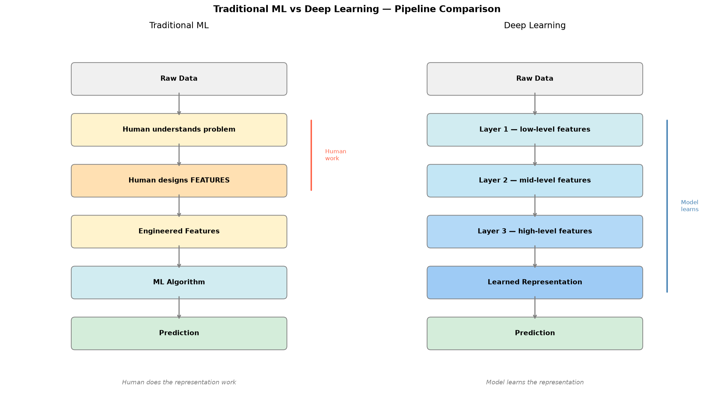
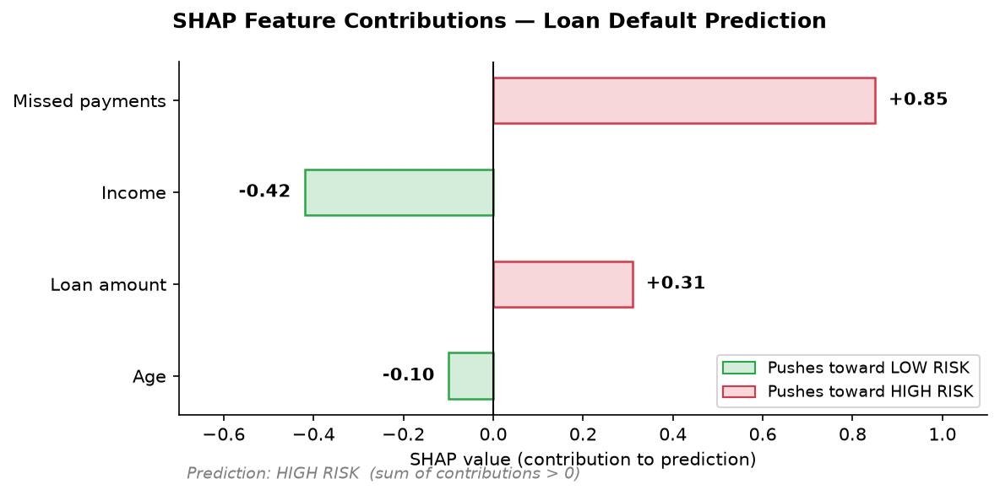
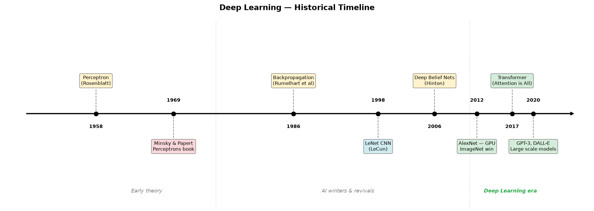

# 01 — ML vs Deep Learning

## The Core Idea

The most important distinction is **not** simply:

> "ML needs feature engineering, DL does not."

That is too absolute. The precise distinction is:

> Traditional ML usually requires humans to design a useful **representation** of raw data before the model can learn.  
> Deep Learning can **learn that representation itself**, directly from less-processed input.

---

## The Two Pipelines

### Traditional ML

```
Raw Data
   ↓
Human understands the problem
   ↓
Human designs FEATURES
   ↓
Features
   ↓
ML Algorithm (SVM, Random Forest, etc.)
   ↓
Prediction
```

### Deep Learning

```
Raw Data
   ↓
Neural Network
   ↓
Learns low-level features
   ↓
Learns higher-level features
   ↓
Learns task representation
   ↓
Prediction
```

The key shift:



| | Who does the feature work? |
|---|---|
| Traditional ML | Human (feature engineering) |
| Deep Learning | The model itself (feature learning) |

---

## Example: Recognizing Handwritten Digits (8 vs 3)

Input: a **28 × 28 grayscale image** = 784 pixel values

```
[0, 0, 12, 80, 255, ...]
[0, 5, 90, 255, 255, ...]
...
```

The computer has no initial concept of loops, curves, edges, or digits.

---

### Traditional ML Approach

A model like SVM or Logistic Regression does not naturally learn hierarchical visual patterns from raw pixels. So we engineer features manually:

```
Raw Image (784 pixels)
        ↓
   Human designs:
   ┌─────────────────────────────┐
   │ Feature 1 → loop count      │
   │ Feature 2 → vertical sym.   │
   │ Feature 3 → horizontal sym. │
   │ Feature 4 → aspect ratio    │
   │ Feature 5 → curved regions  │
   │ Feature 6 → ink upper half  │
   │ Feature 7 → ink lower half  │
   └─────────────────────────────┘
        ↓
   [2, 0.91, 0.72, 0.83, ...]
        ↓
   ML Algorithm
        ↓
      "8"
```

The model learns from features **we decided were useful**.  
We told it: *"Here are measurements I think describe a digit — now learn how they relate to 8 vs 3."*

---

### Deep Learning Approach

We give the raw pixels directly to a neural network:

```
Raw Image (784 pixels)
        ↓
   Layer 1 → learns edges
        ↓
   Layer 2 → learns curves / lines
        ↓
   Layer 3 → learns shapes / loops
        ↓
   Layer 4 → learns digit representation
        ↓
        "8"
```

We never explicitly programmed:

```python
if loops == 2:
    digit = 8
```

The network learned useful representations from training examples.

---

## The 5 Key Differences

| # | Dimension | Traditional ML | Deep Learning |
|---|-----------|---------------|---------------|
| 1 | **Feature representation** | Human designs features | Model learns features |
| 2 | **Model architecture** | Shallow algorithms | Multi-layer neural networks |
| 3 | **Data requirements** | Works well with smaller structured data | Benefits greatly from large datasets |
| 4 | **Compute requirements** | Usually CPU is sufficient | Usually requires GPU / TPU |
| 5 | **Interpretability** | Often easier to inspect and explain | Generally harder to explain (black box) |

---

## 1. Feature Engineering vs Feature Learning

This is the **most important** difference.

```
TRADITIONAL ML                      DEEP LEARNING
──────────────────────────────      ──────────────────────────────
Raw Data                            Raw Data
   ↓                                   ↓
Human-designed features             Neural network
   ↓                                   ↓
ML model learns relationship        Learns representation
   ↓                                   ↓
Prediction                          Learns higher-level representation
                                       ↓
                                    Learns relationship
                                       ↓
                                    Prediction
```

In DL, **feature learning and task learning happen together** in one trainable system:

```
             DEEP LEARNING

   ┌──────────────────────────┐
   │   FEATURE LEARNING       │
   │         +                │  Raw → Prediction
   │   TASK LEARNING          │
   └──────────────────────────┘
```

---

## 2. Interpretability

With traditional ML and engineered features:

```
loop_count    = 2
symmetry      = 0.91
aspect_ratio  = 0.72
stroke_width  = 0.65
      ↓
Prediction = "8"
```

You can reason: *"It predicted 8 because it has two loops and high symmetry."*

With a deep neural network:

```
784 pixels
   ↓
Layer 1: millions of learned parameters
   ↓
Layer 2: millions more
   ↓
   ...
   ↓
"8"
```

It becomes very hard to give a simple human explanation of why the network arrived at that answer.

> Note: Not all ML is interpretable and not all DL is completely uninterpretable.  
> Explainability techniques exist for both.



### Explainability Tools

| Tool | Works with | What it does |
|---|---|---|
| **SHAP** | ML + DL | Shows how much each feature contributed to a prediction |
| **LIME** | ML + DL | Builds a simple local explanation around one prediction |
| **Grad-CAM** | CNN (images) | Highlights which regions of an image the network focused on |

**Grad-CAM example** — a CNN predicting a chest X-ray as pneumonia:

```
Input X-ray image
        ↓
   CNN predicts: Pneumonia
        ↓
   Grad-CAM produces a heatmap:
   ┌──────────────────────┐
   │  ░░░░░░░░░░░░░░░░░░  │
   │  ░░░░▓▓▓▓▓▓░░░░░░░  │  ← high activation (network focused here)
   │  ░░░▓▓▓▓▓▓▓▓░░░░░░  │
   │  ░░░░░░░░░░░░░░░░░░  │
   └──────────────────────┘
```

You can see *where* the network looked, but not *why* it learned to look there — that distinction matters at postgraduate level.

**SHAP example** — a loan default prediction model:

```
Prediction: HIGH RISK

Feature contributions:
  Income        → -0.42  (pushed toward low risk)
  Missed payments → +0.85  (pushed toward high risk)
  Loan amount   → +0.31  (pushed toward high risk)
  Age           → -0.10  (pushed toward low risk)
```

This is why traditional ML with engineered features is often easier to audit and explain in regulated industries (finance, healthcare, law).

---

## 3. Data Requirements

Traditional ML works well with **structured / tabular data** even at smaller scale:

```
Customer record:
  Age, Income, Location, Purchases, Visits → Churn prediction
```

Deep Learning becomes attractive when input is **complex and unstructured**:

```
Images / Audio / Video / Text / Speech
```

For example, manually designing every feature for human speech is extremely difficult:

```
Raw Audio → ????? → Speech representation → Words
```

A deep network can learn those representations from data.

---

## 4. Compute Requirements

| | Typical Hardware |
|---|---|
| Random Forest, XGBoost | CPU is usually fine |
| Large Neural Network | GPU / TPU often required |

This is because DL involves:

```
Millions / Billions of parameters
         +
Large dataset
         +
Many training iterations
         ↓
High compute demand
```

> Note: Small neural networks can run on CPUs. Some traditional ML workloads also use GPUs. Avoid oversimplifying to "ML = CPU, DL = GPU."

---

## 5. Model Architecture

DL is a **subset** of ML:

```
ML
├── Linear Regression
├── Logistic Regression
├── Decision Trees
├── Random Forest
├── SVM
├── K-Means
└── Neural Networks
      └── Deep Learning (multi-layer neural networks)
```

Different DL architectures are designed for different data types:

| Architecture | Best suited for |
|---|---|
| CNN | Images, spatial patterns |
| RNN / LSTM | Sequential data, time series |
| Transformer | Text, audio, vision, multimodal |

---

## Why Deep Learning Became Possible Now

Deep learning is not a new idea — neural networks have existed since the 1950s–80s. So why did DL only take off around 2012?

Three things converged:

```
        DATA
          +
       COMPUTE
          +
      ALGORITHMS
          ↓
  Deep Learning era
```

### 1. Data

```
Before internet era:
  Thousands of labeled images → not enough to train deep networks

After internet era:
  ImageNet → 1.2 million labeled images
  YouTube  → millions of hours of video
  Web text → billions of documents
```

Deep networks have millions of parameters. They need large amounts of data to learn meaningful representations — otherwise they just memorize or fail.

### 2. Compute — GPUs

Training a deep network requires the same operation repeated billions of times:

```
w = w - learning_rate × gradient
```

GPUs were originally designed for graphics (parallel pixel processing), but that same parallelism maps perfectly onto neural network matrix operations:

```
CPU:  few powerful cores → sequential operations
GPU:  thousands of smaller cores → massively parallel operations
         ↓
  Training that took weeks on CPU → hours on GPU
```

AlexNet (2012) was one of the first models to use GPUs for training and won ImageNet by a large margin.

### 3. Algorithmic Improvements

Early deep networks had training problems. Key fixes:

| Problem | Solution |
|---|---|
| Vanishing gradients | ReLU activation, better weight initialization |
| Overfitting | Dropout, data augmentation, batch normalization |
| Slow convergence | Adam optimizer, learning rate schedules |

Without these, stacking many layers simply did not work reliably.

### The Convergence



```
1950s–1980s:  Neural network theory exists
                    ↓
1990s–2000s:  Limited data + limited compute → ML dominates
                    ↓
2012:         ImageNet + GPU + better algorithms → AlexNet
                    ↓
2012–present: Deep learning era
```

> The idea was always there. What changed was the fuel (data), the engine (GPU), and the engineering (algorithms).

---

## What is a Neural Network — Brief Intuition

Before going deeper into DL, it helps to have a basic mental model of what a neural network actually is.

Think of it as a **chain of transformations**:

```
Input
  ↓
[Layer 1] → applies learned transformation
  ↓
[Layer 2] → applies learned transformation
  ↓
  ...
  ↓
[Output Layer] → final prediction
```

Each layer is made of **neurons**. A single neuron does something very simple:

```
Inputs:   x₁, x₂, x₃
Weights:  w₁, w₂, w₃

Neuron computes:
  z = (w₁·x₁) + (w₂·x₂) + (w₃·x₃) + bias
  output = activation_function(z)
```

The **weights** are what the network learns during training — they are adjusted to reduce prediction error.

A network is called **deep** when it has many layers:

```
Shallow network:   Input → [1-2 layers] → Output
Deep network:      Input → [many layers] → Output
```

The depth is what allows the network to learn increasingly abstract representations:

```
Layer 1 → detects simple patterns (edges, frequencies)
Layer 2 → combines them into shapes / phonemes
Layer 3 → combines those into objects / words
   ...
Final layer → makes the prediction
```

> A full treatment of neural networks — architecture, forward pass, backpropagation, activation functions — is covered in the next topic.

---

## What to Remember

Do **not** memorize:

> "ML requires feature engineering; DL doesn't."

Instead memorize:

> "Traditional ML often relies on **human-designed features**, whereas Deep Learning **learns hierarchical representations** directly from input as part of model training."

And the single most important conceptual shift:

> Deep Learning combines **feature learning** and **prediction** into one end-to-end trainable system.
