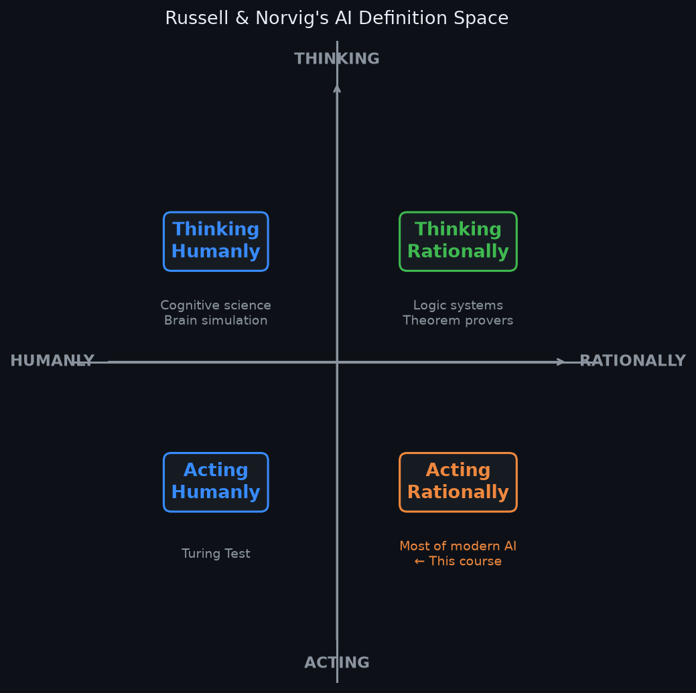
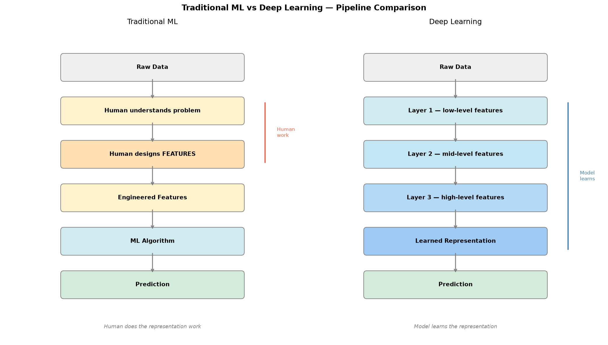
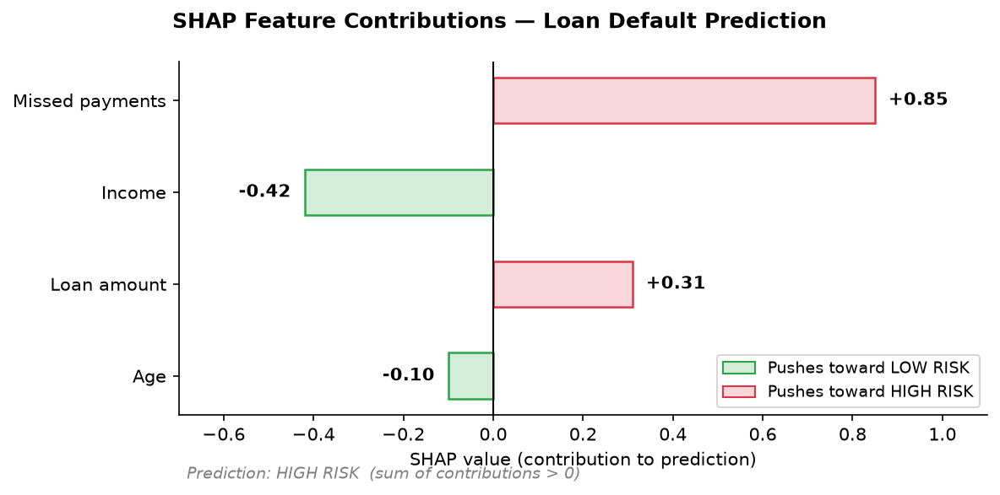
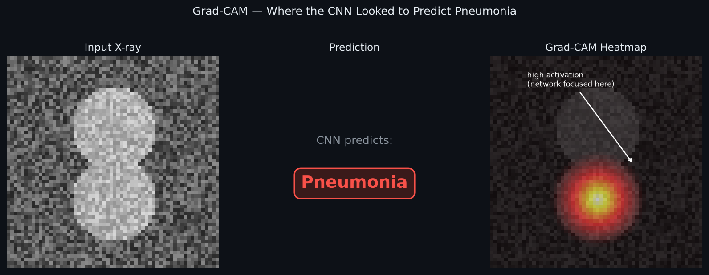
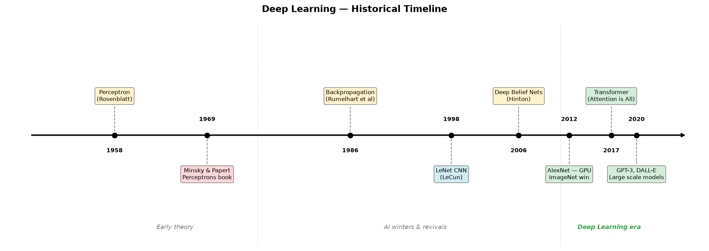

# 01 — ML vs Deep Learning

---

## Part 0: What is Artificial Intelligence?

Before machine learning, before deep learning — what is the field we are actually in?

### Norvig and Russell's Definition

Russell and Norvig's *Artificial Intelligence: A Modern Approach* — the standard reference in the field — defines AI not as a single thing but as a space of goals along two axes. The diagram below shows the four quadrants, with modern AI sitting in the acting rationally quadrant.



| Quadrant | Goal | Example |
|---|---|---|
| Thinking humanly | Model human cognition | Cognitive science, brain simulation |
| Thinking rationally | Use logic and formal reasoning | Theorem provers, logic systems |
| Acting humanly | Behave indistinguishably from a human | Turing Test |
| Acting rationally | Do the right thing to achieve a goal | Most of modern AI |

Modern AI — and everything in this course — sits in the **acting rationally** quadrant. The goal is not to simulate human thought but to build systems that act effectively to achieve objectives.

> A **rational agent** is one that acts to maximise its expected performance given its goals and available information.

---

### The Paradigms That Came Before ML

AI did not start with machine learning. Several paradigms were tried first — each with real successes and fundamental limits.

#### 1. Symbolic AI and Expert Systems (1950s – 1980s)

The dominant approach for decades. The idea: intelligence is symbol manipulation. Encode human knowledge as explicit rules and logic, then reason over them.

```
Knowledge Base:
  IF patient has fever AND cough AND no rash
  THEN consider flu

  IF patient has fever AND rash AND joint pain
  THEN consider dengue

  ...(thousands more rules)

Inference Engine:
  Apply rules to patient symptoms → diagnosis
```

This produced **expert systems** — programs that encoded the knowledge of human experts. MYCIN (medical diagnosis), DENDRAL (chemistry), XCON (computer configuration) were real successes in narrow domains.

**Where it broke down:**

```
The Knowledge Bottleneck:

  Every rule must be written by hand
          ↓
  Experts struggle to articulate all their knowledge
          ↓
  Edge cases multiply faster than rules can cover them
          ↓
  Systems become brittle — fail on anything outside their rules
          ↓
  Maintaining thousands of rules becomes unmanageable
```

The real world is too messy, too ambiguous, and too large to encode by hand.

#### 2. Search and Planning (1950s – present, still used)

Another paradigm: intelligence is search. Define a problem as a state space and find the path from start to goal.

```
State space for chess:

  Start state: initial board
  Actions: legal moves
  Goal state: checkmate

  Search: explore possible move sequences → find best path
```

This works well for well-defined problems with clear rules — chess, route planning, puzzle solving. Deep Blue beat Kasparov in 1997 using search.

**Where it breaks down:**

```
State space explosion:

  Chess:  ~10⁴³ possible games — manageable with pruning
  Go:     ~10³°⁰ possible games — brute force search is impossible
  Real world perception: infinite continuous states — cannot enumerate
```

Search works when the problem is discrete and well-defined. It cannot handle perception, language, or any task where the state space is continuous and unstructured.

#### 3. The Knowledge Bottleneck — Why a New Paradigm Was Needed

Both symbolic AI and search share the same fundamental assumption:

```
Knowledge must be provided to the system by humans
```

This is the **knowledge bottleneck**. For narrow, well-defined domains it works. For the full breadth of human-level tasks it does not — because:

```
- Much human knowledge is tacit (we cannot articulate how we recognise a face)
- The real world has too many exceptions to enumerate
- Rules written for one domain do not transfer to another
- The cost of encoding knowledge grows faster than the benefit
```

The field needed a different question. Instead of:

```
"How do we encode knowledge into a system?"
```

The new question became:

```
"How do we build a system that acquires knowledge from experience?"
```

That shift is the birth of machine learning.

```
SYMBOLIC AI:   Human encodes knowledge → System reasons
MACHINE LEARNING: System learns knowledge from data → System reasons
```

---

## Part 1: Traditional Programming vs Machine Learning

Before defining machine learning, it helps to understand what it replaced — and why.

### Traditional Programming

In traditional programming, a human writes explicit rules that map inputs to outputs:

```
Rules (written by human)
        +
      Input
        ↓
     Output
```

Example — detecting spam email:

```python
if "free money" in email or "click here" in email:
    label = "spam"
else:
    label = "not spam"
```

This works when the rules are known, finite, and stable. It breaks down when:

```
- Rules are too complex to write by hand
- Rules change over time (spammers adapt)
- Input is unstructured (images, audio, text)
- The problem has too many edge cases
```

### Machine Learning

ML inverts the relationship. Instead of writing rules, you provide examples and let the system figure out the rules:

```
Traditional Programming:
  Rules + Input → Output

Machine Learning:
  Input + Output (examples) → Rules (learned)
```

Visually:

```
TRADITIONAL PROGRAMMING        MACHINE LEARNING

Human writes rules              Human provides examples
       ↓                                ↓
  [Program]                       [ML Algorithm]
       ↓                                ↓
  Output                          Learned rules (model)
                                        ↓
                                   New input → Output
```

The program is no longer written — it is **learned from data**.

---

## Part 2: What Does "Learning from Data" Mean?

A machine learning model **learns** by adjusting its internal parameters to reduce the difference between its predictions and the correct answers.

```
Step 1:  Model makes a prediction on an example
Step 2:  Prediction is compared to the correct answer
Step 3:  The difference (error) is measured
Step 4:  Model adjusts its parameters to reduce that error
Step 5:  Repeat over many examples
```

After enough examples, the model has adjusted its parameters to capture the underlying pattern in the data — it has "learned."

```
Before training:   model parameters are random → predictions are wrong
During training:   parameters adjust toward correct answers
After training:    parameters encode the learned pattern → predictions are useful
```

This is fundamentally different from programming. No human wrote the rule — the rule **emerged from data**.

---

## Part 3: Types of Learning

How a model learns depends on what kind of data it is given.

### Supervised Learning

The training data contains both inputs and correct outputs (labels). The model learns to map inputs to outputs.

```
Training data:
  (x₁, y₁), (x₂, y₂), ..., (xₙ, yₙ)
   input  label

Goal: learn f such that f(x) ≈ y
```

Examples:

```
Input: email text          → Label: spam / not spam
Input: house features      → Label: price
Input: patient scan        → Label: disease / no disease
```

The word "supervised" comes from the fact that the correct answer is always provided during training — like a teacher supervising the learning.

### Unsupervised Learning

The training data contains only inputs — no labels. The model finds structure, patterns, or groupings on its own.

```
Training data:
  x₁, x₂, ..., xₙ
  (no labels)

Goal: discover hidden structure in x
```

Examples:

```
Input: customer purchase history  → find natural customer segments
Input: news articles              → group by topic
Input: gene expression data       → find patterns
```

No one tells the model what the groups are — it discovers them.

### Reinforcement Learning

An agent learns by interacting with an environment. It takes actions, receives rewards or penalties, and learns a policy that maximises cumulative reward.

```
Agent → takes action → Environment
                            ↓
                       Reward / Penalty
                            ↓
                       Agent updates policy
```

Examples:

```
Game playing (AlphaGo, chess)
Robot locomotion
Recommendation systems
```

No labeled dataset — the signal comes from the reward.

### Summary

```
┌─────────────────────┬──────────────────────────────────────┐
│ Type                │ Data                                 │
├─────────────────────┼──────────────────────────────────────┤
│ Supervised          │ Input + Label                        │
│ Unsupervised        │ Input only                           │
│ Reinforcement       │ Actions + Rewards (no dataset)       │
└─────────────────────┴──────────────────────────────────────┘
```

---

## Part 4: Types of ML Tasks

Within supervised and unsupervised learning, there are specific task types.

### Classification

Predict which **category** an input belongs to. Output is a discrete class label.

```
Input: image of a digit  →  Output: 0, 1, 2, ..., 9
Input: email             →  Output: spam / not spam
Input: tumour scan       →  Output: malignant / benign
```

The model draws a **decision boundary** that separates classes.

### Regression

Predict a **continuous numerical value**.

```
Input: house size, location, age  →  Output: £320,000
Input: hours studied              →  Output: exam score 74.3
Input: temperature, humidity      →  Output: energy consumption 142.7 kWh
```

The model fits a **curve or surface** through the data.

### Clustering

Group inputs into clusters based on similarity — no labels provided.

```
Input: 10,000 customer records  →  Output: 4 natural customer segments
```

The model decides both how many groups exist and which inputs belong together.

### Key Distinction

```
Classification  →  predicting a category    (supervised)
Regression      →  predicting a number      (supervised)
Clustering      →  discovering groups       (unsupervised)
```

---

## Part 5: Data Fundamentals

Every ML system is built on data. Precise vocabulary matters.

### Dataset Structure

A dataset is a collection of **samples**. Each sample has **features** and (in supervised learning) a **label**.

```
Dataset:
┌──────────┬──────────┬──────────┬────────┐
│ Feature 1│ Feature 2│ Feature 3│ Label  │
├──────────┼──────────┼──────────┼────────┤
│   25     │  50,000  │    1     │   0    │  ← sample 1
│   34     │  80,000  │    3     │   1    │  ← sample 2
│   28     │  62,000  │    2     │   0    │  ← sample 3
└──────────┴──────────┴──────────┴────────┘
```

| Term | Meaning |
|---|---|
| Sample | One row — one data point, one observation |
| Feature | One column — one measurable property of the input |
| Label / Target | The correct output for that sample |
| Input | The features fed into the model (x) |
| Output | The prediction produced by the model (ŷ) |

### Labeled vs Unlabeled Data

```
Labeled:    each sample has a known correct output
            → used for supervised learning
            → expensive (requires human annotation)

Unlabeled:  samples have no output attached
            → used for unsupervised learning
            → cheap and abundant
```

### Variable Types

Features and labels come in different types. The type determines how you process and model them.

**Numerical variables** — values are numbers with meaningful magnitude:

```
Age: 25, 34, 28
Income: 50000, 80000, 62000
Temperature: 21.4, 19.8, 23.1
```

**Categorical variables** — values are categories with no inherent order:

```
Colour: red, blue, green
Country: UK, France, Germany
Blood type: A, B, AB, O
```

**Discrete variables** — can only take specific separated values (often integers):

```
Number of children: 0, 1, 2, 3
Number of rooms: 1, 2, 3, 4
```

**Continuous variables** — can take any value within a range:

```
Height: 1.73m, 1.812m, 1.6554m
Temperature: 21.4°C, 21.41°C, 21.413°C
```

Summary:

```
┌─────────────┬──────────────────────────────────────────┐
│ Type        │ Example                                  │
├─────────────┼──────────────────────────────────────────┤
│ Numerical   │ income, temperature, score               │
│ Categorical │ colour, country, blood type              │
│ Discrete    │ number of rooms, count of events         │
│ Continuous  │ height, weight, time                     │
└─────────────┴──────────────────────────────────────────┘
```

---

## The Core Idea

The most important distinction is **not** simply:

> "ML needs feature engineering, DL does not."

That is too absolute. The precise distinction is:

> Traditional ML usually requires humans to design a useful **representation** of raw data before the model can learn.  
> Deep Learning can **learn that representation itself**, directly from less-processed input.

---

## The Two Pipelines

### Traditional ML

```
Raw Data
   ↓
Human understands the problem
   ↓
Human designs FEATURES
   ↓
Features
   ↓
ML Algorithm (SVM, Random Forest, etc.)
   ↓
Prediction
```

### Deep Learning

```
Raw Data
   ↓
Neural Network
   ↓
Learns low-level features
   ↓
Learns higher-level features
   ↓
Learns task representation
   ↓
Prediction
```

The key shift:



| | Who does the feature work? |
|---|---|
| Traditional ML | Human (feature engineering) |
| Deep Learning | The model itself (feature learning) |

---

## Example: Recognizing Handwritten Digits (8 vs 3)

Input: a **28 × 28 grayscale image** = 784 pixel values

```
[0, 0, 12, 80, 255, ...]
[0, 5, 90, 255, 255, ...]
...
```

The computer has no initial concept of loops, curves, edges, or digits.

---

### Traditional ML Approach

A model like SVM or Logistic Regression does not naturally learn hierarchical visual patterns from raw pixels. So we engineer features manually:

```
Raw Image (784 pixels)
        ↓
   Human designs:
   ┌─────────────────────────────┐
   │ Feature 1 → loop count      │
   │ Feature 2 → vertical sym.   │
   │ Feature 3 → horizontal sym. │
   │ Feature 4 → aspect ratio    │
   │ Feature 5 → curved regions  │
   │ Feature 6 → ink upper half  │
   │ Feature 7 → ink lower half  │
   └─────────────────────────────┘
        ↓
   [2, 0.91, 0.72, 0.83, ...]
        ↓
   ML Algorithm
        ↓
      "8"
```

The model learns from features **we decided were useful**.  
We told it: *"Here are measurements I think describe a digit — now learn how they relate to 8 vs 3."*

---

### Deep Learning Approach

We give the raw pixels directly to a neural network:

```
Raw Image (784 pixels)
        ↓
   Layer 1 → learns edges
        ↓
   Layer 2 → learns curves / lines
        ↓
   Layer 3 → learns shapes / loops
        ↓
   Layer 4 → learns digit representation
        ↓
        "8"
```

We never explicitly programmed:

```python
if loops == 2:
    digit = 8
```

The network learned useful representations from training examples.

---

## The 5 Key Differences

| # | Dimension | Traditional ML | Deep Learning |
|---|-----------|---------------|---------------|
| 1 | **Feature representation** | Human designs features | Model learns features |
| 2 | **Model architecture** | Shallow algorithms | Multi-layer neural networks |
| 3 | **Data requirements** | Works well with smaller structured data | Benefits greatly from large datasets |
| 4 | **Compute requirements** | Usually CPU is sufficient | Usually requires GPU / TPU |
| 5 | **Interpretability** | Often easier to inspect and explain | Generally harder to explain (black box) |

---

## 1. Feature Engineering vs Feature Learning

This is the **most important** difference.

```
TRADITIONAL ML                      DEEP LEARNING
──────────────────────────────      ──────────────────────────────
Raw Data                            Raw Data
   ↓                                   ↓
Human-designed features             Neural network
   ↓                                   ↓
ML model learns relationship        Learns representation
   ↓                                   ↓
Prediction                          Learns higher-level representation
                                       ↓
                                    Learns relationship
                                       ↓
                                    Prediction
```

In DL, **feature learning and task learning happen together** in one trainable system:

```
             DEEP LEARNING

   ┌──────────────────────────┐
   │   FEATURE LEARNING       │
   │         +                │  Raw → Prediction
   │   TASK LEARNING          │
   └──────────────────────────┘
```

---

## 2. Interpretability

With traditional ML and engineered features:

```
loop_count    = 2
symmetry      = 0.91
aspect_ratio  = 0.72
stroke_width  = 0.65
      ↓
Prediction = "8"
```

You can reason: *"It predicted 8 because it has two loops and high symmetry."*

With a deep neural network:

```
784 pixels
   ↓
Layer 1: millions of learned parameters
   ↓
Layer 2: millions more
   ↓
   ...
   ↓
"8"
```

It becomes very hard to give a simple human explanation of why the network arrived at that answer.

> Note: Not all ML is interpretable and not all DL is completely uninterpretable.  
> Explainability techniques exist for both.



### Explainability Tools

| Tool | Works with | What it does |
|---|---|---|
| **SHAP** | ML + DL | Shows how much each feature contributed to a prediction |
| **LIME** | ML + DL | Builds a simple local explanation around one prediction |
| **Grad-CAM** | CNN (images) | Highlights which regions of an image the network focused on |

**Grad-CAM example** — a CNN predicting a chest X-ray as pneumonia. The three panels below show the input image, the prediction, and the Grad-CAM heatmap highlighting where the network focused.



You can see *where* the network looked, but not *why* it learned to look there — that distinction matters at postgraduate level.

**SHAP example** — a loan default prediction model:

```
Prediction: HIGH RISK

Feature contributions:
  Income        → -0.42  (pushed toward low risk)
  Missed payments → +0.85  (pushed toward high risk)
  Loan amount   → +0.31  (pushed toward high risk)
  Age           → -0.10  (pushed toward low risk)
```

This is why traditional ML with engineered features is often easier to audit and explain in regulated industries (finance, healthcare, law).

---

## 3. Data Requirements

Traditional ML works well with **structured / tabular data** even at smaller scale:

```
Customer record:
  Age, Income, Location, Purchases, Visits → Churn prediction
```

Deep Learning becomes attractive when input is **complex and unstructured**:

```
Images / Audio / Video / Text / Speech
```

For example, manually designing every feature for human speech is extremely difficult:

```
Raw Audio → ????? → Speech representation → Words
```

A deep network can learn those representations from data.

---

## 4. Compute Requirements

| | Typical Hardware |
|---|---|
| Random Forest, XGBoost | CPU is usually fine |
| Large Neural Network | GPU / TPU often required |

This is because DL involves:

```
Millions / Billions of parameters
         +
Large dataset
         +
Many training iterations
         ↓
High compute demand
```

> Note: Small neural networks can run on CPUs. Some traditional ML workloads also use GPUs. Avoid oversimplifying to "ML = CPU, DL = GPU."

---

## 5. Model Architecture

DL is a **subset** of ML:

```
ML
├── Linear Regression
├── Logistic Regression
├── Decision Trees
├── Random Forest
├── SVM
├── K-Means
└── Neural Networks
      └── Deep Learning (multi-layer neural networks)
```

Different DL architectures are designed for different data types:

| Architecture | Best suited for |
|---|---|
| CNN | Images, spatial patterns |
| RNN / LSTM | Sequential data, time series |
| Transformer | Text, audio, vision, multimodal |

---

## Why Deep Learning Became Possible Now

Deep learning is not a new idea — neural networks have existed since the 1950s–80s. So why did DL only take off around 2012?

Three things converged:

```
        DATA
          +
       COMPUTE
          +
      ALGORITHMS
          ↓
  Deep Learning era
```

### 1. Data

```
Before internet era:
  Thousands of labeled images → not enough to train deep networks

After internet era:
  ImageNet → 1.2 million labeled images
  YouTube  → millions of hours of video
  Web text → billions of documents
```

Deep networks have millions of parameters. They need large amounts of data to learn meaningful representations — otherwise they just memorize or fail.

### 2. Compute — GPUs

Training a deep network requires the same operation repeated billions of times:

```
w = w - learning_rate × gradient
```

GPUs were originally designed for graphics (parallel pixel processing), but that same parallelism maps perfectly onto neural network matrix operations:

```
CPU:  few powerful cores → sequential operations
GPU:  thousands of smaller cores → massively parallel operations
         ↓
  Training that took weeks on CPU → hours on GPU
```

AlexNet (2012) was one of the first models to use GPUs for training and won ImageNet by a large margin.

### 3. Algorithmic Improvements

Early deep networks had training problems. Key fixes:

| Problem | Solution |
|---|---|
| Vanishing gradients | ReLU activation, better weight initialization |
| Overfitting | Dropout, data augmentation, batch normalization |
| Slow convergence | Adam optimizer, learning rate schedules |

Without these, stacking many layers simply did not work reliably.

### The Convergence



```
1950s–1980s:  Neural network theory exists
                    ↓
1990s–2000s:  Limited data + limited compute → ML dominates
                    ↓
2012:         ImageNet + GPU + better algorithms → AlexNet
                    ↓
2012–present: Deep learning era
```

> The idea was always there. What changed was the fuel (data), the engine (GPU), and the engineering (algorithms).

---

## What is a Neural Network — Brief Intuition

Before going deeper into DL, it helps to have a basic mental model of what a neural network actually is.

Think of it as a **chain of transformations**:

```
Input
  ↓
[Layer 1] → applies learned transformation
  ↓
[Layer 2] → applies learned transformation
  ↓
  ...
  ↓
[Output Layer] → final prediction
```

Each layer is made of **neurons**. A single neuron does something very simple:

```
Inputs:   x₁, x₂, x₃
Weights:  w₁, w₂, w₃

Neuron computes:
  z = (w₁·x₁) + (w₂·x₂) + (w₃·x₃) + bias
  output = activation_function(z)
```

The **weights** are what the network learns during training — they are adjusted to reduce prediction error.

A network is called **deep** when it has many layers:

```
Shallow network:   Input → [1-2 layers] → Output
Deep network:      Input → [many layers] → Output
```

The depth is what allows the network to learn increasingly abstract representations:

```
Layer 1 → detects simple patterns (edges, frequencies)
Layer 2 → combines them into shapes / phonemes
Layer 3 → combines those into objects / words
   ...
Final layer → makes the prediction
```

> A full treatment of neural networks — architecture, forward pass, backpropagation, activation functions — is covered in the next topic.

---

## Summary

```
SYMBOLIC AI       →  Human encodes knowledge → System reasons
MACHINE LEARNING  →  System learns knowledge from data → System reasons
DEEP LEARNING     →  System learns hierarchical representations end-to-end
```

Key takeaways:

- AI is the field of building rational agents — systems that act to maximise performance toward a goal
- Symbolic AI and expert systems encoded knowledge as rules — powerful in narrow domains, brittle at scale
- Search works for well-defined discrete problems but cannot handle continuous unstructured input
- The knowledge bottleneck — humans cannot articulate all knowledge — forced a new paradigm
- ML inverts the relationship: instead of rules + input = output, it learns rules from input + output examples
- "Learning" means adjusting parameters to reduce prediction error over many examples
- Supervised learning uses labeled data, unsupervised uses unlabeled, reinforcement uses rewards
- Classification predicts a category, regression predicts a number, clustering discovers groups
- A sample is one data point; features are its measurable properties; the label is the correct output
- Variables are numerical or categorical, discrete or continuous — type determines how they are processed
- Traditional ML often relies on **human-designed features**, whereas Deep Learning **learns hierarchical representations** directly from input as part of model training
- Deep Learning combines **feature learning** and **prediction** into one end-to-end trainable system
- DL became viable around 2012 due to the convergence of large datasets, GPU compute, and better algorithms
