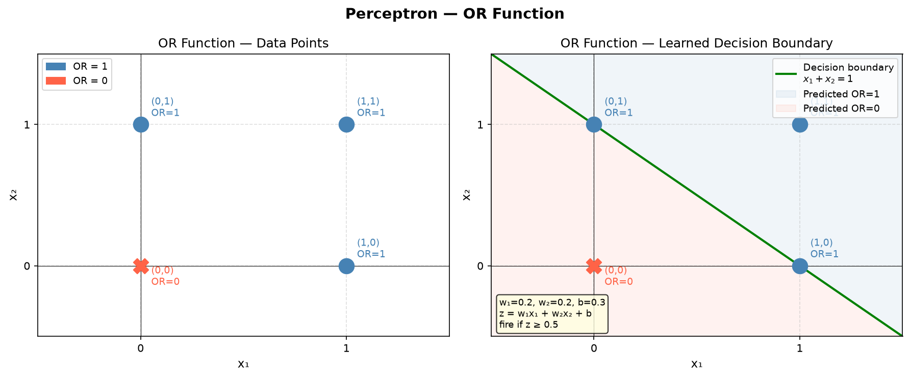

# 02 — Biological Neuron → Artificial Neuron → Perceptron

---

## Part 1: Biological Neuron

The artificial neuron is directly inspired by how a biological neuron works. Understanding the biology gives the math a reason to exist.

### Structure of a Biological Neuron

```
                        Cell Body (Soma)
                        ┌─────────────┐
Dendrites               │             │
(receive signals)       │   Nucleus   │──────────── Axon ──────────► (to next neuron)
    ──────────┐         │             │
    ──────────┼────────►│             │
    ──────────┘         └─────────────┘
                               │
                        Axon Terminals
                        (send signals to
                         next neuron's dendrites)
```

| Biological Part | Role |
|---|---|
| Dendrites | Receive input signals from other neurons |
| Cell Body (Soma) | Accumulates and processes signals |
| Axon | Transmits output signal |
| Axon Terminals | Pass signal to next neuron via synapse |
| Synapse | Connection point — controls signal strength |

### How it fires

A biological neuron does not fire for every signal it receives. It accumulates incoming signals. If the total exceeds a **threshold**, it fires an output signal down the axon.

```
Incoming signals accumulate
         ↓
Total signal < threshold  →  neuron stays silent
Total signal ≥ threshold  →  neuron FIRES
```

This is called the **all-or-nothing principle**.

---

## Part 2: Artificial Neuron and the Perceptron

The perceptron (Rosenblatt, 1958) is the direct mathematical model of the biological neuron. There is no meaningful separation between "artificial neuron" and "perceptron" at this level — the perceptron IS the artificial neuron. We build it step by step.

### Mapping Biology to Math

| Biological | Artificial / Perceptron |
|---|---|
| Dendrites | Inputs x₁, x₂, ..., xₙ |
| Synapse strength | Weights w₁, w₂, ..., wₙ |
| Cell body accumulation | Weighted sum z = Σ wᵢxᵢ + b |
| Threshold / firing | Activation function f(z) |
| Axon output | Output ŷ = f(z) |
| Resting state | Bias term b |

### Diagram

```
  x₁ ──(w₁)──┐
              │
  x₂ ──(w₂)──┼──► [ z = Σwᵢxᵢ + b ] ──► [ f(z) ] ──► ŷ
              │
  xₙ ──(wₙ)──┘
```

### The Math

**Step 1 — Weighted sum (pre-activation):**

```
z = w₁x₁ + w₂x₂ + ... + wₙxₙ + b

or in vector form:

z = wᵀx + b
```

**Step 2 — Activation (post-activation):**

```
ŷ = f(z)
```

---

### The Neuron Formula is a Line — y = mx + c

This is a connection most textbooks skip. Look at the weighted sum for two inputs:

```
z = w₁x₁ + w₂x₂ + b
```

Now compare to the equation of a straight line:

```
y = mx + c
```

They are the same structure:

```
  z  = w₁x₁  +  w₂x₂  +  b
  │     │           │       │
  │     └── slope ──┘       └── intercept
  │
 output (before activation)
```

For two inputs, the decision boundary `z = 0` becomes:

```
w₁x₁ + w₂x₂ + b = 0

Rearranging:
x₂ = -(w₁/w₂)x₁ - (b/w₂)
      └── slope ──┘  └── intercept
```

This is literally a straight line in the x₁-x₂ plane:

```
x₂
 │          /
 │         /  ← decision boundary (a line)
 │        /      w₁x₁ + w₂x₂ + b = 0
 │       /
 └──────────── x₁

One side → z > 0 → neuron fires  (class 1)
Other side → z < 0 → neuron silent (class 0)
```

So a single perceptron can only ever draw **one straight line** to separate classes. This is exactly why it fails on XOR — and why we need multiple layers.

### What is the Bias?

The bias b is the intercept of that line:

```
Without bias:   x₂ = -(w₁/w₂)x₁         (line always passes through origin)
With bias:      x₂ = -(w₁/w₂)x₁ - b/w₂  (line can shift freely)
```

Geometrically:

```
No bias:              With bias:
x₂                    x₂
 │    /                │       /
 │   /                 │      /
 │  / ← fixed at       │     / ← can shift
 │ /   origin          │    /   anywhere
 └──── x₁              └──── x₁
```

Without bias, the decision boundary is forced through the origin — severely limiting what the neuron can learn.

---

### Activation: The Step Function

The original perceptron uses a **step function** (Heaviside function):

```
         ┌ 1   if z ≥ 0
f(z)  =  │
         └ 0   if z < 0
```

Visually:

```
f(z)
 1 │         ┌──────────────
   │         │
 0 │─────────┘
   └──────────────────────── z
             0
```

The neuron outputs 1 (fires) if the weighted sum crosses zero, otherwise 0.

---

### Why the Step Function is Not Enough — and Why Activation Functions Exist

The step function has a critical problem for training:

```
Step function:
  - Output is only 0 or 1
  - Not differentiable at z = 0
  - Derivative is 0 everywhere else
         ↓
  Cannot use gradient descent
  Cannot express probabilities
```

But there is a deeper problem that goes beyond the step function — it applies to **any linear activation**, including no activation at all.

**The linearity collapse problem:**

Suppose we stack two neurons with no activation function (or a linear one):

```
Layer 1 output:   z₁ = W₁x + b₁
Layer 2 output:   z₂ = W₂z₁ + b₂
                     = W₂(W₁x + b₁) + b₂
                     = (W₂W₁)x + (W₂b₁ + b₂)
                     = Wx + b        ← still a single line
```

Now stack 10 layers:

```
Layer 10 output = W₁₀(W₉(...(W₁x + b₁)...)) + b₁₀
                = Wx + b             ← still a single line
```

**No matter how many layers you stack, without non-linear activation, the entire network collapses to a single linear transformation — equivalent to one neuron.**

```
10 layers, no activation:          1 neuron:

x → L1 → L2 → ... → L10 → ŷ  ≡  x → [Wx + b] → ŷ
```

Depth becomes meaningless. The network cannot learn anything a single neuron cannot.

This is the real reason activation functions exist:

```
✓ Non-linearity        →  breaks the collapse, allows complex boundaries
✓ Differentiability    →  allows gradient descent to work
✓ Expressiveness       →  output can represent probabilities, ranges, etc.
```

Examples: Sigmoid, Tanh, ReLU, Leaky ReLU, Softmax — covered in full detail in **Note 04**.  
For now, we use the step function to understand the perceptron fully.

---

## Part 4: Forward Pass — How a Perceptron Computes

Given inputs, weights, and bias — the perceptron computes a prediction in two steps:

```
FORWARD PASS

  Inputs + Weights
        ↓
  z = wᵀx + b        ← weighted sum
        ↓
  ŷ = f(z)           ← apply activation (step function)
        ↓
  Output ŷ
```

### Example

```
x₁ = 1,  x₂ = 0
w₁ = 0.5, w₂ = 0.5, b = -0.5

z = (0.5)(1) + (0.5)(0) + (-0.5)
z = 0.5 + 0 - 0.5
z = 0

ŷ = f(0) = 1     (since z ≥ 0)
```

---

## Part 5: Perceptron Learning Rule

The perceptron learns by adjusting weights when it makes a wrong prediction.

### The Rule

```
For each training example (x, y):

  1. Compute prediction:   ŷ = f(wᵀx + b)
  2. Compute error:        e = y - ŷ
  3. Update weights:       wᵢ ← wᵢ + η × e × xᵢ
  4. Update bias:          b  ← b  + η × e
```

Where:
- y  = true label
- ŷ  = predicted label
- e  = error (0 if correct, ±1 if wrong)
- η  = learning rate (small positive number, e.g. 0.1)

### Intuition

```
Prediction correct  →  e = 0  →  no update
Prediction too low  →  e = +1 →  weights increase (push output up)
Prediction too high →  e = -1 →  weights decrease (push output down)
```

---

## Part 6: Full Training Example — OR Function

### OR Truth Table

| x₁ | x₂ | y (OR) |
|---|---|---|
| 0 | 0 | 0 |
| 0 | 1 | 1 |
| 1 | 0 | 1 |
| 1 | 1 | 1 |

### Geometric View

```
x₂
 1 │  ●(0,1)    ●(1,1)
   │
 0 │  ○(0,0)    ●(1,0)
   └──────────────────── x₁
      0          1

● = class 1 (OR = 1)
○ = class 0 (OR = 0)
```

A single straight line can separate ○ from ● — OR is **linearly separable**.



### Initial Setup

```
w₁ = 0.0,  w₂ = 0.0,  b = 0.0
η  = 0.1
Step function: ŷ = 1 if z ≥ 0.5, else 0
  (we use threshold 0.5 for cleaner hand computation)
```

---

### Epoch 1

**Sample 1: x = [0, 0], y = 0**

```
z  = (0.0)(0) + (0.0)(0) + 0.0 = 0.0
ŷ  = 0     (0.0 < 0.5)
e  = 0 - 0 = 0
→  No update
w₁ = 0.0,  w₂ = 0.0,  b = 0.0
```

**Sample 2: x = [0, 1], y = 1**

```
z  = (0.0)(0) + (0.0)(1) + 0.0 = 0.0
ŷ  = 0     (0.0 < 0.5)
e  = 1 - 0 = 1
w₁ ← 0.0 + 0.1 × 1 × 0 = 0.0
w₂ ← 0.0 + 0.1 × 1 × 1 = 0.1
b  ← 0.0 + 0.1 × 1     = 0.1
w₁ = 0.0,  w₂ = 0.1,  b = 0.1
```

**Sample 3: x = [1, 0], y = 1**

```
z  = (0.0)(1) + (0.1)(0) + 0.1 = 0.1
ŷ  = 0     (0.1 < 0.5)
e  = 1 - 0 = 1
w₁ ← 0.0 + 0.1 × 1 × 1 = 0.1
w₂ ← 0.1 + 0.1 × 1 × 0 = 0.1
b  ← 0.1 + 0.1 × 1     = 0.2
w₁ = 0.1,  w₂ = 0.1,  b = 0.2
```

**Sample 4: x = [1, 1], y = 1**

```
z  = (0.1)(1) + (0.1)(1) + 0.2 = 0.4
ŷ  = 0     (0.4 < 0.5)
e  = 1 - 0 = 1
w₁ ← 0.1 + 0.1 × 1 × 1 = 0.2
w₂ ← 0.1 + 0.1 × 1 × 1 = 0.2
b  ← 0.2 + 0.1 × 1     = 0.3
w₁ = 0.2,  w₂ = 0.2,  b = 0.3
```

**End of Epoch 1:** w₁ = 0.2, w₂ = 0.2, b = 0.3

---

### Epoch 2

**Sample 1: x = [0, 0], y = 0**

```
z  = (0.2)(0) + (0.2)(0) + 0.3 = 0.3
ŷ  = 0     (0.3 < 0.5)
e  = 0 - 0 = 0
→  No update
```

**Sample 2: x = [0, 1], y = 1**

```
z  = (0.2)(0) + (0.2)(1) + 0.3 = 0.5
ŷ  = 1     (0.5 ≥ 0.5)
e  = 1 - 1 = 0
→  No update
```

**Sample 3: x = [1, 0], y = 1**

```
z  = (0.2)(1) + (0.2)(0) + 0.3 = 0.5
ŷ  = 1     (0.5 ≥ 0.5)
e  = 1 - 1 = 0
→  No update
```

**Sample 4: x = [1, 1], y = 1**

```
z  = (0.2)(1) + (0.2)(1) + 0.3 = 0.7
ŷ  = 1     (0.7 ≥ 0.5)
e  = 1 - 1 = 0
→  No update
```

**End of Epoch 2:** No updates — perceptron has converged.

---

### Final Verification

```
Final weights: w₁ = 0.2,  w₂ = 0.2,  b = 0.3

x=[0,0]: z = 0.3          → ŷ = 0  ✓  (y=0)
x=[0,1]: z = 0.5          → ŷ = 1  ✓  (y=1)
x=[1,0]: z = 0.5          → ŷ = 1  ✓  (y=1)
x=[1,1]: z = 0.7          → ŷ = 1  ✓  (y=1)
```

All correct. The perceptron learned the OR function in 2 epochs.

### Decision Boundary

The learned decision boundary is:

```
w₁x₁ + w₂x₂ + b = 0.5   (our threshold)
0.2x₁ + 0.2x₂ + 0.3 = 0.5
0.2x₁ + 0.2x₂ = 0.2
x₁ + x₂ = 1
```

Geometrically:

```
x₂
 1 │  ●(0,1)    ●(1,1)
   │      ╲
   │        ╲  ← decision boundary: x₁ + x₂ = 1
 0 │  ○(0,0)  ╲ ●(1,0)
   └──────────────────── x₁
      0          1

Everything above/on the line → class 1
Everything below the line    → class 0
```

---

## Part 7: Why XOR Fails — The Limitation of a Single Perceptron

### XOR Truth Table

| x₁ | x₂ | y (XOR) |
|---|---|---|
| 0 | 0 | 0 |
| 0 | 1 | 1 |
| 1 | 0 | 1 |
| 1 | 1 | 0 |

### Geometric Intuition

```
x₂
 1 │  ●(0,1)    ○(1,1)
   │
 0 │  ○(0,0)    ●(1,0)
   └──────────────────── x₁
      0          1

● = class 1 (XOR = 1)
○ = class 0 (XOR = 0)
```

Try to draw a single straight line that separates ● from ○:

```
Attempt 1:          Attempt 2:          Attempt 3:
x₂                  x₂                  x₂
 1│ ●    ○           1│ ●    ○           1│ ●    ○
  │   ╲              │      │            │ ─────────
 0│ ○    ●          0│ ○    ●           0│ ○    ●
  └────────           └────────           └────────
  Misses (1,1)       Misses (0,0)        Misses both
```

**It is impossible.** No single straight line can separate the two classes of XOR. XOR is **not linearly separable**.

### Mathematical Proof

A perceptron computes:

```
ŷ = 1  if  w₁x₁ + w₂x₂ + b ≥ 0
ŷ = 0  otherwise
```

For XOR to be solved, we need all four conditions simultaneously:

```
(0,0) → 0:   b < 0                    ... (i)
(0,1) → 1:   w₂ + b ≥ 0              ... (ii)
(1,0) → 1:   w₁ + b ≥ 0              ... (iii)
(1,1) → 0:   w₁ + w₂ + b < 0         ... (iv)
```

From (ii):  w₂ ≥ -b > 0  (using i)
From (iii): w₁ ≥ -b > 0

Adding (ii) and (iii):

```
w₁ + w₂ + 2b ≥ 0
w₁ + w₂ + b  ≥ -b > 0
```

But condition (iv) requires:

```
w₁ + w₂ + b < 0
```

**Contradiction.** No values of w₁, w₂, b can satisfy all four conditions.

### The Conclusion

```
Single Perceptron
       ↓
Can only learn LINEARLY SEPARABLE functions
       ↓
OR  ✓   AND  ✓   NAND  ✓
XOR ✗   XNOR ✗
```

This was the core criticism in Minsky & Papert's 1969 book "Perceptrons" — it nearly killed neural network research for a decade.

The solution: **stack multiple layers** → Multilayer Perceptron (Note 03).

---

## Summary

```
BIOLOGICAL NEURON          ARTIFICIAL NEURON / PERCEPTRON
──────────────────         ───────────────────────────────
Dendrites                  Inputs x
Synapse strength           Weights w
Cell body                  Weighted sum z = wᵀx + b  ≡  y = mx + c
Threshold / firing         Activation function f(z)
Axon output                Output ŷ = f(z)
```

Key takeaways:

- Artificial neuron and perceptron are the same thing — the perceptron is the artificial neuron with a step function
- The neuron formula `z = wᵀx + b` is a straight line — the decision boundary is literally `y = mx + c`
- Without non-linear activation, stacking any number of layers collapses to a single line — depth is meaningless
- A perceptron learns using the perceptron learning rule: `w ← w + η(y - ŷ)x`
- It can solve linearly separable problems (OR, AND)
- It **cannot** solve non-linearly separable problems (XOR) — proven geometrically and mathematically
- Stacking multiple perceptrons into layers solves the XOR problem → **Note 03**
