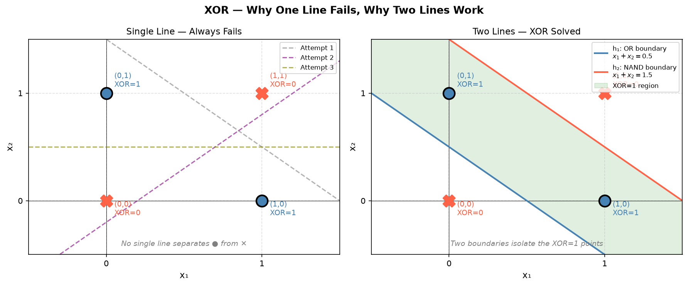
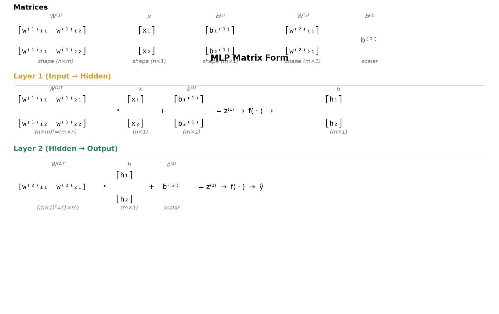
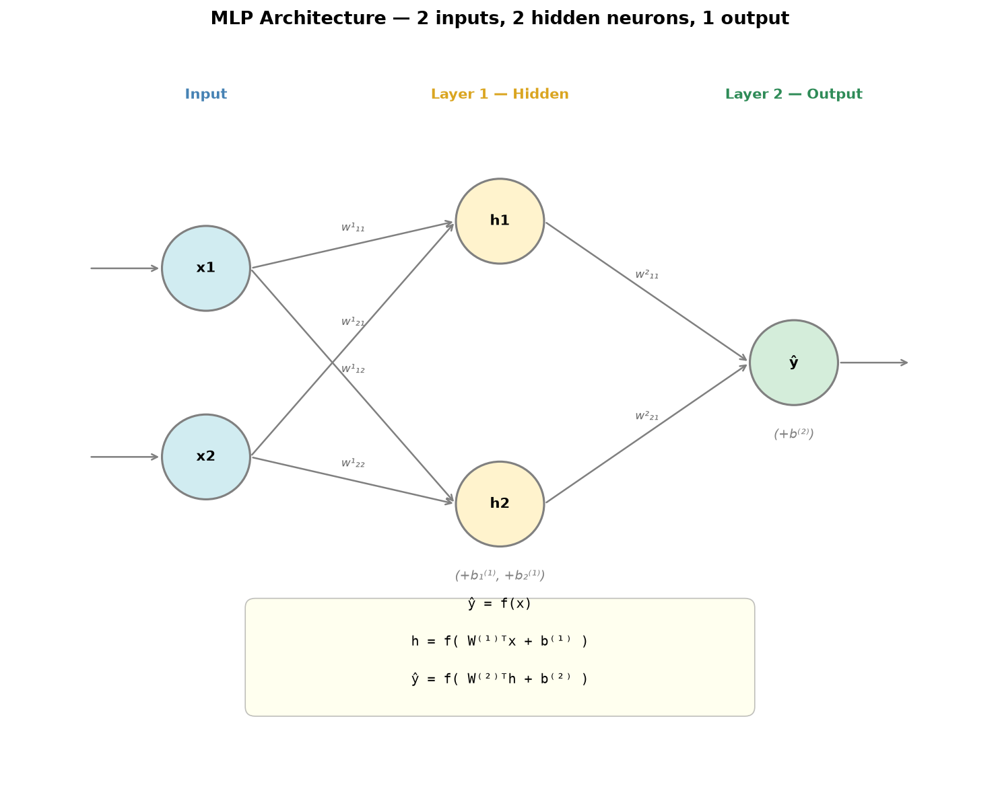
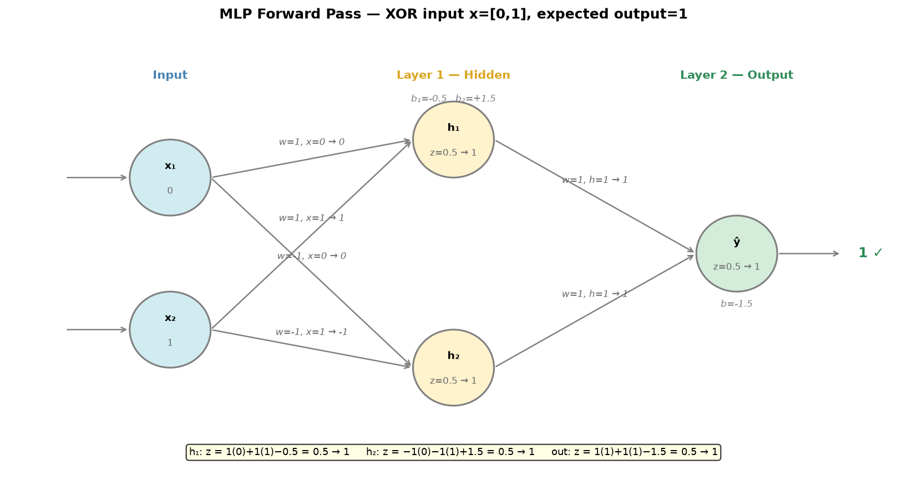
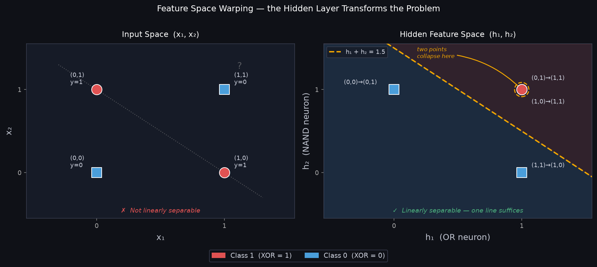
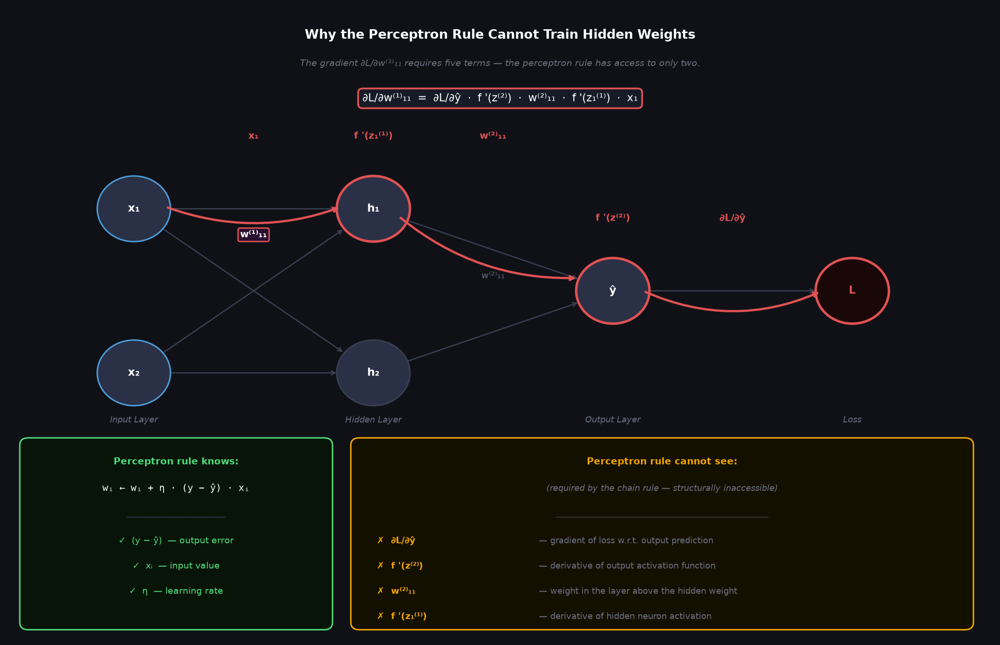
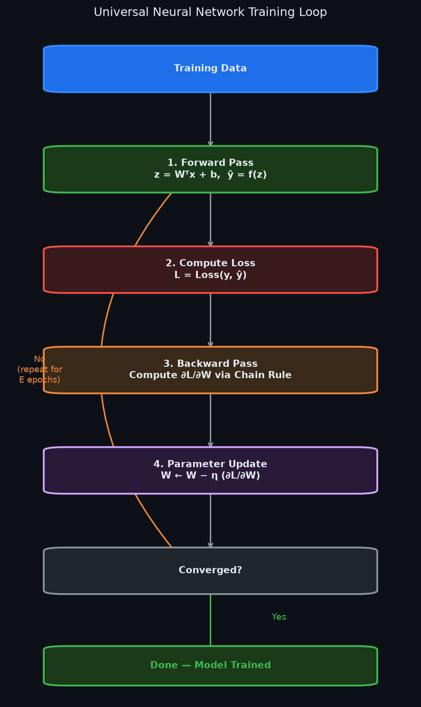
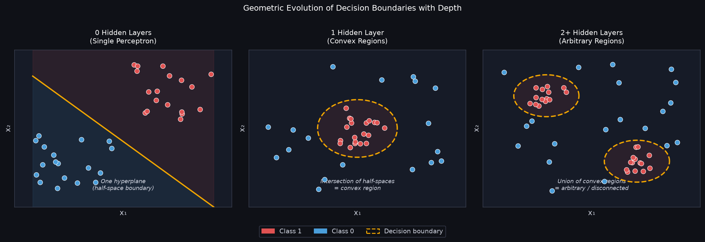
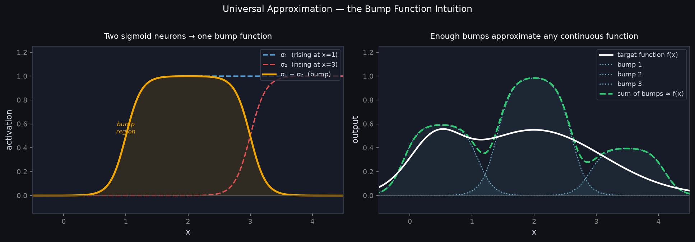

# 03 — Multilayer Perceptron (MLP)

---

## Part 1: From XOR Failure to the Solution

Note 02 ended with an algebraic and geometric proof: no single straight line can separate the XOR function. A single perceptron is fundamentally constrained to linear decision boundaries:

```
ŷ = f(w₁x₁ + w₂x₂ + b)
```

The question is: what if we use **more than one line**?

### XOR Revisited — Two Lines Solve It

Recall the XOR truth table and coordinate plane:

```
x₂
 1 │  ● (0,1)     ○ (1,1)
   │
 0 │  ○ (0,0)     ● (1,0)
   └────────────────────── x₁
      0           1

● = XOR = 1  (Class 1)
○ = XOR = 0  (Class 0)
```

No single straight line can isolate the two `●` points from the two `○` points. However, two lines working together can sandwich the positive points between them:

```
x₂
 1 │  ● (0,1)     ○ (1,1)
   │         ╲   ╱
   │          ╲ ╱   ← two decision boundaries form a bounded region
   │           ╳
 0 │  ○ (0,0) ╱ ╲ ● (1,0)
   └────────────────────── x₁
      0           1

Line 1: Separates (0,0) from the rest   (x₁ + x₂ = 0.5)
Line 2: Separates (1,1) from the rest   (x₁ + x₂ = 1.5)
Enclosed region: Only (0,1) and (1,0) fall inside → XOR = 1
```

Each line is computed by an individual artificial neuron. To generate two lines simultaneously, we need two neurons operating in parallel on the inputs — forming a **hidden layer**.



### Why This Requires Layers

A single neuron draws one decision boundary. To combine multiple boundaries into an enclosed region, computation must happen in successive stages:

```
Stage 1: Two neurons each draw an independent boundary  ← Hidden Layer
Stage 2: One neuron combines their decisions            ← Output Layer

        ┌──► [ Hidden Neuron 1: Line 1 ] ──┐
Input ──┤                                  ├──► [ Output Neuron: Combine ] ──► ŷ
        └──► [ Hidden Neuron 2: Line 2 ] ──┘
```

This hierarchical structure is the **Multilayer Perceptron (MLP)**.

---

## Part 2: MLP Architecture

A Multilayer Perceptron (MLP) — also termed a **Feedforward Neural Network** — consists of artificial neurons organised into discrete layers, with signals flowing strictly unidirectionally from input to output (no cycles or loops).

### Layers and Terminology

```
INPUT LAYER             HIDDEN LAYER            OUTPUT LAYER
(data, no compute)     (feature learning)      (task prediction)

                         ┌──── h₁ ────┐
          x₁ ────────────┤            ├──── ŷ
                         │            │
          x₂ ────────────┤            │
                         └──── h₂ ────┘
```

Every input connects to every hidden neuron, and every hidden neuron connects to every output neuron. This is called a **fully connected** (or **dense**) layer.

Only layers that perform mathematical transformations are counted as computational layers:

| Layer | Computational Role | Learnable Parameters |
|---|---|---|
| **Input Layer** | Transmits the raw feature vector x. Performs no computation. | None |
| **Layer 1 — Hidden** | Computes intermediate activations h = f(W⁽¹⁾ᵀx + b⁽¹⁾). Learns new representations. | W⁽¹⁾, b⁽¹⁾ |
| **Layer 2 — Output** | Computes the final prediction ŷ = f(W⁽²⁾ᵀh + b⁽²⁾). | W⁽²⁾, b⁽²⁾ |

> **Layer Counting Convention:** This architecture is designated a **2-layer network** (1 hidden layer + 1 output layer). The input is not counted because it has no weights or activation function. Superscripts W⁽¹⁾ and W⁽²⁾ index the computational layers.
>
> *(Note: Some older introductory texts count the input group and refer to this as a 3-layer network. In modern deep learning literature, only parameterized layers are counted).*

---

### Individual Weight Indexing

To avoid ambiguity, we establish a consistent indexing convention across all notes:

```
w⁽ˡ⁾ᵢⱼ  =  weight in layer l, from neuron i (layer l-1) to neuron j (layer l)
```

For our network with 2 inputs, 2 hidden neurons, and 1 output neuron:

```
Layer 1 Weights (Input → Hidden):         Layer 2 Weights (Hidden → Output):

  x₁ → h₁ :  w⁽¹⁾₁₁                       h₁ → ŷ :  w⁽²⁾₁₁
  x₁ → h₂ :  w⁽¹⁾₁₂                       h₂ → ŷ :  w⁽²⁾₂₁
  x₂ → h₁ :  w⁽¹⁾₂₁
  x₂ → h₂ :  w⁽¹⁾₂₂
```

Each neuron computes a scalar pre-activation z (weighted sum plus bias), followed by an activation f(z):

```
Hidden Layer:
  z₁⁽¹⁾ = w⁽¹⁾₁₁·x₁ + w⁽¹⁾₂₁·x₂ + b₁⁽¹⁾   →   h₁ = f(z₁⁽¹⁾)
  z₂⁽¹⁾ = w⁽¹⁾₁₂·x₁ + w⁽¹⁾₂₂·x₂ + b₂⁽¹⁾   →   h₂ = f(z₂⁽¹⁾)

Output Layer:
  z⁽²⁾  = w⁽²⁾₁₁·h₁ + w⁽²⁾₂₁·h₂ + b⁽²⁾    →   ŷ  = f(z⁽²⁾)
```

---

### Matrix Form (Single Sample)

Expressing equations neuron-by-neuron does not scale to networks with thousands of units. We assemble inputs, weights, and biases into vectors and matrices.

With wᵢⱼ indexed as **source i → destination j**:
* Row i of W⁽¹⁾ contains all weights fanning out from input xᵢ.
* Column j of W⁽¹⁾ contains all weights arriving at hidden neuron hⱼ.

```
W⁽¹⁾ = ⎡w⁽¹⁾₁₁  w⁽¹⁾₁₂⎤,   x = ⎡x₁⎤,   b⁽¹⁾ = ⎡b₁⁽¹⁾⎤
       ⎣w⁽¹⁾₂₁  w⁽¹⁾₂₂⎦       ⎣x₂⎦          ⎣b₂⁽¹⁾⎦
```

Because weights into neuron j form column j of W⁽¹⁾, transposing the weight matrix turns column j into row j:

```
W⁽¹⁾ᵀ = ⎡w⁽¹⁾₁₁  w⁽¹⁾₂₁⎤
        ⎣w⁽¹⁾₁₂  w⁽¹⁾₂₂⎦

z⁽¹⁾ = W⁽¹⁾ᵀx + b⁽¹⁾
     = ⎡w⁽¹⁾₁₁  w⁽¹⁾₂₁⎤ ⎡x₁⎤ + ⎡b₁⁽¹⁾⎤
       ⎣w⁽¹⁾₁₂  w⁽¹⁾₂₂⎦ ⎣x₂⎦   ⎣b₂⁽¹⁾⎦
     = ⎡w⁽¹⁾₁₁·x₁ + w⁽¹⁾₂₁·x₂ + b₁⁽¹⁾⎤
       ⎣w⁽¹⁾₁₂·x₁ + w⁽¹⁾₂₂·x₂ + b₂⁽¹⁾⎦

h = f(z⁽¹⁾) = ⎡f(z₁⁽¹⁾)⎤
              ⎣f(z₂⁽¹⁾)⎦
```

For Layer 2 (with 2 hidden units and 1 output):

```
W⁽²⁾ = ⎡w⁽²⁾₁₁⎤   →   W⁽²⁾ᵀ = [w⁽²⁾₁₁  w⁽²⁾₂₁]   (1×2 row vector)
       ⎣w⁽²⁾₂₁⎦

z⁽²⁾ = W⁽²⁾ᵀh + b⁽²⁾
     = [w⁽²⁾₁₁  w⁽²⁾₂₁] ⎡h₁⎤ + b⁽²⁾
                         ⎣h₂⎦
     = w⁽²⁾₁₁·h₁ + w⁽²⁾₂₁·h₂ + b⁽²⁾

ŷ = f(z⁽²⁾)
```



> **Notation Check across Textbooks:**
> * Some textbooks (e.g., Goodfellow et al., Bishop) index weights as wⱼᵢ (destination j, source i). Under that convention, row j stores weights entering neuron j, allowing the matrix-vector product to be written directly as Wx without a transpose.
> * Both conventions describe the exact same underlying arithmetic. Here, we use wᵢⱼ (source → destination) because it traces the forward flow of signals naturally.

---

### Architecture Diagram

The complete architecture with parameter dimensions and signal routing is shown below:



---

## Part 3: Forward Pass & Feature Space Warping

The forward pass computes layer by layer — each layer calculates a weighted sum followed by an activation function, and its output feeds directly as the input to the next layer.

### Forward Pass Equations

Hidden Layer (Layer 1):
```
z⁽¹⁾ = W⁽¹⁾ᵀx + b⁽¹⁾       ← weighted sum for all hidden neurons
h    = f(z⁽¹⁾)              ← activation applied element-wise
```

Output Layer (Layer 2):
```
z⁽²⁾ = W⁽²⁾ᵀh + b⁽²⁾       ← weighted sum for output neuron
ŷ    = f(z⁽²⁾)              ← activation produces final prediction
```

In deeper networks, this exact two-step pattern repeats layer by layer: each layer computes `z = Wᵀ(input) + b` followed by `f(z)`, passing its activations forward until the output layer is reached.


---

### Worked Numerical Example: Solving XOR

To demonstrate the forward pass end-to-end, we evaluate a 2-2-1 MLP on all four XOR inputs. 
For clarity of arithmetic, we use the **Heaviside step activation** (`f(z) = 1` if `z ≥ 0`, else `0`). (Continuous activations like Sigmoid and ReLU are covered in full in Note 04).

**Pre-set Network Parameters:**
* Hidden neuron h₁ (learns OR boundary): `w₁ = [1, 1],  b₁ = -0.5`
* Hidden neuron h₂ (learns NAND boundary): `w₂ = [-1, -1], b₂ = 1.5`
* Output neuron ŷ (learns AND of h₁, h₂): `w = [1, 1],  b = -1.5`

```
W⁽¹⁾ = ⎡ 1  -1⎤,   b⁽¹⁾ = ⎡-0.5⎤,   W⁽²⁾ = ⎡1⎤,   b⁽²⁾ = -1.5
       ⎣ 1  -1⎦           ⎣ 1.5⎦           ⎣1⎦
```

---

#### Step-by-Step Evaluation for All 4 Cases

**Case 1: x = [0, 0], Target y = 0**
```
h₁:  z = 1(0) + 1(0) - 0.5 = -0.5   →  h₁ = 0
h₂:  z = -1(0) - 1(0) + 1.5 = 1.5   →  h₂ = 1
out: z = 1(0) + 1(1) - 1.5 = -0.5   →  ŷ  = 0  ✓
```

**Case 2: x = [0, 1], Target y = 1**
```
h₁:  z = 1(0) + 1(1) - 0.5 = 0.5    →  h₁ = 1
h₂:  z = -1(0) - 1(1) + 1.5 = 0.5   →  h₂ = 1
out: z = 1(1) + 1(1) - 1.5 = 0.5    →  ŷ  = 1  ✓
```

**Case 3: x = [1, 0], Target y = 1**
```
h₁:  z = 1(1) + 1(0) - 0.5 = 0.5    →  h₁ = 1
h₂:  z = -1(1) - 1(0) + 1.5 = 0.5   →  h₂ = 1
out: z = 1(1) + 1(1) - 1.5 = 0.5    →  ŷ  = 1  ✓
```

**Case 4: x = [1, 1], Target y = 0**
```
h₁:  z = 1(1) + 1(1) - 0.5 = 1.5    →  h₁ = 1
h₂:  z = -1(1) - 1(1) + 1.5 = -0.5  →  h₂ = 0
out: z = 1(1) + 1(0) - 1.5 = -0.5   →  ŷ  = 0  ✓
```

Every output matches the true target label. The 2-layer MLP has successfully solved XOR.



---

### What Actually Happened: Feature Space Warping (Representation Learning)

Look carefully at what the hidden layer did to the data. It transformed the raw input coordinates (x₁, x₂) into a new internal feature space (h₁, h₂):

| Raw Input x = (x₁, x₂) | Hidden Features h = (h₁, h₂) | True Label y |
|---|---|---|
| (0, 0) | (0, 1) | 0 |
| (0, 1) | **(1, 1)** | **1** |
| (1, 0) | **(1, 1)** | **1** |
| (1, 1) | (1, 0) | 0 |



The left panel shows the original input space — no single straight line can separate the red points from the blue. The right panel shows what the hidden layer produced: a completely different coordinate system in which the problem is trivially solved by one line.

Three things happened:

1. In the original (x₁, x₂) space, the two positive points (0,1) and (1,0) sit on opposite corners of the square — no line can isolate them.
2. The hidden layer **collapsed both positive points to the exact same location (1,1)** in (h₁, h₂) space. Two geometrically distant points became identical.
3. In the new space, the output neuron only needs to draw one straight line (`h₁ + h₂ = 1.5`) to classify everything correctly.

The hidden layer did not find a clever boundary in the original space. It **changed the space itself**.

### The Geometry of What the Hidden Layer Did

Each hidden neuron applies a weighted sum followed by a non-linear activation. Geometrically, this is a **coordinate transformation** — it takes the input points and repositions them in a new space defined by the neuron's learned weights.

In this example:
- h₁ computes OR: it fires whenever at least one input is 1
- h₂ computes NAND: it fires unless both inputs are 1

The network was never told to compute OR or NAND. It discovered these two derived quantities on its own because they are exactly the intermediate representations that make XOR linearly separable. The weights encode a learned change of coordinates.

This is the geometric meaning of the term **representation learning**: the network learns a new way to represent the data — a new coordinate system — in which the task becomes easy.

### Why This Is the Defining Difference from Traditional Machine Learning

In traditional machine learning, a human engineer looks at the problem and manually constructs features:

```
Traditional ML pipeline:

  Raw data  ──►  Human designs features  ──►  Linear classifier  ──►  Prediction
                 (domain expertise,                (learned)
                  trial and error)
```

For XOR, a human might think: "I'll add a feature h = x₁ XOR x₂" — but that is circular. In practice, for images, audio, or language, no one knows what the right features are. Decades of research in computer vision were spent hand-crafting edge detectors, texture descriptors, and shape features.

Deep learning replaces this entirely:

```
Deep learning pipeline:

  Raw data  ──►  Network learns features  ──►  Linear classifier  ──►  Prediction
                 (hidden layers,                (output layer,
                  learned from data)             learned)
```

The hidden layers are a **learned feature extractor**. The output layer is always, in effect, a linear classifier — but it operates on a representation that the network itself has warped into a linearly separable form.

This is why depth matters. Each additional hidden layer applies another learned coordinate transformation, progressively warping the representation until the task is linearly separable at the final layer. In a deep network trained on images:

```
Layer 1:   raw pixels  ──►  edges and orientations
Layer 2:   edges       ──►  textures and corners
Layer 3:   textures    ──►  object parts
Layer 4:   parts       ──►  full objects
Output:    objects     ──►  linear classification
```

No human specified any of these intermediate representations. The network discovered them because they are the transformations that make the final classification linearly separable.

> **Core Insight:** A multilayer neural network does not fit a complex boundary in the original input space. It applies a sequence of learned coordinate transformations — one per hidden layer — that progressively warp the geometry of the data until the task is linearly separable. The output layer then draws a single hyperplane in this learned space.
>
> The hidden layers learn the representation. The output layer uses it. This division of labour is what separates deep learning from every approach that came before it.

---

## Part 4: The Training Problem & Credit Assignment

We have verified that a 2-layer MLP can represent and execute non-linear functions like XOR. However, in our worked example, the weights and biases were **manually supplied**.

In real-world deep learning, we cannot hand-craft millions of weights. They must be learned automatically from data.

### Why the Perceptron Learning Rule Fails on MLPs

Recall the Perceptron Learning Rule from Note 02:

```
wᵢ ← wᵢ + η × (y - ŷ) × xᵢ
```

This rule works for a single perceptron because the error `(y - ŷ)` is directly and linearly coupled to weight `wᵢ`. If the output is wrong, we know exactly how much each weight contributed to the discrepancy.

In an MLP, this direct link is severed. To see why, write out what it would mean to apply the perceptron rule to a hidden weight — say `w⁽¹⁾₁₁`, the weight from input x₁ to hidden neuron h₁:

```
Forward pass (2-2-1 network):

  z₁⁽¹⁾ = w⁽¹⁾₁₁·x₁ + w⁽¹⁾₂₁·x₂ + b₁⁽¹⁾
  h₁    = f(z₁⁽¹⁾)
  z⁽²⁾  = w⁽²⁾₁₁·h₁ + w⁽²⁾₂₁·h₂ + b⁽²⁾
  ŷ     = f(z⁽²⁾)
```

The loss L depends on ŷ, which depends on z⁽²⁾, which depends on h₁, which depends on z₁⁽¹⁾, which depends on w⁽¹⁾₁₁. By the chain rule:

```
∂L/∂w⁽¹⁾₁₁ = dL/dŷ · ∂ŷ/∂z⁽²⁾ · ∂z⁽²⁾/∂h₁ · ∂h₁/∂z₁⁽¹⁾ · ∂z₁⁽¹⁾/∂w⁽¹⁾₁₁
            = dL/dŷ · f'(z⁽²⁾) · w⁽²⁾₁₁ · f'(z₁⁽¹⁾) · x₁
```



The perceptron rule has no access to any of these terms. It only knows `(y - ŷ)` and `xᵢ`. It cannot compute `f'(z⁽²⁾)` — the derivative of the output activation. It cannot compute `w⁽²⁾₁₁` — the weight in the layer above. It cannot compute `f'(z₁⁽¹⁾)` — the derivative of the hidden activation. The rule is structurally blind to everything between the hidden weight and the output error.

This is not a fixable limitation of the perceptron rule — it is a fundamental consequence of the network having intermediate layers. The error signal at the output must be **propagated backwards** through every layer to reach the hidden weights, accounting for each layer's contribution along the way.

This fundamental challenge is known as the **Credit Assignment Problem**:

> **The Credit Assignment Problem:** How do we distribute responsibility (credit or blame) for the final prediction error back to the internal hidden weights that have no direct connection to the output?

---

### Why This Was Historically Hard — The AI Winter

The credit assignment problem was identified in the 1960s. Minsky and Papert's 1969 book *Perceptrons* proved formally that single-layer networks could not solve non-linearly separable problems like XOR, and cast serious doubt on whether multilayer networks could ever be trained efficiently. Neural network research funding collapsed. This was the beginning of the first **AI Winter** — roughly 1969 to 1986.

Backpropagation — the algorithm that solves the credit assignment problem — was known in various forms as early as the 1970s (Werbos, 1974) and was clearly articulated for neural networks by Rumelhart, Hinton, and Williams in 1986. The algorithm itself was not the bottleneck.

What was missing was everything else:

```
1970s–1980s:   Backpropagation known, but —
  ✗ No large labelled datasets (ImageNet didn't exist until 2009)
  ✗ No GPU compute (training deep nets took weeks on CPUs)
  ✗ No good activation functions (sigmoid vanishing gradient killed depth)
  ✗ No good weight initialisation (networks failed to train beyond ~3 layers)
  ✗ No regularisation techniques (deep nets overfit immediately)

2006–2012:     Hinton, LeCun, Bengio revive deep learning —
  ✓ Unsupervised pre-training as initialisation (Hinton, 2006)
  ✓ ReLU activation eliminates vanishing gradient (Nair & Hinton, 2010)
  ✓ GPU training makes large networks feasible
  ✓ ImageNet provides scale

2012:          AlexNet wins ImageNet by a 10-point margin — the modern era begins
```

The lesson is that backpropagation alone was not sufficient. The algorithm required the right activation functions, the right loss functions, sufficient data, and sufficient compute to work in practice. Notes 04, 05, and 06 develop exactly these components.

---

### The Three Pillars of Modern Neural Network Training

To solve the credit assignment problem, three mathematical components must work together. Each one is necessary; none is sufficient alone.

**Pillar 1 — Continuous Loss Function** `→ Note 05`

Replace discrete 0/1 misclassification with a smooth, differentiable scalar L(y, ŷ) that measures prediction error as a real number. This gives backpropagation a starting gradient ∂L/∂ŷ at the output layer.

> Without it: no gradient exists at the output — backpropagation has no signal to start from. Nothing propagates backwards.

**Pillar 2 — Differentiable Activation Functions** `→ Note 04`

Replace the Heaviside step function (derivative = 0 everywhere) with smooth non-linearities — Sigmoid, Tanh, ReLU — that have informative f'(z) at every point. This allows the chain rule to pass gradients through each hidden layer.

> Without it: the chain rule multiplies by zero at every hidden layer — gradients vanish immediately and no hidden weight ever receives an update.

**Pillar 3 — Backpropagation & Gradient Descent** `→ Note 06`

Apply the chain rule backwards from output to input, computing ∂L/∂W for every parameter in one efficient pass. Then update every weight: W ← W − η(∂L/∂W).

> Without it: even with a good loss and smooth activations, there is no algorithm to compute how each hidden weight should change.

The interdependence matters. A smooth loss with a step activation gives a starting gradient that immediately becomes zero at the first hidden layer — nothing reaches the hidden weights. A differentiable activation with a discrete loss gives no gradient to start propagating. All three must be present simultaneously.

---

### The Universal Neural Network Training Loop

Once these three pillars are in place, training any feedforward network follows this iterative loop:

The diagram below shows the four steps that repeat every epoch until convergence.



**Step 1 — Forward Pass:** The input is fed through the network layer by layer. Each layer computes `z = Wᵀ(input) + b` then `h = f(z)`, passing activations forward. The final layer produces the prediction ŷ. All intermediate values z and h are stored — they will be needed in the backward pass.

**Step 2 — Compute Loss:** The prediction ŷ is compared to the true label y using the loss function. This produces a single scalar L — the height of the loss surface at the current weight configuration. A lower L means the network is closer to correct.

**Step 3 — Backward Pass:** Starting from ∂L/∂ŷ at the output, the chain rule is applied layer by layer in reverse — output → last hidden → ... → first hidden. Each layer's gradient is computed using the stored activations from the forward pass. The result is ∂L/∂W for every weight in the network simultaneously.

**Step 4 — Parameter Update:** Every weight is nudged in the direction that reduces L: `W ← W − η(∂L/∂W)`. The learning rate η controls the step size. Too large and the update overshoots; too small and training is impractically slow.

**Epoch:** One full pass through the entire training dataset. The loop repeats for E epochs — or until the loss stops decreasing (convergence). In practice, a network may be trained for hundreds or thousands of epochs on millions of examples before the weights stabilise.

Notes 04, 05, and 06 develop each of the three pillars with full mathematical rigour.

---

## Part 5: Representation Power & The Universal Approximation Theorem

### Geometric Evolution of Decision Boundaries

How does representational capacity change as we increase depth?



* **0 Hidden Layers (Perceptron):** A single neuron computes one weighted sum and applies one threshold. The decision boundary is a single flat hyperplane — it partitions the entire input space into exactly two half-spaces. Nothing more complex is possible.

* **1 Hidden Layer:** Each hidden neuron draws one hyperplane. The output neuron receives all hidden activations and computes a weighted combination of them — effectively taking the **intersection** (logical AND) of the regions defined by each hidden neuron. The intersection of half-spaces is always a convex set: any two points inside the region can be connected by a straight line that stays inside the region. This is why a 1-hidden-layer network can form convex polyhedra or smooth convex blobs, but cannot form a donut, an L-shape, or two disconnected islands.

* **2+ Hidden Layers:** The second hidden layer receives the convex regions produced by the first and computes weighted combinations of those — effectively taking **unions** (logical OR) of multiple convex regions. The union of convex sets is not generally convex. This is what breaks the convexity constraint: the network can now represent disconnected regions, non-convex shapes, and arbitrarily complex manifolds.

---

### The Universal Approximation Theorem

Can a network with just one hidden layer represent *any* mathematical function?

> **Universal Approximation Theorem (Cybenko, 1989; Hornik, 1991):**
> A feedforward network with a single hidden layer containing a finite number of neurons can approximate any continuous function on a compact (closed and bounded) subset of ℝⁿ to arbitrary precision, given a suitable non-linear activation function:
>
> `| F(x) - f(x) | < ε`  for all `x`
>
> *(Here F denotes the network's output function and f the target function — both distinct from the activation function used elsewhere in this note.)*

#### What the Theorem Means — and What it Does NOT Mean

* **What it guarantees:** Mathematical **existence**. A 1-hidden-layer network is expressive enough in principle to represent any continuous function.
* **What it does NOT guarantee:**
  1. **Efficiency (Width explosion):** The theorem requires a *finite* number of neurons, but that number can be impractically, astronomically large for complex tasks.
  2. **Learnability:** The theorem states that good weights *exist*; it provides no algorithm to find them.
  3. **Generalisation:** A shallow network with massive width easily memorises training data (overfitting) rather than learning the underlying function.

#### Why the Theorem Is True — The Bump Function Intuition

The theorem is not just a formal result — there is a concrete constructive argument for why it holds.

A single sigmoid neuron with a steep slope approximates a step function — it transitions sharply from 0 to 1 at a location controlled by its bias. Take two such neurons with opposite signs and subtract them:

```
bump(x) = σ(w·x + b₁) − σ(w·x + b₂),   with b₁ > b₂
```

The condition b₁ > b₂ ensures the left sigmoid rises before the right one falls, producing a positive bump. With a large weight w, this produces a narrow bump — a function that is near 1 in a small interval and near 0 everywhere else. The position of the bump is set by b₁ and b₂; its width is controlled by w.

Now tile the input domain with enough bumps, each scaled to the correct height:

```
F(x) ≈ Σₖ aₖ · bumpₖ(x)
```

This is a weighted sum of localised bumps — which is exactly what a single hidden layer computes. Each pair of neurons contributes one bump; the output neuron weights them. With enough neurons, the bumps can be made narrow enough and numerous enough to approximate any continuous shape to within ε.



The left panel shows how two sigmoid neurons with opposite signs produce a single localised bump. The right panel shows three bumps of different heights tiling a smooth target function — the weighted sum (green) closely tracks the target (white). More neurons means narrower bumps and a closer approximation.

This is the constructive core of the UAT: any continuous function can be approximated by a weighted sum of bump functions, and a single hidden layer can represent any weighted sum of bumps.

---

### Why Deep Networks? Depth vs. Width

If one hidden layer can approximate any continuous function, why do modern neural networks use deep architectures with many layers instead of just making a single layer extremely wide?

#### 1. Parameter Efficiency

The bump function argument shows that a shallow network *can* approximate any function — but it does so by tiling the input space with local bumps. Each bump covers a small patch and contributes nothing outside it. To cover a high-dimensional input space this way, the number of bumps required grows exponentially with the number of input dimensions. This is the **curse of dimensionality** applied to shallow networks.

A deep network does not tile the space. Instead, each layer builds on the abstractions of the previous layer. The same low-level feature — an edge detector, a phoneme recogniser — can be reused by many higher-level neurons. This **reuse** is what makes depth efficient: a feature learned once in an early layer is available to every neuron in every subsequent layer, at no additional parameter cost.

Formally: there exist functions that a deep network with O(n) parameters can represent, but a shallow network requires O(2ⁿ) parameters to approximate to the same precision (Montufar et al., 2014). Depth provides exponential representational efficiency.

#### 2. Hierarchical Feature Learning

Real-world data is naturally compositional — complex structures are built from simpler ones:

```
Images:    pixels ──► edges ──► textures ──► parts ──► objects
Language:  characters ──► subwords ──► words ──► phrases ──► meaning
Audio:     samples ──► spectral features ──► phonemes ──► words ──► sentences
```

A shallow network must learn to map raw pixels directly to object categories in a single transformation. A deep network mirrors the compositional structure of the data: each layer learns the vocabulary of the next level of abstraction, and each concept is defined in terms of the concepts below it.

This is why features learned by deep networks are interpretable in a way that shallow network features are not — they correspond to real levels of structure in the data, not arbitrary local patches.

#### 3. The Reuse Argument in Detail

Consider recognising the digit 8 and the digit 0. Both contain circular arcs. In a shallow network, the neurons responsible for detecting 8 and the neurons responsible for detecting 0 must each independently learn to detect circular arcs — duplicating the same computation. In a deep network, a single early-layer neuron learns to detect circular arcs, and both the 8-detector and the 0-detector in later layers simply reference it.

```
Shallow network:
  Neuron for 8:   learns arcs + learns loops + learns crossings  (all from scratch)
  Neuron for 0:   learns arcs + learns loops                     (all from scratch)

Deep network:
  Layer 1 neuron:   learns arcs                                  (once)
  Layer 2 neuron for 8:   references arc neuron + learns crossings
  Layer 2 neuron for 0:   references arc neuron + learns closure
```

This reuse compounds across layers. In a network with L layers and n neurons per layer, a single primitive feature learned in layer 1 can be referenced by all n neurons in layer 2, all n² combinations in layer 3, and so on. The representational leverage of depth grows exponentially with the number of layers.

---

## Summary

```
CHARACTERISTIC         SINGLE PERCEPTRON             MULTILAYER PERCEPTRON (MLP)
─────────────────────  ────────────────────────────  ───────────────────────────────
Layer Architecture     1 Layer (output only)         2+ Layers (1+ hidden, 1 output)
Decision Boundary      Single flat hyperplane        Complex non-convex, closed regions
Linearity Collapse     Single layer — no collapse     Overcome by non-linear activations
XOR Capability         Cannot solve (linear only)    Solves XOR (folds feature space)
Representation Power   Linearly separable functions  Universal approximator (Cybenko, 1989)
Parameter Learning     Perceptron Learning Rule      Backpropagation + Gradient Descent
Activation Function    Heaviside Step function       Smooth differentiable (ReLU, Sigmoid)
```

*(Note: Layer counts include computational layers only — the input vector x is not counted as a layer).*

### Key Takeaways

1. **Why Layers:** A single neuron computes one linear boundary. By stacking neurons in a hidden layer and combining them in an output layer, networks construct closed and arbitrary decision regions.
2. **Non-Linear Activations:** As established in Note 02, non-linear activation functions between layers are essential to prevent the network from collapsing into an equivalent single linear model.
3. **Representation Warping:** The hidden layer solves non-linear tasks (like XOR) by transforming the coordinate space such that the data becomes linearly separable by the time it reaches the output neuron.
4. **Universal Approximation:** A network with a single hidden layer can approximate any continuous function to arbitrary precision, but may require exponential width. Deep networks achieve equal or greater expressive power with exponentially fewer parameters through hierarchical feature reuse.
5. **The Training Hurdle:** The Perceptron Learning Rule cannot train hidden layers due to the credit assignment problem. Training deep networks requires smooth activations (Note 04), differentiable loss functions (Note 05), and backpropagation via the chain rule (Note 06).
