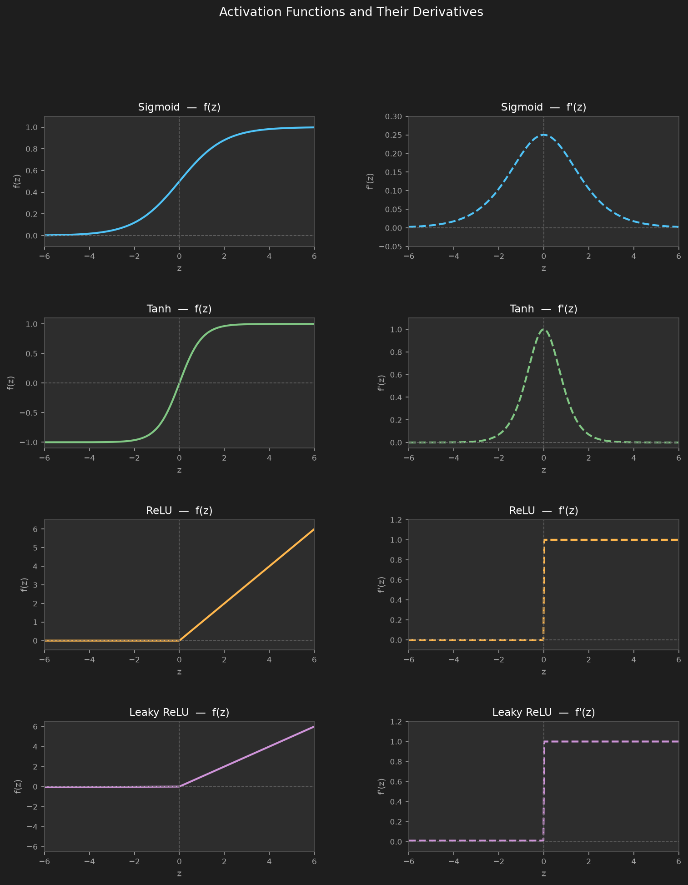
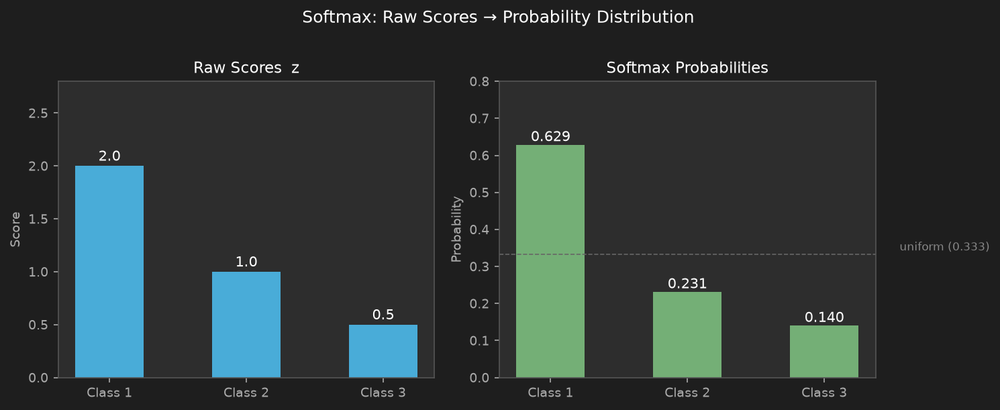

# 04 — Activation Functions

---

## Part 1: Why Activation Functions Exist

A neural network without non-linear activation functions is not a deep model — it is a single linear transformation wearing a disguise.

Stacking linear layers collapses to one layer regardless of depth:

```
Layer 1:   z₁ = W₁x + b₁
Layer 2:   z₂ = W₂z₁ + b₂
                = W₂(W₁x + b₁) + b₂
                = (W₂W₁)x + (W₂b₁ + b₂)
                = Wx + b          ← single linear transformation
```

No matter how many layers you stack, the result is always `Wx + b`. The network can only ever draw a single hyperplane as its decision boundary. Depth is meaningless. This is the linearity collapse problem established in **Note 02** and carried forward through **Note 03**.

Non-linear activation functions break this collapse. Applied after each weighted sum, they introduce curvature into the computation — allowing the network to represent functions that no single linear transformation can.

```
Without activation:   x → [L1] → [L2] → [L3] → ŷ   ≡   x → [Wx + b] → ŷ
With activation:      x → [L1] → f → [L2] → f → [L3] → ŷ   ← genuinely deep
```

Three properties are required of any activation function used in training:

- **Non-linearity** — breaks the collapse, enables complex decision boundaries
- **Differentiability** — gradient descent requires ∂f/∂z to exist and be informative
- **Computational efficiency** — applied millions of times per training step, must be fast

### Why Differentiability is Non-Negotiable

Training a network means computing ∂L/∂w for every weight via the chain rule — layer by layer, backwards from the output. Each layer contributes its activation derivative f'(z) as a multiplicative factor in that chain.

The perceptron (Note 02) used the Heaviside step function:

```
f(z) = 1  if z ≥ 0
f(z) = 0  if z < 0

f'(z) = 0  everywhere (undefined at z = 0)
```

This was fine for a single perceptron because the perceptron learning rule does not use gradients — it only uses the output error directly. But the moment hidden layers exist and backpropagation must carry a gradient signal backwards, the step function breaks everything:

```
Chain rule for a hidden weight w⁽¹⁾:

  ∂L/∂w⁽¹⁾ = dL/dŷ · f'(z⁽²⁾) · w⁽²⁾ · f'(z⁽¹⁾) · x
            = dL/dŷ · f'(z⁽²⁾) · w⁽²⁾ · 0 · x
            = 0
```

The zero from f'(z⁽¹⁾) kills the entire product. No gradient reaches the hidden weight — not because the network is wrong, but because the activation function has no slope to carry the signal back through. Every hidden weight receives a zero update, every epoch, forever.

> Differentiability is not a mathematical nicety — it is the mechanism by which the output error is translated into weight updates throughout the network. Without it, backpropagation has nothing to propagate.

A fourth desirable property — not always achievable — is that gradients remain informative across a wide range of input values. When they do not, training stalls. This is the **vanishing gradient problem**, and it is the central failure mode of the early activation functions.

---

## Part 2: Sigmoid

### Formula

```
σ(z) = 1 / (1 + e⁻ᶻ)
```

### Shape and Derivative

The sigmoid squashes any real number into the range (0, 1). At z = 0, σ(0) = 0.5. As z → +∞, σ → 1. As z → −∞, σ → 0.

The following plot shows the sigmoid function (left) and its derivative (right):



### Deriving the Derivative

Starting from σ(z) = (1 + e⁻ᶻ)⁻¹, apply the chain rule:

```
dσ/dz = −1 · (1 + e⁻ᶻ)⁻² · (−e⁻ᶻ)
       = e⁻ᶻ / (1 + e⁻ᶻ)²
```

Now rewrite the numerator by adding and subtracting 1:

```
e⁻ᶻ / (1 + e⁻ᶻ)²  =  (1 + e⁻ᶻ − 1) / (1 + e⁻ᶻ)²
                    =  1/(1 + e⁻ᶻ)  −  1/(1 + e⁻ᶻ)²
                    =  σ(z)  −  σ(z)²
                    =  σ(z) · (1 − σ(z))
```

So:

```
dσ/dz = σ(z) · (1 − σ(z))
```

This is elegant — the derivative is expressed entirely in terms of the output itself, which is already computed during the forward pass. No extra computation is needed.

At z = 0: dσ/dz = 0.5 × 0.5 = 0.25 — its maximum value. The derivative always lies in (0, 0.25).

### Worked Example

```
z = 2.0

σ(2.0) = 1 / (1 + e⁻²·⁰)
        = 1 / (1 + 0.1353)
        = 1 / 1.1353
        = 0.8808

dσ/dz  = 0.8808 × (1 − 0.8808)
        = 0.8808 × 0.1192
        = 0.1050
```

### The Vanishing Gradient Problem

Backpropagation computes gradients by multiplying derivatives layer by layer via the chain rule. Each hidden layer contributes a factor of `dσ/dz` to the gradient flowing back through it:

```
Gradient at layer l = dσ/dz at layer l  ×  gradient from layer l+1
```

The maximum value of `dσ/dz` is 0.25. In a network with L hidden layers:

```
Gradient reaching layer 1  ≈  0.25ᴸ × gradient at output
```

For L = 4 layers:   0.25⁴ = 0.0039
For L = 8 layers:   0.25⁸ ≈ 0.0000153
For L = 10 layers:  0.25¹⁰ ≈ 0.000001

Early layers receive almost no gradient signal. Their weights barely update. The network learns only from its final few layers — the early layers that extract low-level features are frozen in place.

### Additional Problem: Not Zero-Centred

Sigmoid outputs are always positive (range 0 to 1). This means the gradient with respect to the weights of a layer always has the same sign as the upstream gradient — all positive or all negative. Weight updates are forced to move in correlated directions, slowing convergence. Tanh fixes this.

### When to Use Sigmoid

| | |
|---|---|
| ✓ | Output layer for binary classification — output is a probability in (0, 1) |
| ✗ | Hidden layers in deep networks — vanishing gradient, not zero-centred |

---

## Part 3: Tanh

### Formula

```
tanh(z) = (eᶻ − e⁻ᶻ) / (eᶻ + e⁻ᶻ)
```

Tanh maps any real number to the range (−1, 1). At z = 0, tanh(0) = 0. The function is antisymmetric: tanh(−z) = −tanh(z).

### Relationship to Sigmoid

Tanh is a rescaled and shifted sigmoid. Starting from the sigmoid formula:

```
σ(z) = 1 / (1 + e⁻ᶻ)

2σ(2z) = 2 / (1 + e⁻²ᶻ)

2σ(2z) − 1 = 2 / (1 + e⁻²ᶻ)  −  1
            = (2 − (1 + e⁻²ᶻ)) / (1 + e⁻²ᶻ)
            = (1 − e⁻²ᶻ) / (1 + e⁻²ᶻ)

Multiply numerator and denominator by eᶻ:

            = (eᶻ − e⁻ᶻ) / (eᶻ + e⁻ᶻ)
            = tanh(z)
```

So `tanh(z) = 2σ(2z) − 1`. Tanh is sigmoid stretched vertically by 2 and shifted down by 1.

### Deriving the Derivative

```
d(tanh)/dz = d/dz [ (eᶻ − e⁻ᶻ) / (eᶻ + e⁻ᶻ) ]
```

Apply the quotient rule with u = eᶻ − e⁻ᶻ and v = eᶻ + e⁻ᶻ:

```
= (v · du/dz − u · dv/dz) / v²

du/dz = eᶻ + e⁻ᶻ = v
dv/dz = eᶻ − e⁻ᶻ = u

= (v² − u²) / v²
= 1 − (u/v)²
= 1 − tanh²(z)
```

So:

```
d(tanh)/dz = 1 − tanh²(z)
```

At z = 0: derivative = 1 − 0² = 1 — four times larger than sigmoid's maximum of 0.25.

### Worked Example

```
z = 2.0

tanh(2.0) = (e²·⁰ − e⁻²·⁰) / (e²·⁰ + e⁻²·⁰)
           = (7.389 − 0.135) / (7.389 + 0.135)
           = 7.254 / 7.524
           = 0.9640

d(tanh)/dz = 1 − 0.9640²
           = 1 − 0.9293
           = 0.0707
```

### Advantage Over Sigmoid: Zero-Centred

Because tanh outputs are centred at zero (range −1 to 1), gradients with respect to weights can be both positive and negative. This removes the correlated sign problem of sigmoid and allows more efficient weight updates.

### Still Saturates

Despite the zero-centred advantage, tanh still saturates at both ends. For large |z|, the derivative approaches zero:

```
z = 3:   tanh(3) ≈ 0.9951,   derivative ≈ 1 − 0.9903 ≈ 0.0099
z = 5:   tanh(5) ≈ 0.9999,   derivative ≈ 0.0002
```

The vanishing gradient problem is reduced compared to sigmoid but not eliminated. In very deep networks, tanh hidden layers still cause gradient starvation in early layers.

### When to Use Tanh

| | |
|---|---|
| ✓ | Hidden layers when zero-centred outputs matter (e.g., RNNs — **Note 24**) |
| ✓ | Output layer when target range is (−1, 1) |
| ✗ | Deep feedforward hidden layers — ReLU is almost always better |

---

## Part 4: ReLU

### Formula

```
f(z) = max(0, z)
```

If the input is positive, pass it through unchanged. If negative, output zero.

### Derivative

```
f'(z) = 1   if z > 0
f'(z) = 0   if z < 0
f'(z) = undefined at z = 0  (in practice, set to 0)
```

### Worked Example

```
z = 3.5:   f(z) = max(0, 3.5) = 3.5,   f'(z) = 1
z = 0.0:   f(z) = max(0, 0.0) = 0.0,   f'(z) = 0  (by convention)
z = −2.1:  f(z) = max(0, −2.1) = 0.0,  f'(z) = 0
```

### Why ReLU Transformed Deep Learning

ReLU solved the vanishing gradient problem for positive activations. When z > 0, the derivative is exactly 1 — the gradient passes through the layer unchanged. No shrinkage, no saturation.

```
Sigmoid:   gradient × 0.25 × 0.25 × 0.25 × ...   → vanishes exponentially
ReLU:      gradient × 1    × 1    × 1    × ...   → preserved
```

This single property made training deep networks practical. AlexNet (2012), which launched the modern deep learning era, used ReLU throughout its hidden layers.

### Sparse Activation

For any input where z < 0, ReLU outputs exactly zero. In a typical network, roughly 50% of neurons are inactive at any given input. This sparsity has two benefits:

- **Computational efficiency** — zero activations require no further computation downstream
- **Representational efficiency** — only a subset of neurons respond to each input, creating more distinct and separable representations

### The Dying ReLU Problem

ReLU's weakness is the flip side of its strength. When z < 0, the gradient is exactly zero. If a neuron's weighted sum is consistently negative across all training examples — due to a large negative bias or unfortunate weight initialisation — it will never receive a gradient and will never update:

```
Neuron state:   z = wᵀx + b < 0   for all x in training set
Gradient:       0 × upstream_gradient = 0
Weight update:  w ← w + 0 = w     (no change, ever)
```

The neuron is permanently dead. It contributes nothing to the network and cannot be revived by gradient descent. The dying ReLU problem is most severe when the learning rate is too large or biases are initialised to large negative values.

### When to Use ReLU

| | |
|---|---|
| ✓ | Hidden layers in deep feedforward networks — default choice |
| ✓ | Convolutional layers (**Note 20**) |
| ✗ | Output layer — unbounded output is rarely what you want |
| ✗ | When dying neurons are a concern — use Leaky ReLU instead |

---

## Part 5: Leaky ReLU

### Formula

```
f(z) = z     if z > 0
f(z) = αz    if z ≤ 0
```

Where α is a small positive constant, typically 0.01.

### Derivative

```
f'(z) = 1    if z > 0
f'(z) = α    if z ≤ 0
```

### Worked Example

Using α = 0.01:

```
z = 3.5:   f(z) = 3.5,          f'(z) = 1
z = 0.0:   f(z) = 0.0,          f'(z) = 0.01
z = −2.1:  f(z) = 0.01 × −2.1 = −0.021,   f'(z) = 0.01
```

### How It Fixes Dying ReLU

By allowing a small non-zero gradient (α) for negative inputs, Leaky ReLU ensures that neurons in the negative region still receive a gradient signal — small, but non-zero. A dead neuron can recover:

```
ReLU:         z < 0  →  gradient = 0     → neuron dies permanently
Leaky ReLU:   z < 0  →  gradient = α     → neuron can still update
```

### Parametric ReLU (PReLU)

A variant where α is not fixed but learned during training as a parameter. This allows the network to discover the optimal slope for negative inputs per neuron. In practice, the gain over a fixed α = 0.01 is modest and the added complexity is often not worth it.

### When to Use Leaky ReLU

| | |
|---|---|
| ✓ | When dying ReLU is observed or suspected |
| ✓ | As a drop-in replacement for ReLU with minimal cost |
| ✓ | Deep networks where early layers are prone to dying |

---

## Part 6: Softmax

### The Problem Softmax Solves

For binary classification, sigmoid outputs a single probability p(class 1). For multiclass classification with K classes, we need K outputs that:

- Each lie in (0, 1)
- Sum to exactly 1.0
- Reflect the relative magnitude of the raw scores

Softmax achieves all three.

### Formula

For a vector of raw scores z = [z₁, z₂, ..., z_K]:

```
softmax(zₖ) = e^zₖ / Σⱼ e^zⱼ
```

Each output is the exponentiated score of class k divided by the sum of all exponentiated scores.

### Worked Example

A 3-class network produces raw scores z = [2.0, 1.0, 0.5]:

```
e^2.0 = 7.389
e^1.0 = 2.718
e^0.5 = 1.649

Sum = 7.389 + 2.718 + 1.649 = 11.756

softmax(z₁) = 7.389 / 11.756 = 0.629
softmax(z₂) = 2.718 / 11.756 = 0.231
softmax(z₃) = 1.649 / 11.756 = 0.140

Sum = 0.629 + 0.231 + 0.140 = 1.000  ✓
```

The following plot shows the raw scores and the resulting probability distribution:



### Why Exponentiation?

The exponential function does two things:

- Ensures all outputs are positive (e^z > 0 for all z)
- Amplifies differences — a small gap in raw scores becomes a larger gap in probabilities

```
Raw scores:        [2.0,   1.0,   0.5]    — gap of 1.0 between top two
Softmax outputs:   [0.629, 0.231, 0.140]  — gap of 0.398 between top two
```

This amplification is intentional — it makes the network's confidence more decisive.

### Temperature

The softmax can be generalised with a temperature parameter T:

```
softmax(zₖ, T) = e^(zₖ/T) / Σⱼ e^(zⱼ/T)
```

```
T → 0:   output approaches a one-hot vector (winner takes all)
T = 1:   standard softmax
T → ∞:   output approaches uniform distribution (maximum uncertainty)
```

Temperature is used in language models and knowledge distillation — not in standard classification training.

### Softmax is Not Used in Hidden Layers

Softmax normalises across all units in a layer — the output of each unit depends on all other units. In hidden layers, this creates unwanted competition: activating one neuron suppresses all others. Hidden layers should activate independently. Softmax belongs only at the output layer of multiclass classifiers.

### When to Use Softmax

| | |
|---|---|
| ✓ | Output layer for multiclass classification (K ≥ 3 classes) |
| ✓ | Always paired with categorical cross-entropy loss (→ **Note 05**) |
| ✗ | Hidden layers — creates unwanted inter-neuron competition |
| ✗ | Binary classification — use sigmoid instead |

---

## Part 7: How to Choose an Activation Function

The choice of activation function depends on where in the network it is used and what the output layer needs to produce.

### Decision Guide

| Layer | Task | Activation |
|---|---|---|
| Hidden layers | Default | ReLU |
| Hidden layers | Dying ReLU observed | Leaky ReLU |
| Hidden layers | Recurrent networks | Tanh (**Note 24**) |
| Output layer | Binary classification | Sigmoid |
| Output layer | Multiclass classification | Softmax |
| Output layer | Regression | None (linear) |

### Summary of Properties

| Function | Range | Zero-centred | Saturates | Vanishing gradient | Dying neurons |
|---|---|---|---|---|---|
| Sigmoid | (0, 1) | No | Yes | Yes | No |
| Tanh | (−1, 1) | Yes | Yes | Reduced | No |
| ReLU | [0, ∞) | No | No (z > 0) | No (z > 0) | Yes |
| Leaky ReLU | (−∞, ∞) | No | No | No | No |
| Softmax | (0, 1) | No | No | No | No |

### The Practical Default

For most deep feedforward networks:

```
Hidden layers:   ReLU
Output layer:    Sigmoid (binary classification) or Softmax (multiclass)
```

This combination avoids vanishing gradients in hidden layers while producing interpretable probability outputs at the output. It is the starting point for almost every classification network built today.

---

## Summary

Key takeaways:

- Without non-linear activation, any depth of network collapses to a single linear transformation — depth is meaningless
- Sigmoid maps to (0, 1) with derivative σ(z)(1 − σ(z)) — maximum 0.25 — causing vanishing gradients in deep hidden layers; also not zero-centred
- Tanh maps to (−1, 1) with derivative 1 − tanh²(z) — zero-centred, which improves gradient flow, but still saturates at large |z|
- ReLU (max(0, z)) passes gradient through unchanged for z > 0 — solved the vanishing gradient problem and enabled deep networks; dying ReLU occurs when neurons are permanently stuck in the negative region
- Leaky ReLU fixes dying ReLU by allowing a small slope α for z ≤ 0 — gradient is never exactly zero
- Softmax converts a vector of raw scores into a probability distribution summing to 1 — used exclusively at the output layer for multiclass classification, always paired with categorical cross-entropy (→ **Note 05**)
- Practical default: ReLU in hidden layers, Sigmoid or Softmax at the output
