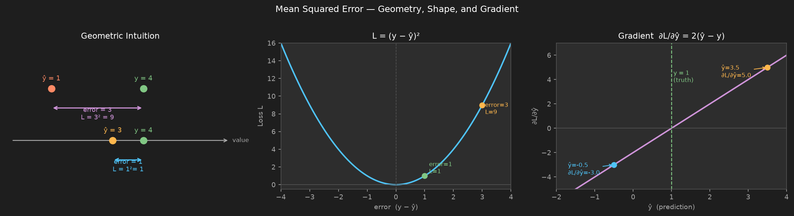
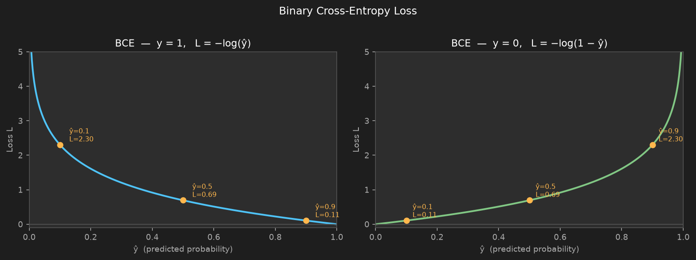
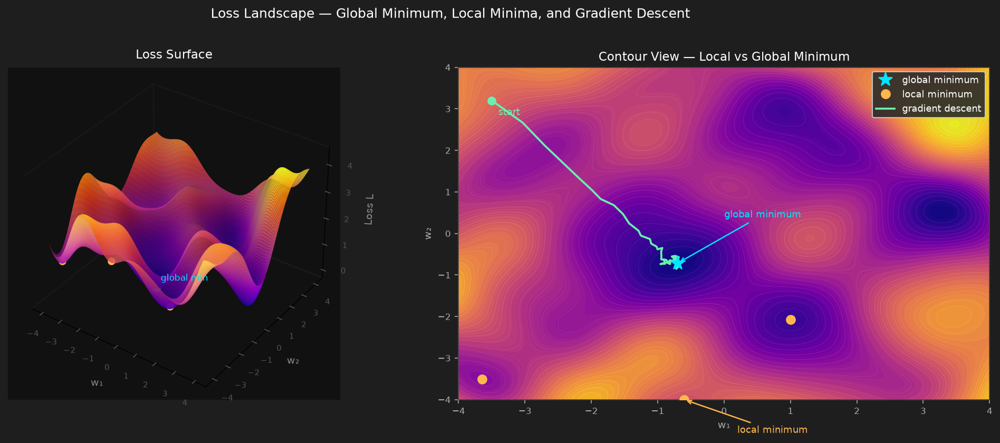

# 05 — Loss Functions

---

## Part 1: What a Loss Function Is

A neural network learns by adjusting its weights. But adjust them toward what? There must be a precise, mathematical measure of how wrong the network's current predictions are. That measure is the **loss function**.

```
Loss function L(y, ŷ):

  y  = true label (what the answer actually is)
  ŷ  = predicted output (what the network currently says)
  L  = a scalar ≥ 0 measuring the discrepancy between them
```

The loss function is the signal that drives all learning. Without it, gradient descent has nothing to minimise. Without it, backpropagation has no starting point. The entire training process is the process of minimising L.

### Three Requirements for a Loss Function

- **L = 0 when ŷ = y exactly** — perfect prediction costs nothing
- **L increases as ŷ diverges from y** — worse predictions cost more
- **L is differentiable with respect to ŷ** — gradient descent requires ∂L/∂ŷ

Different tasks require different loss functions. The choice is not arbitrary — it determines the shape of the gradient signal and therefore what the network learns to optimise.

---

## Part 2: Mean Squared Error (MSE)

### The Setting

MSE is the standard loss function for **regression** — tasks where the output is a continuous numerical value.

```
Examples:
  Predicting house price given features
  Predicting tomorrow's temperature
  Predicting a patient's blood pressure from clinical measurements
```

### Formula

For a single sample:

```
L = (y − ŷ)²
```

For a dataset of n samples:

```
L = (1/n) Σᵢ (yᵢ − ŷᵢ)²
```

The squared difference between the true value and the predicted value, averaged over all samples.

### Geometric Intuition

MSE measures the squared distance between the prediction and the truth on a number line. The left panel below shows this geometrically — a small error of 1 costs 1, but a large error of 3 costs 9, not 3. The middle panel shows the full parabola: the loss surface is bowl-shaped with the minimum at zero error. The right panel shows the gradient ∂L/∂ŷ = 2(ŷ − y) as a straight line — large when the prediction is far from the truth, zero when it is exactly right.



Squaring the error has two consequences:

- All errors are positive — overestimates and underestimates both contribute
- Large errors are penalised disproportionately — an error of 3 costs 9, not 3

### Why Squaring Matters

Consider two models:

```
Model A errors:  [2, 2, 2, 2]     MSE = 4.0
Model B errors:  [0, 0, 0, 8]     MSE = 16.0
```

Both models have the same total absolute error (8). But MSE penalises Model B far more heavily because of the single large error. MSE is appropriate when large errors are especially undesirable — a prediction that is catastrophically wrong should cost much more than one that is slightly wrong.

### Gradient of MSE

Differentiating L = (y − ŷ)² with respect to ŷ:

```
∂L/∂ŷ = −2(y − ŷ) = 2(ŷ − y)
```

The gradient is **linear in the error** — when the prediction is far from the truth the gradient is large, and when the prediction is close the gradient is small. This means the network automatically takes larger steps when it is more wrong and smaller steps as it converges. This is well-behaved for regression with a linear output layer.

### MSE for Classification — Why It Fails

MSE can technically be applied to classification. It fails for a subtle but important reason related to gradient behaviour when combined with sigmoid or softmax outputs, which is explained in Part 5 after cross-entropy is introduced.

---

## Part 3: Binary Cross-Entropy

### The Setting

Binary cross-entropy (BCE) is the standard loss for **binary classification** — tasks where the output is one of two classes.

```
Examples:
  Spam vs not spam
  Disease present vs absent
  Fraud vs legitimate transaction
```

The network's output layer uses sigmoid activation, producing ŷ ∈ (0, 1) — a probability that the input belongs to class 1.

### Derivation from Maximum Likelihood

BCE is not an arbitrary formula — it is derived from the principle of maximum likelihood estimation.

**Step 1 — Model the output as a probability.**

The network outputs ŷ ∈ (0, 1) via sigmoid. We interpret this as the probability that the input belongs to class 1:

```
P(y = 1 | x) = ŷ
P(y = 0 | x) = 1 − ŷ
```

**Step 2 — Write both cases as one expression.**

Writing two separate cases is inconvenient. Notice that both can be captured in a single formula using the label y as an exponent:

```
P(y | x) = ŷʸ · (1 − ŷ)^(1−y)
```

Verify this works for both cases:

```
y = 1:   ŷ¹ · (1−ŷ)⁰ = ŷ · 1 = ŷ          ✓
y = 0:   ŷ⁰ · (1−ŷ)¹ = 1 · (1−ŷ) = 1 − ŷ  ✓
```

**Step 3 — Write the likelihood over the full dataset.**

Maximum likelihood says: find the weights that make the observed training labels as probable as possible. Assuming the n training samples are independent, the probability of observing all of them together is the product of their individual probabilities:

```
likelihood = Π P(yᵢ | xᵢ) = Π ŷᵢʸⁱ · (1 − ŷᵢ)^(1−yᵢ)
```

**Step 4 — Take the log.**

Products of many small numbers are numerically unstable — they underflow to zero in floating point. More importantly, products are hard to differentiate. The logarithm converts the product into a sum, which is both numerically stable and easy to differentiate. Since log is a monotonically increasing function, maximising the log-likelihood is exactly equivalent to maximising the likelihood:

```
log-likelihood = Σ [ yᵢ log(ŷᵢ) + (1 − yᵢ) log(1 − ŷᵢ) ]
```

**Step 5 — Negate to get a loss.**

We want to *minimise* a loss, not maximise a likelihood. Negating flips the direction:

```
BCE = −(1/n) Σ [ yᵢ log(ŷᵢ) + (1 − yᵢ) log(1 − ŷᵢ) ]
```

The 1/n averages over the dataset so the loss scale does not grow with dataset size.

> BCE is not a heuristic — it is the exact maximum likelihood loss for a Bernoulli output. Every term in the formula has a precise probabilistic meaning.

### Intuition

The following plot shows how BCE behaves for y = 1 (left) and y = 0 (right):



For a single sample:

| True label | Prediction ŷ | Loss L | Interpretation |
|---|---|---|---|
| y = 1 | 0.9 | 0.105 | Confident and correct — low loss |
| y = 1 | 0.5 | 0.693 | Uncertain — moderate loss |
| y = 1 | 0.1 | 2.303 | Confident and wrong — high loss |
| y = 0 | 0.1 | 0.105 | Confident and correct — low loss |
| y = 0 | 0.5 | 0.693 | Uncertain — moderate loss |
| y = 0 | 0.9 | 2.303 | Confident and wrong — high loss |

The loss grows without bound as the prediction becomes confidently wrong. A network that predicts ŷ = 0.001 when y = 1 incurs a loss of −log(0.001) = 6.9 — a very strong gradient signal pushing the weights to correct the mistake.

### Gradient of BCE with Sigmoid

The raw gradient of BCE with respect to ŷ is:

```
∂L/∂ŷ = −y/ŷ + (1−y)/(1−ŷ)
```

When BCE is paired with sigmoid, ŷ = σ(z), and we need ∂L/∂z via the chain rule:

```
∂L/∂z = ∂L/∂ŷ · dσ/dz
       = [ −y/ŷ + (1−y)/(1−ŷ) ] · σ(z)(1 − σ(z))
```

Substituting ŷ = σ(z):

```
= [ −y/σ(z) + (1−y)/(1−σ(z)) ] · σ(z)(1 − σ(z))

= −y · (1 − σ(z)) + (1−y) · σ(z)

= −y + y·σ(z) + σ(z) − y·σ(z)

= σ(z) − y

= ŷ − y
```

So:

```
∂L/∂z = ŷ − y
```

The gradient is simply the prediction error. The sigmoid derivative cancels out completely — BCE is specifically designed to pair with sigmoid so that saturation does not suppress the gradient.

---

## Part 4: Categorical Cross-Entropy

### The Setting

Categorical cross-entropy (CCE) extends binary cross-entropy to **multiclass classification** — tasks where the output is one of K ≥ 3 classes.

```
Examples:
  Digit recognition (10 classes: 0–9)
  Disease diagnosis (multiple conditions)
  Language model next-word prediction (vocabulary size classes)
```

The network's output layer uses softmax, producing a probability distribution ŷ = [ŷ₁, ŷ₂, ..., ŷ_K] where Σ ŷₖ = 1.

### Formula

The true label y is represented as a **one-hot vector** — a vector of zeros with a single 1 at the correct class position:

```
Class 2 out of 4:   y = [0, 1, 0, 0]
```

The loss for a single sample:

```
L = −Σₖ yₖ log(ŷₖ)
```

Because y is one-hot, only one term in the sum is non-zero — the term for the correct class c:

```
L = −log(ŷ_c)
```

The loss is simply the negative log of the probability assigned to the correct class.

### Worked Example

True class: class 2 (index 1, 0-based). Network outputs: ŷ = [0.1, 0.7, 0.2].

```
y = [0, 1, 0]

L = −(0 × log(0.1) + 1 × log(0.7) + 0 × log(0.2))
  = −log(0.7)
  = 0.357
```

| Network output ŷ | Loss L | Interpretation |
|---|---|---|
| [0.1, 0.7, 0.2] | 0.357 | Confident and correct |
| [0.3, 0.4, 0.3] | 0.916 | Uncertain |
| [0.05, 0.05, 0.9] | 2.996 | Confident and wrong |

The loss only cares about the probability assigned to the correct class. All other probabilities matter only indirectly through the softmax normalisation.

### Gradient of CCE with Softmax

The gradient of CCE with respect to the pre-softmax score zₖ is derived using the chain rule through the softmax. For the correct class c and any class k:

```
∂L/∂zₖ = ŷₖ − yₖ
```

Expanding:

```
For the correct class (k = c):    ∂L/∂z_c = ŷ_c − 1   (push probability up toward 1)
For all other classes (k ≠ c):    ∂L/∂zₖ  = ŷₖ − 0    (push probability down toward 0)
```

This is the same clean form as BCE + sigmoid. Softmax and cross-entropy are natural conjugates — the softmax Jacobian and the cross-entropy gradient cancel in exactly the same way that sigmoid and BCE cancel, leaving prediction error as the gradient.

---

## Part 5: Why Cross-Entropy Outperforms MSE for Classification

This is one of the most important practical insights in deep learning. The issue is not accuracy — both losses can in principle converge to the correct answer. The issue is **gradient behaviour**.

### The Saturation Problem with MSE + Sigmoid

Consider a binary classification network with sigmoid output. The network predicts ŷ = 0.01 when the true label is y = 1. This is a catastrophically wrong, highly confident prediction.

**With MSE:**

```
L = (y − ŷ)² = (1 − 0.01)² ≈ 0.98

∂L/∂ŷ = 2(ŷ − y) = 2(0.01 − 1) = −1.98

∂L/∂z = ∂L/∂ŷ × dσ/dz = −1.98 × σ(z)(1 − σ(z))
```

When ŷ = 0.01, the sigmoid is near zero, meaning z is a large negative number. At z ≈ −4.6:

```
σ(z)(1 − σ(z)) = 0.01 × 0.99 ≈ 0.01

∂L/∂z = −1.98 × 0.01 ≈ −0.02
```

The gradient is tiny — despite the prediction being catastrophically wrong. The sigmoid has saturated, and MSE does not compensate for this. The network learns extremely slowly from its worst mistakes.

**With BCE:**

```
L = −log(ŷ) = −log(0.01) = 4.605

∂L/∂z = ŷ − y = 0.01 − 1 = −0.99
```

The gradient is large — nearly 1. The network receives a strong signal to correct the mistake immediately. BCE + sigmoid cancels the sigmoid saturation algebraically, producing a gradient that is always proportional to the prediction error.

### Summary

| Scenario: y = 1, ŷ = 0.01 (confidently wrong) | Gradient ∂L/∂z | Learning speed |
|---|---|---|
| MSE + sigmoid | ≈ −0.02 | Very slow |
| BCE + sigmoid | ≈ −0.99 | Fast |

The same principle applies to CCE + softmax for multiclass classification.

### When to Use Each Loss Function

| Task | Output activation | Loss function |
|---|---|---|
| Regression | None (linear) | MSE |
| Binary classification | Sigmoid | Binary cross-entropy |
| Multiclass classification | Softmax | Categorical cross-entropy |

---

## Part 6: Loss as the Landscape — Connection to Training

The loss function defines a **surface** in parameter space. Every possible setting of the network's weights corresponds to a point on this surface, and the height of the surface at that point is the loss value.

The following plot shows the loss surface as a function of two weights. The left panel is the 3D surface — crests are regions of high loss, troughs are regions of low loss. The right panel is the contour view from above, with a gradient descent path overlaid:



Three features of this surface matter for training:

**Global minimum** (blue star) — the weight configuration that produces the lowest possible loss on the training data. This is what gradient descent is trying to reach.

**Local minima** (orange dots) — troughs that are lower than their immediate surroundings but not the lowest point overall. Gradient descent can get trapped here: the gradient is zero, so weights stop updating, but the network has not found the best solution. In practice, deep networks have so many parameters that true local minima are rare — most apparent traps are saddle points where the gradient is zero in some directions but not others.

**Gradient descent path** (green line) — the trajectory of weight updates from a starting point. Each step moves in the direction of steepest descent. The path is not straight because the surface is curved and the step size (learning rate) is finite.

Training is the process of navigating this surface to find the global minimum. The loss function determines the shape of the surface. Gradient descent (**Note 06**) is the navigation algorithm.

The choice of loss function directly determines:

- The shape of the loss surface — smooth or jagged, convex or not
- The gradient signal at every point — how strongly and in what direction weights update
- What the network is actually optimising — MSE optimises for small average squared error, cross-entropy optimises for correct probability assignment

> The loss function is not a detail — it is a fundamental design decision that determines what the network learns. Choosing the wrong loss for a task does not just slow training — it trains the network to optimise the wrong thing entirely.

---

## Summary

Key takeaways:

- The loss function is the mathematical measure of prediction error — it is the signal that drives all learning; without it backpropagation has no starting point
- MSE measures average squared error — appropriate for regression, penalises large errors disproportionately, well-behaved gradient for linear outputs
- Binary cross-entropy is derived from maximum likelihood for Bernoulli outputs — the principled loss for binary classification with sigmoid; gradient simplifies to ŷ − y
- Categorical cross-entropy extends BCE to K classes — always paired with softmax, reduces to −log(probability of correct class); gradient also simplifies to ŷₖ − yₖ
- Cross-entropy outperforms MSE for classification because it cancels sigmoid/softmax saturation algebraically — the gradient is always proportional to the prediction error, not suppressed by the activation derivative
- The loss function defines the shape of the parameter space landscape that gradient descent navigates — it is a fundamental design choice, not a detail
- Practical defaults: MSE for regression, BCE for binary classification, CCE for multiclass classification
