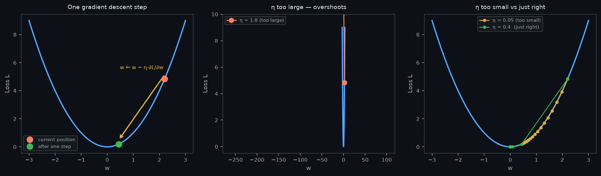
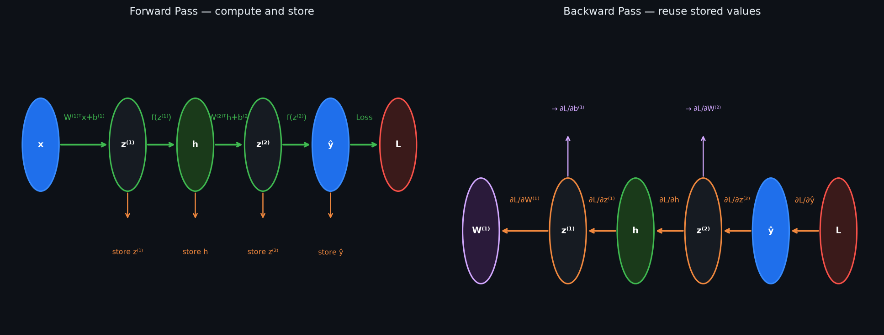

# 06 — Gradient Descent & Backpropagation

---

## Part 1: The Loss Surface

Note 05 ended with the idea that the loss function defines a surface in parameter space. This note begins there.

A neural network with P parameters defines a point in a P-dimensional space. Every possible combination of weight values is a point in that space. The loss function assigns a scalar value — the prediction error — to every such point. Together, these form the **loss surface** (also called the **loss landscape**).

Training is the problem of finding the point in this space where the loss is minimised. The weights at that point are the weights that make the best predictions.

For a network with millions of parameters, this surface exists in millions of dimensions — impossible to visualise, but the mathematics is the same.

### Properties of the Loss Surface

Real loss surfaces are not smooth bowls. They are complex, high-dimensional landscapes with:

```
Global minimum:   the single best point — lowest loss possible
Local minima:     points lower than their immediate neighbourhood, but not globally lowest
Saddle points:    gradient is zero, but the surface curves up in some directions and down
                  in others — not a minimum in any direction, training can stall here
Plateaus:         large flat regions where gradient is near zero — training stalls
```

The loss landscape from **Note 05** illustrates this — crests are regions of high loss, troughs are regions of low loss, and the gradient descent path shows how training navigates toward the minimum.

Gradient descent navigates this surface. The direction of steepest descent at any point is given by the negative gradient.

---

## Part 2: Gradient Descent

### Derivative, Partial Derivative, and Gradient

These three terms are used throughout this note and the rest of the course. They are related but not the same thing.

**Derivative** — the rate of change of a function of a single variable:

```
L = f(w)      (loss as a function of one weight)

dL/dw = rate of change of L as w changes
      = slope of L at the current value of w
```

**Partial derivative** — the rate of change with respect to one variable while all others are held fixed:

```
L = f(w₁, w₂, w₃, ...)      (loss as a function of many weights)

∂L/∂w₁ = rate of change of L as w₁ changes, with w₂, w₃, ... fixed
∂L/∂w₂ = rate of change of L as w₂ changes, with w₁, w₃, ... fixed
```

The ∂ symbol (not d) signals that other variables exist and are being held constant.

**Gradient** — the vector that collects all partial derivatives together:

```
∇_W L = ⎡∂L/∂w₁⎤
        ⎢∂L/∂w₂⎥
        ⎢  ...  ⎥
        ⎣∂L/∂wₙ⎦
```

The gradient is not a new operation — it is the partial derivative applied to every parameter and assembled into a vector. It points in the direction of **steepest ascent** of the loss surface at the current weight configuration. Its negative points in the direction of steepest descent.

```
One weight:    dL/dw    — a scalar, tells you the slope in one direction
Many weights:  ∇_W L   — a vector, tells you the slope in every direction simultaneously
```

> The gradient generalises the derivative to multiple variables. A partial derivative is one component of the gradient. Gradient descent moves in the direction of the negative gradient — the direction that decreases the loss most steeply.

---

### The Core Idea

The gradient of the loss with respect to a weight tells us how the loss changes when that weight changes:

```
∂L/∂w > 0:   increasing w increases loss → decrease w
∂L/∂w < 0:   increasing w decreases loss → increase w
∂L/∂w = 0:   loss is flat with respect to w → no update needed
```

The update rule moves each weight in the direction that reduces the loss:

```
w ← w − η × ∂L/∂w
```

Where η (eta) is the **learning rate** — a small positive scalar that controls the step size.

### Visualising Gradient Descent

The left panel below shows one step of gradient descent on a simple parabolic loss surface. The red dot is the current position, the green dot is the position after one update. The middle panel shows what happens when η is too large — the update overshoots the minimum and the loss bounces back and forth. The right panel compares η too small (slow convergence) with η just right (efficient convergence).



### The Learning Rate

The learning rate η is the most important hyperparameter in training. It controls how large each step is.

```
η too large:   overshoots the minimum — loss oscillates or diverges
η too small:   converges, but extremely slowly — training stalls
η just right:  converges efficiently in a reasonable number of steps
```

There is no universal correct value for η. Typical starting values are in the range 0.001 to 0.1. Learning rate schedules (reducing η over time) and adaptive optimisers (**Note 12**) address this problem more systematically.

### For All Parameters Simultaneously

In a network with P parameters, gradient descent updates all weights simultaneously:

```
For each weight wᵢ:
  wᵢ ← wᵢ − η × ∂L/∂wᵢ

In matrix form:
  W ← W − η × ∇_W L
```

The gradient ∇_W L is a matrix of the same shape as W, containing the partial derivative of the loss with respect to every weight. Computing this gradient for all weights in all layers is the job of backpropagation.

---

## Part 3: Batch, Stochastic, and Mini-Batch Gradient Descent

The update rule `w ← w − η × ∂L/∂w` requires computing the gradient. But the gradient depends on the loss, and the loss depends on the data. The question is: which data do we use to compute each gradient update?

### Batch Gradient Descent

Use the entire training dataset to compute the gradient before each update.

```
For each epoch:
  Compute loss over ALL n training samples
  Compute gradient ∂L/∂w
  Update: w ← w − η × ∂L/∂w
```

```
Advantages:
  ✓ Gradient is exact — computed over the full dataset
  ✓ Stable convergence — no noise in the update direction

Disadvantages:
  ✗ Extremely slow for large datasets — one update per full pass
  ✗ Requires entire dataset in memory
  ✗ Can get stuck in sharp local minima
```

### Stochastic Gradient Descent (SGD)

Use a single randomly chosen training sample to compute the gradient before each update.

```
For each epoch:
  Shuffle training data
  For each sample (xᵢ, yᵢ):
    Compute loss on this one sample
    Compute gradient ∂L/∂w
    Update: w ← w − η × ∂L/∂w
```

```
Advantages:
  ✓ Very fast — one update per sample
  ✓ Noisy updates can escape local minima and saddle points
  ✓ Works with streaming data

Disadvantages:
  ✗ Gradient is noisy — single sample is not representative of full dataset
  ✗ Loss oscillates — does not converge smoothly
  ✗ Cannot exploit GPU parallelism efficiently
```

### Mini-Batch Gradient Descent

Use a small batch of B samples (typically 32–256) to compute each gradient update.

```
For each epoch:
  Shuffle training data
  For each mini-batch of B samples:
    Compute loss over B samples
    Compute gradient ∂L/∂w
    Update: w ← w − η × ∂L/∂w
```

```
Advantages:
  ✓ More stable than SGD — gradient averaged over B samples
  ✓ Faster than batch GD — many updates per epoch
  ✓ Exploits GPU parallelism — matrix operations over B samples
  ✓ Noise helps escape local minima

Disadvantages:
  ✗ Batch size B is another hyperparameter to tune
```

### Comparison

| Method | Gradient quality | Speed per update | Updates per epoch |
|---|---|---|---|
| Batch GD | Exact | Slow | 1 |
| SGD | Noisy | Fast | n (one per sample) |
| Mini-batch GD | Approximate | Moderate | n/B |

In practice, **mini-batch gradient descent is the standard**. When people say "SGD" in modern deep learning, they almost always mean mini-batch SGD. The batch size B is typically a power of 2 (32, 64, 128, 256) to align with GPU memory architecture.

---

## Part 4: Backpropagation

### The Problem

Note 03 identified the credit assignment problem: how do we compute ∂L/∂w for a hidden weight that has no direct connection to the output? Gradient descent requires this derivative for every weight in the network — a network with millions of weights needs millions of partial derivatives computed at every training step.

Computing each derivative independently — by perturbing each weight slightly and measuring the change in loss — would require millions of forward passes per update. This is computationally infeasible.

Backpropagation solves this by computing all gradients in a single backward pass through the network, using the **chain rule of calculus**.

### The Chain Rule

If y = f(u) and u = g(x), then:

```
dy/dx = dy/du × du/dx
```

> The derivative of a composed function is the product of the derivatives of its components. A neural network is exactly a chain of composed functions — backpropagation applies this rule systematically from output to input.

This extends to any chain of composed functions:

```
y = f₄(f₃(f₂(f₁(x))))

dy/dx = (dy/df₄) × (df₄/df₃) × (df₃/df₂) × (df₂/df₁) × (df₁/dx)
```

### The General Form for a Hidden Weight

Before computing any numbers, it is worth seeing the symbolic form of the gradient for a hidden weight. For a 2-layer network with hidden weight w⁽¹⁾ connecting input xᵢ to hidden neuron j, the chain rule gives:

```
∂L/∂w⁽¹⁾ᵢⱼ = ∂L/∂ŷ × dŷ/dz⁽²⁾ × ∂z⁽²⁾/∂hⱼ × dhⱼ/dz⁽¹⁾ⱼ × ∂z⁽¹⁾ⱼ/∂w⁽¹⁾ᵢⱼ
```

Evaluating each factor:

```
∂L/∂ŷ          =  loss gradient at output          (from the loss function)
dŷ/dz⁽²⁾       =  f'(z⁽²⁾)                         (output activation derivative)
∂z⁽²⁾/∂hⱼ     =  w⁽²⁾ⱼ                            (output layer weight)
dhⱼ/dz⁽¹⁾ⱼ    =  f'(z⁽¹⁾ⱼ)                        (hidden activation derivative)
∂z⁽¹⁾ⱼ/∂w⁽¹⁾ᵢⱼ =  xᵢ                              (the input that fed this weight)
```

So the full expression is:

```
∂L/∂w⁽¹⁾ᵢⱼ = ∂L/∂ŷ × f'(z⁽²⁾) × w⁽²⁾ⱼ × f'(z⁽¹⁾ⱼ) × xᵢ
```

This is exactly the formula from Note 03's credit assignment section. Three things are immediately visible:

```
1. Every factor comes from the forward pass — f'(z⁽²⁾), w⁽²⁾ⱼ, f'(z⁽¹⁾ⱼ), xᵢ are all
   computed or stored during the forward pass. Nothing new needs to be computed.

2. The gradient flows backward through the same path the signal took forward —
   output → output weight → hidden activation → hidden weight → input.

3. If xᵢ = 0, the entire product is zero — a weight connected to a zero input
   receives no gradient from that sample, regardless of the error at the output.
```

### Forward Pass and Backward Pass

Training consists of two passes. The diagram below shows both: the forward pass computes and stores intermediate values left to right; the backward pass reuses those values to propagate gradients right to left.



The quantity ∂L/∂z at each layer is called the **error signal** (often written δ) for that layer. It is computed once and reused to get both the weight gradient and the error signal for the layer below:

```
δ⁻²⁾ = ∂L/∂z⁻²⁾ = ∂L/∂ŷ · f'(z⁻²⁾)          ← error signal at output layer

∂L/∂W⁻²⁾ = δ⁻²⁾ · hᵀ                          ← weight gradient (outer product)
∂L/∂b⁻²⁾ = δ⁻²⁾                               ← bias gradient

δ⁻¹⁾ = ∂L/∂z⁻¹⁾ = (W⁻²⁾ · δ⁻²⁾) · f'(z⁻¹⁾)   ← error signal propagated back

∂L/∂W⁻¹⁾ = δ⁻¹⁾ · xᵀ                          ← weight gradient
∂L/∂b⁻¹⁾ = δ⁻¹⁾                               ← bias gradient
```

This pattern — compute δ for a layer, use it to get weight gradients, propagate δ to the layer below — repeats for every layer in the network, no matter how deep.

> Backpropagation is not a separate algorithm from the chain rule — it is the chain rule applied in the right order, reusing intermediate results so that each value is computed exactly once. This is what makes it O(P) rather than O(P²).

---

## Part 5: Full Worked Example — Backprop on the XOR MLP

We use the exact network from **Note 03**. This connects the forward pass you already know to the backward pass that trains it.

### Network Setup

```
Architecture: 2 inputs → 2 hidden neurons → 1 output
Activation: sigmoid σ(z) = 1/(1+e⁻ᶻ) in all layers
Loss: MSE  L = (y − ŷ)²
```

We use sigmoid here (not step function) because backpropagation requires a differentiable activation. MSE is used for simplicity of the worked example — in practice, BCE would be used for classification.

### Parameters (initialised for this example)

```
W⁽¹⁾ = ⎡1   -1⎤    b⁽¹⁾ = ⎡-0.5⎤
       ⎣1   -1⎦           ⎣ 1.5⎦

W⁽²⁾ = ⎡1⎤    b⁽²⁾ = -1.5
       ⎣1⎦

Learning rate η = 0.5
```

### Training Sample

```
x = [0, 1],   y = 1   (XOR: 0 XOR 1 = 1)
```

---

### Step 1: Forward Pass

**Hidden layer pre-activations:**

```
z₁⁽¹⁾ = w⁽¹⁾₁₁·x₁ + w⁽¹⁾₂₁·x₂ + b₁⁽¹⁾
       = 1(0) + 1(1) + (−0.5)
       = 0.5

z₂⁽¹⁾ = w⁽¹⁾₁₂·x₁ + w⁽¹⁾₂₂·x₂ + b₂⁽¹⁾
       = −1(0) + (−1)(1) + 1.5
       = 0.5
```

**Hidden layer activations:**

```
h₁ = σ(0.5) = 1/(1 + e⁻⁰·⁵) = 1/(1 + 0.6065) = 0.6225
h₂ = σ(0.5) = 0.6225
```

**Output layer pre-activation:**

```
z⁽²⁾ = w⁽²⁾₁₁·h₁ + w⁽²⁾₂₁·h₂ + b⁽²⁾
      = 1(0.6225) + 1(0.6225) + (−1.5)
      = 1.245 − 1.5
      = −0.255
```

**Output:**

```
ŷ = σ(−0.255) = 1/(1 + e⁰·²⁵⁵) = 1/(1 + 1.2908) = 0.4365
```

**Loss:**

```
L = (y − ŷ)² = (1 − 0.4365)² = (0.5635)² = 0.3175
```

---

### Step 2: Backward Pass

We compute gradients from output to input, applying the chain rule at each step.

**Gradient of loss with respect to output:**

```
∂L/∂ŷ = −2(y − ŷ) = −2(1 − 0.4365) = −1.127
```

**Gradient through output sigmoid:**

```
dσ/dz at z⁽²⁾ = σ(z⁽²⁾)(1 − σ(z⁽²⁾)) = ŷ(1 − ŷ) = 0.4365 × 0.5635 = 0.2460

∂L/∂z⁽²⁾ = ∂L/∂ŷ × dσ/dz = −1.127 × 0.2460 = −0.2773
```

This is the error signal at the output layer. We now use it to compute gradients for the output layer weights.

**Gradients for output layer weights:**

```
∂L/∂w⁽²⁾₁₁ = ∂L/∂z⁽²⁾ × h₁ = −0.2773 × 0.6225 = −0.1726
∂L/∂w⁽²⁾₂₁ = ∂L/∂z⁽²⁾ × h₂ = −0.2773 × 0.6225 = −0.1726
∂L/∂b⁽²⁾   = ∂L/∂z⁽²⁾ × 1  = −0.2773
```

**Propagate error back to hidden layer:**

```
∂L/∂h₁ = ∂L/∂z⁽²⁾ × w⁽²⁾₁₁ = −0.2773 × 1 = −0.2773
∂L/∂h₂ = ∂L/∂z⁽²⁾ × w⁽²⁾₂₁ = −0.2773 × 1 = −0.2773
```

**Gradient through hidden sigmoid:**

```
dσ/dz at z₁⁽¹⁾ = h₁(1 − h₁) = 0.6225 × 0.3775 = 0.2350
dσ/dz at z₂⁽¹⁾ = h₂(1 − h₂) = 0.6225 × 0.3775 = 0.2350

∂L/∂z₁⁽¹⁾ = ∂L/∂h₁ × dσ/dz = −0.2773 × 0.2350 = −0.0652
∂L/∂z₂⁽¹⁾ = ∂L/∂h₂ × dσ/dz = −0.2773 × 0.2350 = −0.0652
```

**Gradients for hidden layer weights:**

```
∂L/∂w⁽¹⁾₁₁ = ∂L/∂z₁⁽¹⁾ × x₁ = −0.0652 × 0 = 0
∂L/∂w⁽¹⁾₂₁ = ∂L/∂z₁⁽¹⁾ × x₂ = −0.0652 × 1 = −0.0652
∂L/∂b₁⁽¹⁾  = ∂L/∂z₁⁽¹⁾ × 1  = −0.0652

∂L/∂w⁽¹⁾₁₂ = ∂L/∂z₂⁽¹⁾ × x₁ = −0.0652 × 0 = 0
∂L/∂w⁽¹⁾₂₂ = ∂L/∂z₂⁽¹⁾ × x₂ = −0.0652 × 1 = −0.0652
∂L/∂b₂⁽¹⁾  = ∂L/∂z₂⁽¹⁾ × 1  = −0.0652
```

---

### Step 3: Weight Update

Apply gradient descent with η = 0.5:

```
w ← w − η × ∂L/∂w
```

**Output layer:**

```
w⁽²⁾₁₁ ← 1 − 0.5 × (−0.1726) = 1 + 0.0863 = 1.0863
w⁽²⁾₂₁ ← 1 − 0.5 × (−0.1726) = 1.0863
b⁽²⁾   ← −1.5 − 0.5 × (−0.2773) = −1.5 + 0.1387 = −1.3613
```

**Hidden layer:**

```
w⁽¹⁾₁₁ ← 1 − 0.5 × 0 = 1.0
w⁽¹⁾₂₁ ← 1 − 0.5 × (−0.0652) = 1 + 0.0326 = 1.0326
b₁⁽¹⁾  ← −0.5 − 0.5 × (−0.0652) = −0.5 + 0.0326 = −0.4674

w⁽¹⁾₁₂ ← −1 − 0.5 × 0 = −1.0
w⁽¹⁾₂₂ ← −1 − 0.5 × (−0.0652) = −1 + 0.0326 = −0.9674
b₂⁽¹⁾  ← 1.5 − 0.5 × (−0.0652) = 1.5 + 0.0326 = 1.5326
```

After this single update, the network's prediction on x = [0,1] would be slightly closer to y = 1. Training repeats this process over all samples, for many epochs, until the loss converges.

### What the Worked Example Shows

```
1. The forward pass computes predictions and stores intermediate values
2. The backward pass propagates the error signal from output to input
3. Each weight's gradient measures its contribution to the final error
4. Weights connected to inputs that were zero (x₁ = 0) receive zero gradient
   — they cannot be updated from this sample
5. The chain rule links every weight to the final loss through the computation graph
```

---

## Part 6: Vanishing and Exploding Gradients

### Vanishing Gradients

Backpropagation multiplies gradients layer by layer. If each layer contributes a factor less than 1 to the gradient, the signal shrinks exponentially as it travels backward.

```
Gradient at layer l = δ_output × ∏ (dσ/dz at each layer between l and output)
```

For sigmoid: dσ/dz ≤ 0.25. For a 10-layer sigmoid network:

```
Gradient at layer 1 ≈ δ_output × 0.25¹⁰ ≈ δ_output × 10⁻⁶
```

The gradient has shrunk by a factor of a million. Early layers receive almost no signal and their weights barely move. The network effectively only trains its last few layers.

**Why ReLU helps:**

For z > 0, ReLU has derivative exactly 1. The gradient passes through unchanged:

```
Gradient at layer 1 ≈ δ_output × 1¹⁰ = δ_output
```

No shrinkage. This is the primary reason ReLU enabled deep networks.

> Vanishing gradients are not a training slowdown — they are a training failure. Early layers stop learning entirely. ReLU solves this by passing gradients through unchanged for positive activations.

**Residual connections** (used in ResNets, covered in later notes) provide an additional mechanism — they create direct gradient paths that bypass layers entirely, further alleviating vanishing gradients in very deep networks.

### Exploding Gradients

The opposite problem: if each layer contributes a factor greater than 1, gradients grow exponentially.

```
Gradient at layer 1 ≈ δ_output × 2¹⁰ = 1024 × δ_output
```

Weight updates become enormous. The network diverges — loss increases instead of decreasing, weights become NaN.

Exploding gradients are most common in:
- Recurrent networks (**Note 24**) — gradients flow through many time steps
- Poorly initialised networks — large initial weights amplify gradients

**Gradient clipping** is the standard fix: if the gradient norm exceeds a threshold, rescale it:

```
if ||∇L|| > threshold:
    ∇L ← ∇L × (threshold / ||∇L||)
```

This caps the magnitude of the update without changing its direction.

```
Without clipping:   gradient = [500, 300, 800]   → enormous update, diverges
With clipping (threshold=1):
  norm = √(500² + 300² + 800²) ≈ 990
  gradient ← gradient × (1/990) ≈ [0.505, 0.303, 0.808]   → controlled update
```

> Gradient clipping does not fix the underlying cause of exploding gradients — it prevents the damage. Better weight initialisation (**Note 10**) and architecture choices address the root cause.

---

## Summary

Key takeaways:

- The loss surface is the landscape defined by the loss function over all possible weight values — training is the problem of finding the minimum
- A partial derivative ∂L/∂w measures how the loss changes with respect to one weight; the gradient ∇_W L is the vector of all partial derivatives — it points in the direction of steepest ascent
- Gradient descent updates each weight in the direction that reduces the loss: `w ← w − η × ∂L/∂w`
- The learning rate η controls step size — too large overshoots, too small converges slowly; adaptive optimisers (**Note 12**) address this systematically
- Batch GD uses all data per update (exact but slow), SGD uses one sample (fast but noisy), mini-batch GD uses B samples (the standard in practice)
- Backpropagation computes all gradients in a single backward pass using the chain rule — it is the algorithm that makes training deep networks computationally feasible
- The forward pass computes predictions and stores intermediate values; the backward pass uses those values to propagate the error signal from output to input
- Vanishing gradients occur when gradient factors less than 1 multiply across many layers — sigmoid causes this, ReLU largely solves it
- Exploding gradients occur when gradient factors greater than 1 multiply across many layers — gradient clipping is the standard fix
