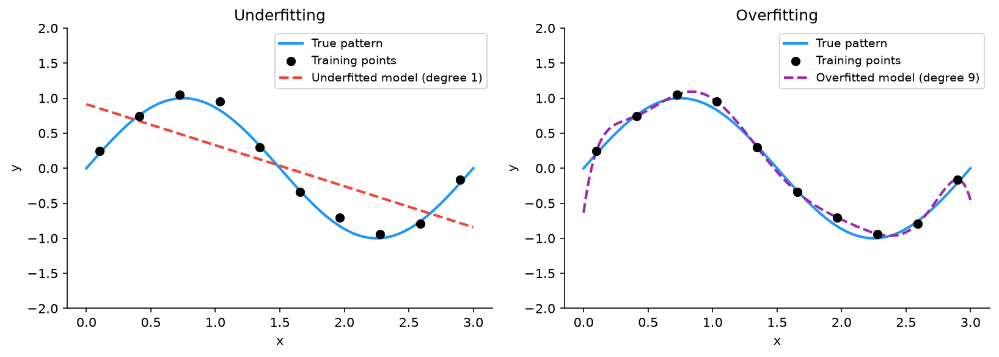
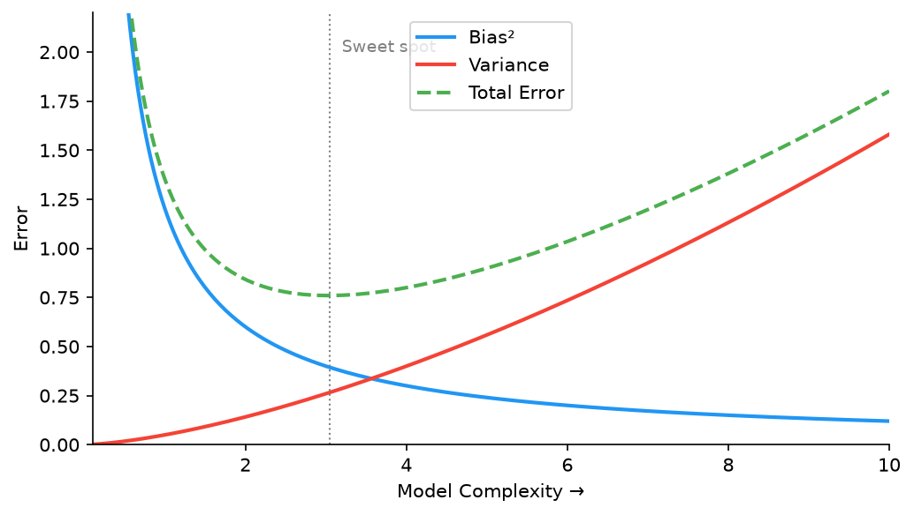
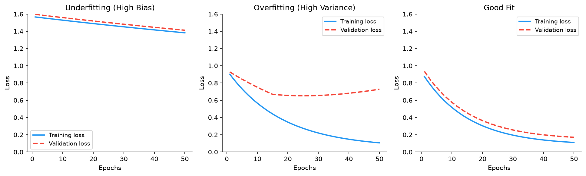
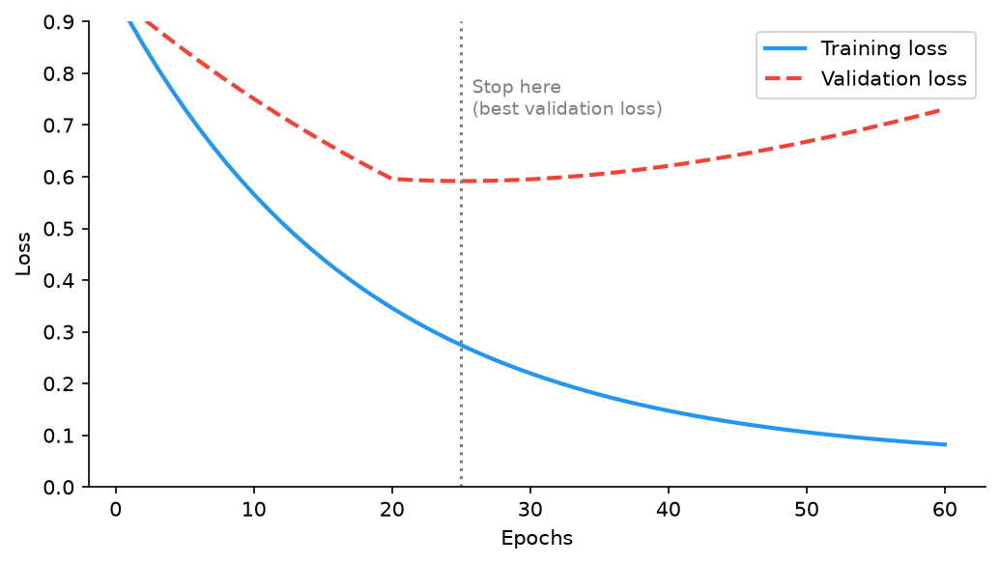

# 07 — Overfitting, Underfitting & Bias-Variance Tradeoff

---

## Part 1: The Fundamental Goal of Learning

A model is not trained to perform well on the training data. It is trained to perform well on **unseen data** — data it has never encountered during training.

This distinction is the central tension in all of machine learning. A model that memorises the training set perfectly but fails on new inputs has learned nothing useful. The goal is **generalisation**: extracting the underlying pattern from training examples and applying it correctly to new ones.

```
What we want:
  Model learns the underlying pattern
         ↓
  Performs well on new, unseen data

What can go wrong:
  Model memorises training data (overfitting)
  Model is too simple to capture the pattern (underfitting)
```

---

## Part 2: Underfitting

### Definition

Underfitting occurs when the model is too simple to capture the structure in the data. It performs poorly on both the training set and on new data.

### Cause

Underfitting is caused by **insufficient model capacity** — the model does not have enough parameters or the right architecture to represent the true function.

```
Examples:
  Using a linear model for a non-linear problem
  Using a shallow network for a complex task
  Training for too few epochs
  Using too strong regularisation
```

### Diagnosis

```
Training loss:    high
Validation loss:  high (similar to training loss)
```

Both losses are high and close together. The model is not even fitting the training data well.

---

## Part 3: Overfitting

### Definition

Overfitting occurs when the model learns the training data too well — including its noise and random fluctuations — and fails to generalise to new data.

The two panels below show both failure modes against the same true pattern. The left panel shows a straight line that cannot follow the curve — underfitting. The right panel shows a high-degree polynomial that passes through every training point exactly but oscillates wildly between them — overfitting.



### Cause

Overfitting is caused by **excessive model capacity relative to the amount of training data**. The model has enough parameters to memorise the training examples rather than learning the underlying pattern.

```
Examples:
  Very deep or wide network trained on a small dataset
  Training for too many epochs
  No regularisation
```

### Diagnosis

```
Training loss:    low (model fits training data well)
Validation loss:  high (model fails on unseen data)
Gap between training and validation loss is large
```

The model has memorised the training set. It has not learned the pattern.

---

## Part 4: The Bias-Variance Tradeoff

### Decomposing Prediction Error

The expected prediction error of a model can be decomposed into three components:

```
Expected Error = Bias² + Variance + Irreducible Noise
```

Understanding each component explains why underfitting and overfitting occur and why they cannot both be eliminated simultaneously.

### Bias

**Bias** measures how far the model's average prediction is from the true value. It captures the error introduced by the model's assumptions.

```
High bias:   model makes strong assumptions that are wrong
             → systematically wrong predictions
             → underfitting

Low bias:    model makes few assumptions
             → predictions are centred on the truth on average
```

A linear model applied to a non-linear problem has high bias — it is structurally incapable of representing the true function, no matter how much data it sees.

### Variance

**Variance** measures how much the model's predictions change when trained on different samples of data. It captures the model's sensitivity to the specific training set.

```
High variance:  model is very sensitive to the training data
                → small changes in training set → large changes in predictions
                → overfitting

Low variance:   model is stable across different training sets
                → predictions are consistent
```

A very deep network trained on a small dataset has high variance — it fits the specific training examples so closely that a different sample of training data would produce a very different model.

### The Tradeoff

Bias and variance pull in opposite directions as model complexity increases. The plot below shows Bias², Variance, and Total Error as functions of model complexity — the sweet spot is where total error is minimised.



```
Simple model:   high bias, low variance   → underfitting
Complex model:  low bias, high variance   → overfitting
Optimal model:  balanced bias and variance → good generalisation
```

Increasing model complexity reduces bias (the model can represent more functions) but increases variance (the model becomes more sensitive to the specific training data). The goal is to find the sweet spot.

### Intuition with an Analogy

Imagine estimating the average height of adults in a country by sampling people on the street.

```
High bias (underfitting):
  You only sample people from one city.
  Your estimate is systematically wrong — it does not represent the country.
  No matter how many people you sample from that city, the estimate stays wrong.

High variance (overfitting):
  You sample only 3 people.
  Your estimate is very sensitive to which 3 people you happened to pick.
  A different sample of 3 would give a very different estimate.

Good model:
  You sample a large, diverse group.
  Your estimate is close to the true average and stable across different samples.
```

---

## Part 5: Training, Validation, and Test Sets

### Why One Dataset Is Not Enough

If you train a model on data and evaluate it on the same data, you are measuring memorisation, not learning. You need separate data to measure generalisation.

But there is a subtler problem: if you use a separate test set to make decisions about the model (choosing architecture, tuning hyperparameters), you are implicitly fitting the model to the test set. The test set is no longer a fair measure of generalisation.

This is why three separate datasets are needed.

### The Three Sets

```
┌─────────────────────────────────────────────────────────────────┐
│                        Full Dataset                             │
├──────────────────────┬──────────────────┬───────────────────────┤
│    Training Set      │  Validation Set  │      Test Set         │
│    (60–80%)          │    (10–20%)      │      (10–20%)         │
└──────────────────────┴──────────────────┴───────────────────────┘
```

**Training set:**
- Used to compute gradients and update weights
- The model sees this data during training

**Validation set:**
- Used to evaluate the model during training
- Guides decisions: when to stop, which hyperparameters to use, which architecture to try
- The model does NOT train on this data, but decisions are made based on it

**Test set:**
- Used once, at the very end, to report final performance
- Never used to make any decisions during development
- Provides an unbiased estimate of generalisation performance

### Data Leakage

**Data leakage** occurs when information from the validation or test set influences the model during training. It produces optimistically biased performance estimates — the model appears to generalise better than it actually does.

```
Common sources of leakage:
  - Normalising the entire dataset before splitting (test statistics leak into training)
  - Selecting features based on correlation with the full dataset
  - Tuning hyperparameters on the test set
  - Including future data in time-series training
```

The rule: **any transformation or decision that uses data must use only training data**. Apply the same transformation to validation and test sets using parameters computed from the training set only.

---

## Part 6: Learning Curves

Learning curves plot training and validation loss (or accuracy) as a function of training progress. They are the primary diagnostic tool for identifying underfitting and overfitting.

The three panels below show the characteristic shape of each case.



**Underfitting (left):** both losses are high and plateau early. The model cannot fit the training data — it is too simple.

**Overfitting (middle):** training loss keeps decreasing while validation loss rises after an early point. The gap between them is the overfitting signal — the model is memorising the training data.

**Good fit (right):** both losses decrease and converge to similar values with a small gap. The model has learned the underlying pattern.

### Reading Learning Curves

```
Symptom                              Diagnosis           Fix
──────────────────────────────────   ─────────────────   ──────────────────────────
Both losses high, small gap          Underfitting        Increase capacity, train longer
Training low, validation high        Overfitting         Regularise, get more data
Validation loss increases over time  Overfitting         Early stopping
Both losses decrease, then plateau   Good fit            Done
Large oscillations in validation     Learning rate high  Reduce η
```

---

## Part 7: Regularisation

Regularisation refers to any technique that reduces overfitting by constraining the model's capacity or adding noise during training. The goal is to reduce variance without increasing bias too much.

### L2 Regularisation (Weight Decay)

Add a penalty term to the loss function proportional to the sum of squared weights:

```
L_total = L_original + λ × Σ wᵢ²
```

Where λ (lambda) is the regularisation strength — a hyperparameter controlling how much the penalty matters.

**Effect on gradient descent:**

```
∂L_total/∂w = ∂L_original/∂w + 2λw

Update: w ← w − η × (∂L_original/∂w + 2λw)
           = w(1 − 2ηλ) − η × ∂L_original/∂w
```

The factor `(1 − 2ηλ)` shrinks the weight at every step — this is why L2 is called **weight decay**. Large weights are penalised more than small weights, pushing the model toward solutions with small, distributed weights.

**Why this reduces overfitting:**

Large weights allow the model to make sharp, complex decision boundaries that fit noise. Penalising large weights forces the model toward smoother functions that generalise better.

### L1 Regularisation (Lasso)

Add a penalty proportional to the sum of absolute weight values:

```
L_total = L_original + λ × Σ |wᵢ|
```

**Key difference from L2:**

L1 produces **sparse** solutions — many weights are driven exactly to zero. This is because the L1 penalty has a constant gradient (±λ) regardless of weight magnitude, which pushes small weights all the way to zero.

```
L2:   penalises large weights more → shrinks all weights, none exactly zero
L1:   constant penalty → drives small weights to exactly zero → sparse model
```

L1 is useful when you believe many features are irrelevant — it performs automatic feature selection by zeroing out unimportant weights.

### Dropout

Dropout is a regularisation technique specific to neural networks. During each training step, each neuron is independently set to zero with probability p (the dropout rate, typically 0.2–0.5).

```
Without dropout:
  x → [h₁, h₂, h₃, h₄] → output

With dropout (p = 0.5, one training step):
  x → [h₁,  0, h₃,  0] → output   (h₂ and h₄ dropped this step)

Next training step:
  x → [ 0, h₂,  0, h₄] → output   (h₁ and h₃ dropped this step)
```

**Why dropout reduces overfitting:**

Each training step uses a different random subset of neurons. The network cannot rely on any single neuron or co-adapt groups of neurons to memorise specific training examples. It must learn redundant, distributed representations.

At test time, dropout is disabled and all neurons are active. To keep the expected output magnitude consistent with training, the activations must be rescaled. Modern frameworks (PyTorch, TensorFlow) use **inverted dropout**: during training, each surviving neuron's output is scaled up by `1/(1 − p)`, so no rescaling is needed at test time. The effect is the same — expected activation magnitude is preserved — but the test-time forward pass is unchanged.

**Dropout as ensemble learning:**

With n neurons and dropout rate 0.5, there are 2ⁿ possible sub-networks. Training with dropout is approximately equivalent to training an ensemble of 2ⁿ networks that share weights. At test time, the full network approximates the average prediction of this ensemble.

### Early Stopping

Early stopping monitors validation loss during training and stops when it begins to increase — before the model overfits.

The plot below shows training and validation loss over epochs, with the optimal stopping point marked where validation loss is lowest.



The model is saved at the epoch with the lowest validation loss. Training continues for a patience window (e.g., 10 epochs) after the best validation loss, in case it improves again. If it does not, training stops.

Early stopping is computationally free — it requires no modification to the model or loss function. It is one of the most effective and widely used regularisation techniques.

### Comparison

```
Technique       Mechanism                          Best for
──────────────  ─────────────────────────────────  ──────────────────────────────
L2              Penalises large weights             General purpose, default choice
L1              Drives weights to zero              Feature selection, sparse models
Dropout         Randomly deactivates neurons        Deep networks, fully connected layers
Early stopping  Stops before overfitting occurs     Any network, computationally free
```

In practice, L2 and dropout are often used together. Early stopping is almost always used. L1 is less common in deep learning but standard in linear models.

---

## Summary

Key takeaways:

- The goal of learning is generalisation — performing well on unseen data, not memorising the training set
- Underfitting (high bias): model too simple, high training and validation loss, cannot capture the pattern
- Overfitting (high variance): model too complex, low training loss but high validation loss, memorises noise
- Bias-variance tradeoff: increasing model complexity reduces bias but increases variance — the optimal model balances both
- Three datasets are required: training (update weights), validation (guide decisions), test (final unbiased evaluation) — never use the test set to make decisions
- Data leakage occurs when test/validation information influences training — produces falsely optimistic performance estimates
- Learning curves (training vs validation loss over epochs) are the primary diagnostic tool for underfitting and overfitting
- L2 regularisation penalises large weights (weight decay), pushing toward smooth solutions
- L1 regularisation drives weights to zero, performing implicit feature selection
- Dropout randomly deactivates neurons during training, forcing distributed representations — equivalent to ensemble learning
- Early stopping monitors validation loss and halts training before overfitting — computationally free and highly effective
