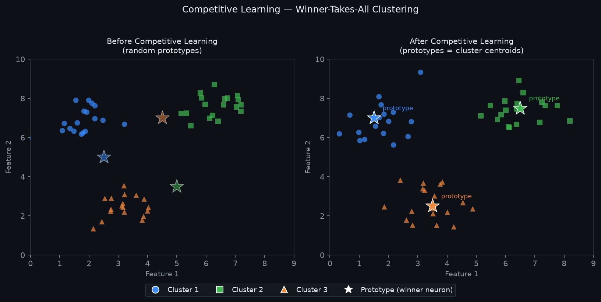
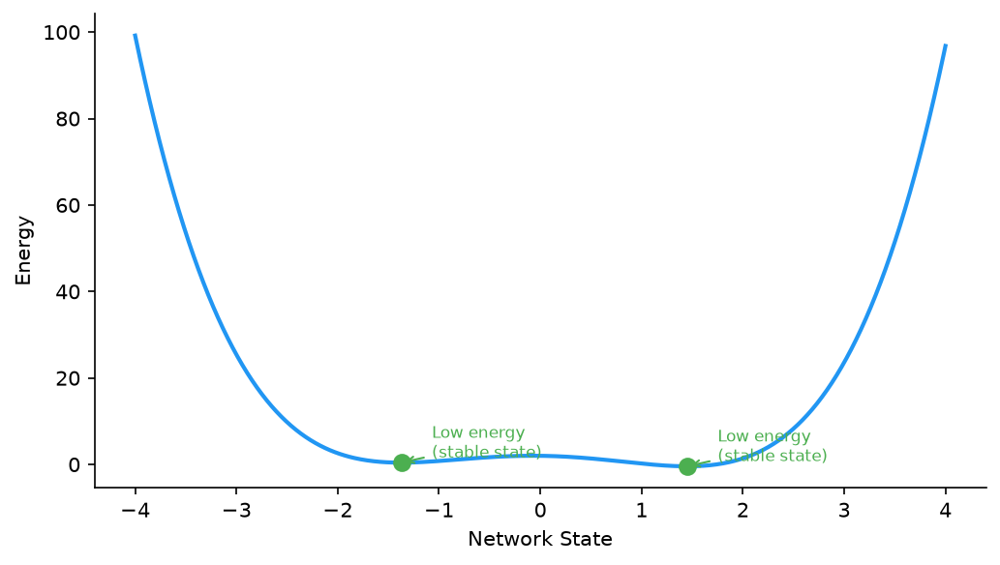

# 08 — Learning Mechanisms: Hebbian, Competitive, Boltzmann

---

## Part 1: Why These Mechanisms Matter

Everything covered so far — the perceptron, the MLP, backpropagation — belongs to one paradigm: **supervised learning with an error signal**. The network makes a prediction, compares it to a known correct answer, and adjusts weights to reduce the difference.

This paradigm is powerful but it has a prerequisite: labeled data. Someone must have already decided what the correct answer is for every training example.

The three learning mechanisms in this note operate without that prerequisite. They are **unsupervised** — they find structure, patterns, and representations in data without being told what to look for. They predate backpropagation and were the dominant paradigm in neural network research through the 1970s and 1980s. More importantly, they are not historical curiosities — they appear in modern architectures in ways that are worth understanding precisely.

```
Supervised learning:    input + correct label → adjust weights to reduce error
Unsupervised learning:  input only → adjust weights to capture structure
```

---

## Part 2: Hebbian Learning

### The Biological Principle

In 1949, Donald Hebb proposed a theory of synaptic plasticity based on a simple observation about biological neurons:

> *"When an axon of cell A is near enough to excite cell B and repeatedly or persistently takes part in firing it, some growth process or metabolic change takes place in one or both cells such that A's efficiency, as one of the cells firing B, is increased."*

Simplified: **neurons that fire together, wire together**.

If neuron A consistently activates at the same time as neuron B, the connection from A to B should strengthen. If they rarely fire together, the connection should weaken or remain unchanged.

### The Hebbian Learning Rule

```
Δwᵢⱼ = η × xᵢ × yⱼ
```

Where:
- wᵢⱼ = weight from input neuron i to output neuron j
- xᵢ = activation of input neuron i
- yⱼ = activation of output neuron j
- η = learning rate
- Δwᵢⱼ = change in weight

The weight between two neurons increases when both are simultaneously active, and does not change when either is inactive.

### Worked Example

Two input neurons, one output neuron. Inputs: x₁ = 1, x₂ = 0. Output fires: y = 1.

```
Δw₁ = η × x₁ × y = 0.1 × 1 × 1 = +0.1   → w₁ strengthens
Δw₂ = η × x₂ × y = 0.1 × 0 × 1 = 0      → w₂ unchanged
```

If this pattern repeats many times, w₁ grows large while w₂ stays small. The neuron becomes selective for inputs where x₁ is active.

### What Hebbian Learning Captures

Hebbian learning detects **co-occurrence** — which inputs tend to be active at the same time. Over many examples, weights grow large for input combinations that frequently co-occur and remain small for combinations that rarely do.

```
Repeated pattern: x₁ and x₃ often active together
Result: w₁ and w₃ grow large
Effect: output neuron becomes a detector for the (x₁, x₃) pattern
```

This is a form of **correlation learning** — the weight matrix encodes the statistical correlations in the input data.

### The Instability Problem

Pure Hebbian learning has a critical flaw: weights grow without bound. If a pattern repeats many times, the corresponding weights keep increasing indefinitely.

```
After 1 presentation:   w₁ = 0.1
After 10 presentations: w₁ = 1.0
After 100 presentations: w₁ = 10.0
After 1000 presentations: w₁ = 100.0   → unbounded growth
```

Several modifications address this:

**Oja's Rule** — normalises the weight vector after each update, keeping its magnitude bounded:

```
Δwᵢⱼ = η × yⱼ × (xᵢ − yⱼ × wᵢⱼ)
```

The second term `−yⱼ × wᵢⱼ` acts as a decay that prevents unbounded growth. Oja's rule converges to the **principal component** of the input distribution — it performs a form of PCA (Principal Component Analysis) online.

**BCM Rule (Bienenstock-Cooper-Munro)** — introduces a sliding threshold: weights strengthen when the output exceeds the threshold and weaken when it falls below. The threshold itself adapts based on recent activity, creating a homeostatic mechanism.

### Connection to Modern Networks

Hebbian-like learning appears in:

```
Self-supervised learning:   representations learned by predicting parts of the input
                            from other parts — no labels, but co-occurrence drives learning

Attention mechanisms:       query-key similarity is a form of co-occurrence detection
                            (Note 27)

Hopfield networks:          weight matrix is constructed as a sum of outer products
                            of stored patterns — a direct application of Hebbian learning
                            (Note 15)
```

---

## Part 3: Competitive Learning

### The Core Idea

In Hebbian learning, multiple output neurons can all respond to the same input. Competitive learning introduces a constraint: **only one output neuron wins per input**. The winner updates its weights; all others do not.

This is the **winner-takes-all** (WTA) principle.

```
Input x arrives
       ↓
All output neurons compute their response to x
       ↓
The neuron with the strongest response WINS
       ↓
Winner updates its weights to become more like x
Losers do not update
```

### The Update Rule

The winning neuron j* updates its weight vector toward the input:

```
j* = argmax_j (similarity(wⱼ, x))

Δwⱼ* = η × (x − wⱼ*)
```

The weight vector of the winner moves toward the current input. Over many inputs, each neuron's weight vector converges to the centroid of the cluster of inputs it wins on.

### What Competitive Learning Discovers

Each output neuron becomes a **prototype** — a representative of a cluster of similar inputs. The network partitions the input space into regions, with each neuron responsible for one region.

The diagram below shows the input space before and after competitive learning: on the left, prototypes are randomly placed; on the right, each prototype has converged to the centroid of its cluster.



No labels were provided. The network discovered the cluster structure from the data alone.

### Connection to K-Means Clustering

Competitive learning with Euclidean distance is mathematically equivalent to the **k-means clustering algorithm**:

```
K-means:
  1. Assign each point to the nearest centroid
  2. Update each centroid to the mean of its assigned points
  3. Repeat

Competitive learning:
  1. Find the neuron whose weight vector is nearest to the input (winner)
  2. Move the winner's weight vector toward the input
  3. Repeat for each input
```

Both algorithms partition the input space into Voronoi regions and converge to similar solutions. Competitive learning is the online (one sample at a time) version of k-means.

### Soft Competition

Hard winner-takes-all can be unstable — some neurons may never win and remain unused (the **dead neuron problem**, analogous to dying ReLU). Soft competition addresses this by allowing the winner's neighbours to also update, with decreasing update magnitude based on distance from the winner.

This is the basis of **Kohonen's Self-Organising Map (SOM)**, covered in Note 17, where neurons are arranged on a 2D grid and the neighbourhood function preserves topological structure.

### Connection to Modern Networks

Competitive learning appears in:

```
K-means and vector quantisation:   direct application
Self-Organising Maps (Note 17):    soft competition with topology preservation
Capsule networks:                  routing by agreement is a form of competition
Sparse coding:                     only a few neurons active per input
Softmax output layer:              soft competition — all neurons contribute,
                                   but the highest-scoring class dominates
```

---

## Part 4: Boltzmann Learning

### The Motivation

Hebbian and competitive learning are local rules — each weight update depends only on the neurons directly connected by that weight. They are simple and biologically plausible, but they are limited in what they can represent.

Boltzmann learning takes a fundamentally different approach. Instead of a local update rule, it defines a **global objective** — an energy function — and learning is the process of adjusting weights so that the network's energy landscape matches the structure of the data.

### Energy-Based Thinking

The key concept is the **energy function**. Assign a scalar energy value to every possible state of the network. Low energy states are preferred — the network naturally settles into them. High energy states are avoided.

The plot below shows a conceptual energy landscape — two valleys are stable states the network settles into; the hill between them is a high-energy region the network avoids.



The goal of learning: **make the low-energy states correspond to patterns in the training data**.

### The Boltzmann Machine

A Boltzmann machine is a network of stochastic binary neurons — each neuron is either on (1) or off (0), and its state is determined probabilistically rather than deterministically.

The network has two types of units:

```
Visible units (v):   connected to the data — we observe these
Hidden units (h):    internal — we do not observe these directly
```

The energy of a state (v, h) is:

```
E(v, h) = −Σᵢⱼ wᵢⱼ vᵢ hⱼ − Σᵢ aᵢ vᵢ − Σⱼ bⱼ hⱼ
```

Where:
- wᵢⱼ = weight between visible unit i and hidden unit j
- aᵢ = bias of visible unit i
- bⱼ = bias of hidden unit j

Lower energy = more probable state. The probability of a state is given by the **Boltzmann distribution** (from statistical physics):

```
P(v, h) = e^(−E(v,h)) / Z
```

Where Z is the partition function — the sum of e^(−E) over all possible states, ensuring probabilities sum to 1.

### What the Hidden Units Do

The visible units represent the data. The hidden units represent **latent features** — internal structure that the network discovers to explain the data.

```
Example: learning from images of handwritten digits

Visible units:   pixel values (what we observe)
Hidden units:    stroke detectors, curve detectors, loop detectors
                 (what the network discovers internally)
```

The hidden units capture statistical regularities in the data that are not directly observable. This is the key power of the Boltzmann machine — it can model complex, multi-modal distributions by learning hidden structure.

### The Learning Rule

The Boltzmann learning rule adjusts weights to make the model's distribution match the data distribution:

```
Δwᵢⱼ = η × (⟨vᵢ hⱼ⟩_data − ⟨vᵢ hⱼ⟩_model)
```

Where:
- ⟨vᵢ hⱼ⟩_data = average co-activation of vᵢ and hⱼ when the visible units are clamped to training data
- ⟨vᵢ hⱼ⟩_model = average co-activation when the network runs freely (no data clamped)

**Intuition:**

```
⟨vᵢ hⱼ⟩_data > ⟨vᵢ hⱼ⟩_model:
  vᵢ and hⱼ co-activate more in the data than the model predicts
  → increase wᵢⱼ to make the model assign more probability to this co-activation

⟨vᵢ hⱼ⟩_data < ⟨vᵢ hⱼ⟩_model:
  vᵢ and hⱼ co-activate more in the model than in the data
  → decrease wᵢⱼ to reduce this spurious co-activation
```

The rule is Hebbian in structure — it is a difference of two Hebbian terms. But the second term (the model expectation) acts as a contrastive force, preventing the weights from growing without bound and pushing the model distribution toward the data distribution.

### The Computational Problem

Computing ⟨vᵢ hⱼ⟩_model requires sampling from the model's distribution — which requires running the network until it reaches thermal equilibrium (a process called **Gibbs sampling**). For a fully connected Boltzmann machine, this is computationally intractable for any non-trivial network size.

This is why the **Restricted Boltzmann Machine (RBM)** was introduced — by removing connections within the visible layer and within the hidden layer, the model expectation can be approximated efficiently using **contrastive divergence** (a short Gibbs sampling chain rather than running to equilibrium). RBMs and their training are covered in full in Note 16.

### The Conceptual Contribution

The Boltzmann machine introduced several ideas that are foundational to modern deep learning:

```
1. Energy-based models:   defining a probability distribution via an energy function
                          → used in modern score-based generative models

2. Latent variables:      hidden units that capture unobserved structure
                          → the basis of all generative models (VAE, GAN, diffusion)

3. Contrastive learning:  learning by comparing data statistics to model statistics
                          → appears in modern self-supervised learning (SimCLR, CLIP)

4. Probabilistic neurons: stochastic units that output probabilities, not hard decisions
                          → dropout can be interpreted as stochastic neuron deactivation
```

---

## Part 5: Comparison — All Three Mechanisms

```
Property              Hebbian              Competitive          Boltzmann
────────────────────  ───────────────────  ───────────────────  ──────────────────────
Learning signal       Co-activation        Distance to input    Data vs model statistics
Supervision           None                 None                 None
Update scope          Local (one synapse)  Local (winner only)  Global (energy function)
What it learns        Correlations         Cluster prototypes   Probability distribution
Stability             Unstable (unbounded) Stable               Stable (with RBM approx)
Biological basis      Strong               Moderate             Weak
Modern relevance      Attention, Hopfield  K-means, SOM         VAE, GAN, self-supervised
```

### How All Three Differ from the Perceptron Rule

The perceptron learning rule:

```
Δwᵢ = η × (y − ŷ) × xᵢ
```

requires a **labeled target y**. The error `(y − ŷ)` is the signal. Without a label, there is no error, and the rule produces no update.

All three mechanisms in this note operate without labels:

```
Hebbian:      Δwᵢⱼ = η × xᵢ × yⱼ              (co-activation, no error term)
Competitive:  Δwⱼ* = η × (x − wⱼ*)             (distance to input, no error term)
Boltzmann:    Δwᵢⱼ = η × (⟨vᵢhⱼ⟩_data − ⟨vᵢhⱼ⟩_model)  (statistics, no error term)
```

The signal in each case comes from the structure of the data itself, not from an external teacher.

---

## Part 6: Where Each Appears in Modern Networks

### Hebbian Learning

```
Hopfield Networks (Note 15):
  Weight matrix W = Σ xᵐ(xᵐ)ᵀ — sum of outer products of stored patterns
  This is exactly Hebbian learning applied once per pattern

Self-Supervised Learning:
  Contrastive methods (SimCLR, CLIP) learn representations by pulling together
  augmented views of the same image (co-activation) and pushing apart different images
  — a modern, large-scale implementation of Hebbian principles

Attention Mechanisms (Note 27):
  The attention score between a query and a key is a measure of their similarity
  — neurons that "fire together" (high similarity) have high attention weight
```

### Competitive Learning

```
K-Means Clustering:
  Direct mathematical equivalent — competitive learning with Euclidean distance

Self-Organising Maps (Note 17):
  Soft competitive learning with topology preservation on a 2D grid

Softmax Output Layer:
  Soft competition — all neurons contribute, but the highest-scoring class
  dominates the probability distribution

Sparse Autoencoders:
  Only a small fraction of hidden neurons active per input — implicit competition
```

### Boltzmann Learning

```
Restricted Boltzmann Machines (Note 16):
  Tractable version of the Boltzmann machine — the direct descendant

Deep Belief Networks:
  Stacked RBMs — each layer trained greedily as an RBM

Variational Autoencoders (Note 30):
  Learn a latent variable model — the hidden units of the Boltzmann machine
  become the latent space of the VAE

Energy-Based Models:
  Modern generative models (score matching, diffusion models) are energy-based
  — the Boltzmann machine is their conceptual ancestor
```

---

## Summary

Key takeaways:

- Hebbian, competitive, and Boltzmann learning are all unsupervised — they find structure in data without labeled targets, unlike the perceptron rule which requires an error signal
- Hebbian learning: neurons that fire together wire together — weights encode co-occurrence statistics; unstable without modification (Oja's rule adds normalisation)
- Competitive learning: winner-takes-all — only the most responsive neuron updates, converging to cluster prototypes; mathematically equivalent to k-means
- Boltzmann learning: energy-based — defines a probability distribution over network states; learning adjusts weights so low-energy states correspond to training data patterns
- The Boltzmann machine introduced latent variables, energy-based modelling, and contrastive learning — all foundational to modern generative models
- All three mechanisms appear in modern architectures: Hebbian in Hopfield networks and attention, competitive in SOMs and softmax, Boltzmann in RBMs, VAEs, and energy-based generative models
- Understanding these mechanisms is not historical background — it is the conceptual foundation for understanding why modern unsupervised and generative models work the way they do
