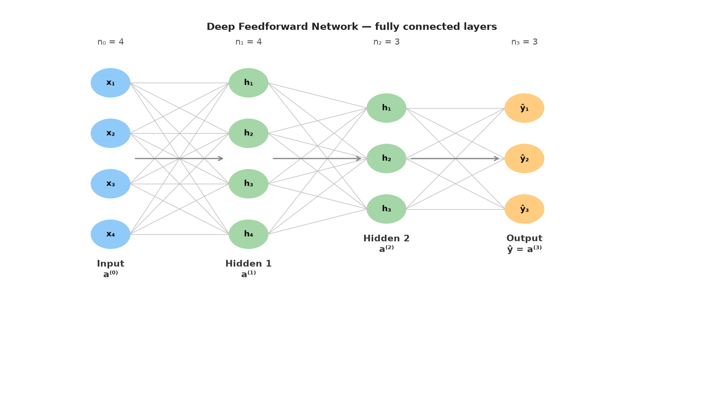
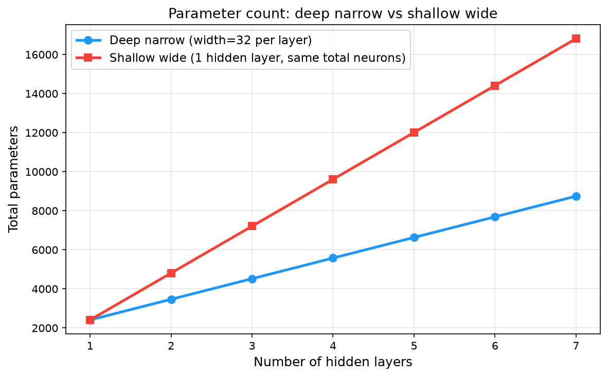
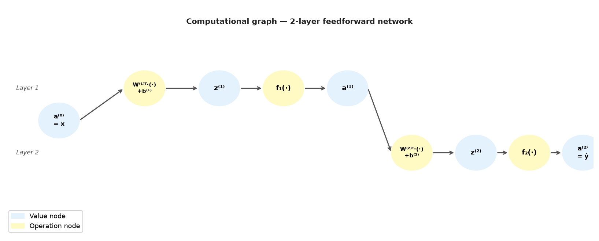

# 09 — Deep Feedforward Network Architectures

---

## Part 1: What Makes a Network Deep?

Note 03 established that a 2-layer MLP can solve problems a single perceptron cannot. It introduced the forward pass, the universal approximation theorem, and the argument that depth is more efficient than width. But it never asked the question precisely: what does "deep" actually mean, and what does the architecture of a deep network look like in full generality?

That is the subject of this note.

### Depth, Width, and Architecture

Three quantities define the shape of a feedforward network:

```
Depth  (L) — the number of computational layers
             (hidden layers + output layer, input not counted)

Width  (nₗ) — the number of neurons in layer l

Architecture — the full specification: L, n₁, n₂, ..., nₗ, activations per layer
```

A network is called **deep** when L ≥ 2 — when it has at least one hidden layer plus an output layer. The term "deep learning" refers specifically to this depth. A single-layer network (one output layer, no hidden layers) is a linear model — it is not deep.

```
Shallow:                          Deep:

Input ──► [Output Layer] ──► ŷ   Input ──► [Hidden 1] ──► [Hidden 2] ──► ... ──► [Output] ──► ŷ

L = 1  (linear model)             L = 2, 3, 4, ...
```

Width is a per-layer quantity. A network does not have a single width — it has a width profile:

```
Example architecture:

  Input:    n₀ = 784   (e.g. 28×28 image flattened)
  Layer 1:  n₁ = 512   hidden neurons
  Layer 2:  n₂ = 256   hidden neurons
  Layer 3:  n₃ = 128   hidden neurons
  Output:   n₄ = 10    neurons (e.g. 10 classes)

Depth L = 4 (3 hidden + 1 output)
Width profile: [512, 256, 128, 10]
```

### The Representational Hierarchy

Depth is not just a count of layers. Each layer transforms the representation produced by the layer below it. The deeper the network, the more levels of abstraction it can build.

```
Raw input (pixels, audio samples, text tokens)
        ↓  Layer 1
Low-level features (edges, frequencies, character n-grams)
        ↓  Layer 2
Mid-level features (textures, phonemes, words)
        ↓  Layer 3
High-level features (object parts, syllables, phrases)
        ↓  Layer 4
Task-level representation (objects, words, sentiment)
        ↓  Output Layer
Prediction
```

No human specified these levels. The network discovers them because they are the intermediate representations that make the final prediction linearly separable. This is the core insight from **Note 03** — the hidden layers warp the geometry of the data. Each additional layer applies one more learned coordinate transformation.

> Depth is the mechanism by which a network builds a hierarchy of abstractions. Each layer speaks the language of the layer above it — not the language of the raw input.

---

## Part 2: The General L-Layer Feedforward Network

Note 03 worked through a 2-layer network in detail. Here we generalise to L layers — the pattern that every deep network follows.

### Notation

```
L        — total number of computational layers (hidden + output)
nₗ       — number of neurons in layer l,  l = 1, 2, ..., L
n₀       — number of input features (input layer, not computational)
W⁽ˡ⁾     — weight matrix for layer l,  shape: nₗ₋₁ × nₗ
b⁽ˡ⁾     — bias vector for layer l,    shape: nₗ
z⁽ˡ⁾     — pre-activation vector,      shape: nₗ
a⁽ˡ⁾     — post-activation vector,     shape: nₗ
fₗ       — activation function for layer l (may differ per layer)
```

The input is denoted a⁽⁰⁾ = x — the raw feature vector. This makes the layer equations uniform: every layer takes the previous layer's activations as input.

### The Forward Pass — Layer by Layer

For each layer l = 1, 2, ..., L:

```
Step 1 — Weighted sum (pre-activation):

  z⁽ˡ⁾ = W⁽ˡ⁾ᵀ a⁽ˡ⁻¹⁾ + b⁽ˡ⁾

Step 2 — Activation (post-activation):

  a⁽ˡ⁾ = fₗ(z⁽ˡ⁾)
```

The output of the network is a⁽ᴸ⁾ = ŷ.

Written out for a 4-layer network (3 hidden + 1 output):

```
a⁽⁰⁾ = x                                    ← input

z⁽¹⁾ = W⁽¹⁾ᵀ a⁽⁰⁾ + b⁽¹⁾,   a⁽¹⁾ = f₁(z⁽¹⁾)  ← hidden layer 1
z⁽²⁾ = W⁽²⁾ᵀ a⁽¹⁾ + b⁽²⁾,   a⁽²⁾ = f₂(z⁽²⁾)  ← hidden layer 2
z⁽³⁾ = W⁽³⁾ᵀ a⁽²⁾ + b⁽³⁾,   a⁽³⁾ = f₃(z⁽³⁾)  ← hidden layer 3
z⁽⁴⁾ = W⁽⁴⁾ᵀ a⁽³⁾ + b⁽⁴⁾,   a⁽⁴⁾ = f₄(z⁽⁴⁾)  ← output layer

ŷ = a⁽⁴⁾
```

The same two-step pattern — weighted sum, then activation — repeats identically at every layer. The only things that change are the weight matrix, the bias vector, and possibly the activation function.

### Architecture Diagram

The diagram below shows a deep feedforward network with 4 inputs, two hidden layers, and 3 outputs. Every neuron in layer l connects to every neuron in layer l−1 — this is a **fully connected** (dense) layer. Each connection carries one weight; each neuron has one bias.



> The feedforward network has no memory, no cycles, no feedback. Information flows in one direction only — from input to output. This is what "feedforward" means.

---

## Part 3: Parameter Count

Before choosing an architecture, you need to know what it costs. Every weight and every bias is a parameter — a number the network must learn from data. Too few parameters and the network cannot represent the function. Too many and it overfits, trains slowly, and requires more data.

### The Formula

For a fully connected layer l connecting nₗ₋₁ neurons to nₗ neurons:

```
Weights:   nₗ₋₁ × nₗ     (every input neuron connects to every output neuron)
Biases:    nₗ             (one bias per output neuron)

Parameters in layer l:   nₗ₋₁ × nₗ + nₗ  =  nₗ(nₗ₋₁ + 1)
```

Total parameters across all L layers:

```
Total = Σₗ₌₁ᴸ [ nₗ₋₁ × nₗ + nₗ ]
```

### Worked Example

Two architectures, both with input size 4 and output size 2. One is deep and narrow, one is shallow and wide.

**Architecture A — Deep and Narrow:**

```
Layer sizes: n₀=4, n₁=8, n₂=8, n₃=8, n₄=2
Depth L = 4
```

```
Layer 1:  4 × 8  + 8  =  32 + 8  =  40
Layer 2:  8 × 8  + 8  =  64 + 8  =  72
Layer 3:  8 × 8  + 8  =  64 + 8  =  72
Layer 4:  8 × 2  + 2  =  16 + 2  =  18

Total:  40 + 72 + 72 + 18  =  202 parameters
```

**Architecture B — Shallow and Wide:**

```
Layer sizes: n₀=4, n₁=64, n₂=2
Depth L = 2
```

```
Layer 1:  4 × 64 + 64  =  256 + 64  =  320
Layer 2:  64 × 2 + 2   =  128 + 2   =  130

Total:  320 + 130  =  450 parameters
```

Architecture A is deeper but uses **less than half** the parameters of Architecture B. This is the efficiency of depth — the same representational power at lower parameter cost.

### What Parameter Count Tells You

```
More parameters:
  + Can represent more complex functions
  − Requires more training data to avoid overfitting
  − Slower to train
  − More memory

Fewer parameters:
  + Trains faster, needs less data
  − May underfit if the function is complex
```

Parameter count is not a quality measure — it is a capacity measure. The right number of parameters depends on the complexity of the task and the amount of available training data.

The plot below shows how parameter count grows with depth and width for a fixed architecture pattern — deep narrow networks grow much more slowly than shallow wide ones.



---

## Part 4: The Computational Graph

The forward pass is a sequence of mathematical operations. Formalising it as a **computational graph** makes the structure of the network explicit — and reveals exactly what backpropagation traverses.

### Definition

A computational graph is a directed acyclic graph (DAG) where:

```
Nodes  — values: inputs, intermediate results, outputs
Edges  — operations: each edge applies a function to produce the next node
```

Every node's value depends only on the nodes that feed into it. There are no cycles — the graph is acyclic, which is why the forward pass can always be evaluated in a fixed order.

### A Simple Example

Consider a single neuron: z = w₁x₁ + w₂x₂ + b, then a = f(z).

```
x₁ ──(×w₁)──┐
              ├──(+)──► z ──(f)──► a
x₂ ──(×w₂)──┤
              │
b  ──────────┘
```

Each node is a value. Each edge is an operation. The graph flows left to right.

### A Two-Layer Network

The graph below shows a 2-layer network. Blue nodes are values (inputs, intermediate results, outputs). Yellow nodes are operations (weighted sum, activation). The input a⁽⁰⁾ feeds into the layer 1 operation, producing z⁽¹⁾, then a⁽¹⁾, which feeds into the layer 2 operation, producing z⁽²⁾, then ŷ = a⁽²⁾.



### Why the Computational Graph Matters

The computational graph is not just a diagram — it is the object that makes automatic differentiation possible.

During the forward pass, every intermediate value (every node) is computed and stored. During the backward pass (backpropagation), the graph is traversed in reverse. At each node, the chain rule is applied to compute how the loss changes with respect to that node's inputs.

```
Forward pass:   left to right — compute and store all node values
Backward pass:  right to left — apply chain rule at each node to compute gradients
```

This is why the forward pass must store intermediate values — they are needed by the backward pass. The computational graph makes explicit exactly which values must be stored and in what order gradients must be computed.

> The computational graph is the skeleton of the network. The forward pass gives it values. The backward pass gives it gradients. Training is the process of using those gradients to update the weights.

### Evaluation Order

Because the graph is acyclic, there is always a valid evaluation order — a sequence in which nodes can be computed such that every node's inputs are available before it is evaluated. This is called a **topological ordering** of the graph.

```
For a feedforward network, the topological order is simply:
  a⁽⁰⁾ → z⁽¹⁾ → a⁽¹⁾ → z⁽²⁾ → a⁽²⁾ → ... → z⁽ᴸ⁾ → a⁽ᴸ⁾ = ŷ
```

No layer can be evaluated before the layer before it. No layer needs to wait for any layer after it. The order is fixed and unambiguous.

---

## Part 5: Depth vs Width — The Efficiency Argument

Note 03 introduced the universal approximation theorem and the reuse argument. Here we make the efficiency argument precise.

### The UAT Revisited

The Universal Approximation Theorem (Cybenko, 1989) guarantees that a network with **one hidden layer** of sufficient width can approximate any continuous function to arbitrary precision. This is a theorem about existence — it says the right weights exist, not that they are easy to find.

The critical word is "sufficient width." For complex functions in high-dimensional spaces, the required width can be astronomically large — exponential in the input dimension. The theorem is true but practically useless for shallow networks on hard problems.

> The UAT tells us that shallow networks are universal. It does not tell us they are efficient.

### The Exponential Efficiency of Depth

There is a precise formal result (Montufar et al., 2014) that quantifies the advantage of depth:

```
A deep ReLU network with L layers and n neurons per layer can represent
functions with O(nᴸ) linear regions.

A shallow ReLU network with the same total number of neurons (n × L neurons)
can represent functions with O(n × L) linear regions.
```

The number of linear regions is a measure of how complex a function the network can represent — more regions means finer-grained decision boundaries.

```
Deep network:    O(nᴸ)    — exponential in depth L
Shallow network: O(n × L) — linear in depth L

Example: n = 10, L = 4

  Deep:    10⁴ = 10,000 linear regions
  Shallow: 10 × 4 = 40 linear regions

Same number of neurons. 250× more representational power from depth.
```

This is not a marginal difference. It is exponential. Depth buys representational power at a rate that width cannot match.

### Why Depth Works — The Reuse Argument

Note 03 introduced the reuse argument with the digit example. Here is the precise version.

In a shallow network, every output neuron must learn its features from scratch — directly from the raw input. There is no sharing of intermediate computations.

In a deep network, features learned in early layers are available to all neurons in all subsequent layers. A feature computed once can be reused by every neuron above it.

```
Shallow network (2 layers):

  Output neuron 1:  learns [edge detector + curve detector + loop detector] from pixels
  Output neuron 2:  learns [edge detector + curve detector + stroke detector] from pixels
  Output neuron 3:  learns [edge detector + texture detector + loop detector] from pixels

  Each output neuron duplicates the edge detector computation independently.

Deep network (4 layers):

  Layer 1 neuron:   learns edge detector                    (once, shared)
  Layer 2 neuron:   learns curve = edge + edge              (references layer 1)
  Layer 3 neuron:   learns loop  = curve + curve            (references layer 2)
  Output neuron 1:  learns digit 8 = loop + loop            (references layer 3)
  Output neuron 2:  learns digit 0 = loop                   (references layer 3)
  Output neuron 3:  learns digit 1 = stroke                 (references layer 2)
```

The edge detector is computed once and used everywhere. In a shallow network it must be recomputed independently for every output. The parameter savings compound with every additional layer.

### When Width Matters

Depth is not always the answer. Width matters when:

```
The task requires detecting many independent features at the same level of abstraction.
  → Increase width of that layer.

The task is simple and shallow — no compositional structure.
  → A wide shallow network may be sufficient.

The hidden layer is a bottleneck — information is being lost.
  → Increase width of the bottleneck layer.
```

The practical rule: **go deep first, then tune width**. Depth provides the representational hierarchy. Width provides the capacity within each level of that hierarchy.

```
Too narrow:   information bottleneck — features cannot be represented
Too wide:     parameter explosion — overfitting, slow training
Too shallow:  cannot build abstractions — high bias on complex tasks
Too deep:     vanishing gradients, harder to train (addressed in Notes 10–12)
```

---

## Part 6: Practical Architecture Design

Given the theory above, how do you actually design a deep feedforward network? There are four decisions to make: input layer, output layer, hidden layers, and activations.

### Decision 1 — Input Layer

The input layer is not a computational layer — it has no weights, no activation, no bias. Its size is fixed by the data:

```
n₀ = number of features in one input sample

Examples:
  Tabular data with 20 features:    n₀ = 20
  28×28 grayscale image (flattened): n₀ = 784
  100-dimensional word embedding:    n₀ = 100
```

No design decision here — n₀ is determined by the problem.

### Decision 2 — Output Layer

The output layer is determined by the task:

```
Task                        Output neurons    Activation
──────────────────────────  ────────────────  ──────────────────────────
Binary classification       1                 Sigmoid  → output ∈ (0,1)
Multiclass (K classes)      K                 Softmax  → outputs sum to 1
Regression (1 value)        1                 None (linear)
Regression (K values)       K                 None (linear)
```

The output layer is not a design choice — it is a consequence of the task. Get this wrong and the network cannot produce valid predictions regardless of how well the hidden layers are designed.

### Decision 3 — Hidden Layers

This is where the actual design happens. Two sub-decisions: how many layers (depth) and how many neurons per layer (width).

**Depth:**

```
Start with 1–2 hidden layers for simple tasks (tabular data, small datasets).
Use 3–5 hidden layers for moderate complexity.
Use deeper architectures (10+) for images, audio, text — but only with
  proper initialisation (Note 10) and batch normalisation (Note 11).
```

**Width:**

```
A common pattern is a funnel — wider early layers, narrower later layers:

  n₀ = 784 → n₁ = 512 → n₂ = 256 → n₃ = 128 → n₄ = 10

Early layers: wide — many features to detect at the low level
Later layers: narrow — compress into task-relevant representation
Output layer: fixed by the task
```

Another common pattern is constant width throughout the hidden layers:

```
  n₀ = 100 → n₁ = 256 → n₂ = 256 → n₃ = 256 → n₄ = 5
```

There is no universal rule. The right architecture depends on the task, the data size, and the available compute. In practice, start simple and increase complexity only when the simpler model underfits.

### Decision 4 — Activation Functions

```
Layer type          Recommended activation    Reason
──────────────────  ────────────────────────  ──────────────────────────────────────
Hidden layers       ReLU                      Fast, sparse, no vanishing gradient
                                              for positive inputs
Hidden layers       Leaky ReLU                When dying ReLU is a problem
Output (binary)     Sigmoid                   Maps to (0,1) — interpretable as prob.
Output (multiclass) Softmax                   Maps to probability distribution
Output (regression) None (linear)             Unbounded output needed
```

ReLU is the default for hidden layers in modern deep networks. The reasons — sparse activation, no saturation for positive inputs, fast gradient — were covered in **Note 04**.

### The Full Design Checklist

```
1. Set n₀ = number of input features                    (fixed by data)
2. Set output layer size and activation                 (fixed by task)
3. Choose depth L — start with 2–3 hidden layers
4. Choose width profile — funnel or constant
5. Use ReLU for all hidden layers
6. Compute parameter count — check it is reasonable for your dataset size
7. If underfitting → increase depth or width
8. If overfitting  → reduce depth or width, or add regularisation (Note 07)
```

### Worked Example — Designing a Network for a Classification Task

Task: classify handwritten digits (0–9) from 28×28 grayscale images. 60,000 training examples.

```
Step 1 — Input:
  n₀ = 28 × 28 = 784

Step 2 — Output:
  10 classes → n_L = 10, Softmax activation

Step 3 — Depth:
  Moderate complexity, 60k examples → 3 hidden layers

Step 4 — Width (funnel pattern):
  n₁ = 512, n₂ = 256, n₃ = 128

Step 5 — Activations:
  Hidden layers: ReLU
  Output: Softmax

Step 6 — Parameter count:
  Layer 1:  784 × 512 + 512  =  401,920
  Layer 2:  512 × 256 + 256  =  131,328
  Layer 3:  256 × 128 + 128  =   32,896
  Layer 4:  128 × 10  + 10   =    1,290

  Total:  567,434 parameters

Step 7 — Sanity check:
  60,000 training examples, ~567k parameters
  Ratio ≈ 0.1 examples per parameter — on the low side
  → Consider adding dropout (Note 07) or reducing width
```

The final architecture:

```
Input (784)
    ↓
Hidden Layer 1: 512 neurons, ReLU
    ↓
Hidden Layer 2: 256 neurons, ReLU
    ↓
Hidden Layer 3: 128 neurons, ReLU
    ↓
Output Layer: 10 neurons, Softmax
    ↓
ŷ ∈ ℝ¹⁰  (probability distribution over 10 classes)
```

---

## Summary

Key takeaways:

- A network is **deep** when it has at least one hidden layer plus an output layer (L ≥ 2). Depth is the number of computational layers; width is the number of neurons per layer; architecture is the full specification of both
- The general L-layer forward pass follows the same two-step pattern at every layer: z⁽ˡ⁾ = W⁽ˡ⁾ᵀ a⁽ˡ⁻¹⁾ + b⁽ˡ⁾, then a⁽ˡ⁾ = fₗ(z⁽ˡ⁾). The input is a⁽⁰⁾ = x; the output is a⁽ᴸ⁾ = ŷ
- Parameter count for a fully connected layer: nₗ₋₁ × nₗ + nₗ. Deep narrow networks use far fewer parameters than shallow wide ones for equivalent representational power
- The computational graph is a directed acyclic graph where nodes are values and edges are operations. The forward pass evaluates it left to right; backpropagation traverses it right to left. The topological ordering of a feedforward network is fixed and unambiguous
- The UAT guarantees that a single hidden layer can approximate any continuous function — but may require exponential width. Deep networks achieve the same representational power with exponentially fewer parameters (Montufar et al., 2014: O(nᴸ) linear regions vs O(n × L) for shallow)
- Depth works through **feature reuse** — a feature computed in an early layer is available to all subsequent layers at no additional parameter cost. Shallow networks must recompute every feature independently for every output
- Output layer design is fixed by the task: sigmoid for binary classification, softmax for multiclass, linear for regression. Hidden layers use ReLU by default
- Practical design: fix input and output layers first, start with 2–3 hidden layers, use a funnel width profile, compute parameter count, then adjust based on underfitting or overfitting
