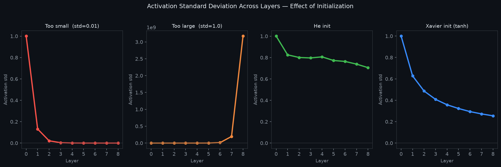
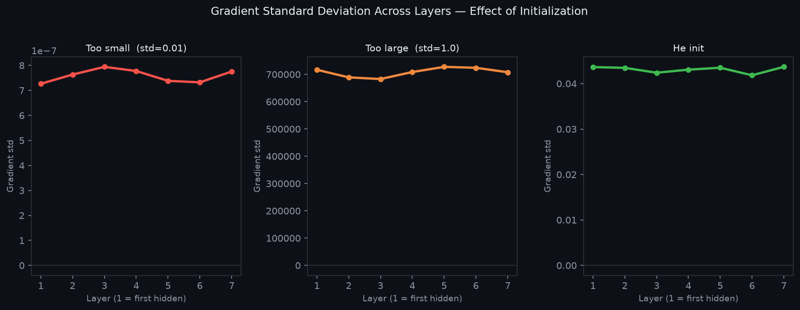

# 10 — Weight Initialization

---

## Part 1: Why Initialization Matters

Training a neural network means finding good values for millions of weights. Those weights have to start somewhere. The question is: does it matter where they start?

It matters enormously. The initial weights determine two things before a single gradient update has been computed:

```
1. Whether the forward pass produces useful activations
   — or collapses to zero / saturates to a constant

2. Whether the backward pass produces useful gradients
   — or vanishes to zero / explodes to infinity
```

A network with bad initialization may never train at all — not because the architecture is wrong or the learning rate is wrong, but because the starting point makes the loss surface effectively flat or the gradients immediately useless. This is not a slow-start problem. It is a structural failure that no amount of training can recover from.

The two requirements that initialization must satisfy:

> **Symmetry breaking:** neurons in the same layer must start with different weights, otherwise they compute identical outputs, receive identical gradients, and remain identical forever — the entire layer collapses to one effective neuron.
>
> **Variance preservation:** the scale of activations and gradients must remain stable as signals pass through many layers — neither shrinking to zero nor growing without bound.

These two requirements pull in different directions. Symmetry breaking requires randomness. Variance preservation requires careful control of that randomness. The history of initialization methods is the history of getting both right simultaneously.

---

## Part 2: Zero Initialization — Why It Fails

The most obvious starting point is to set all weights to zero. It is simple, reproducible, and avoids any arbitrary choices. It is also completely wrong.

### The Symmetry Problem

Consider a network with one hidden layer containing two neurons h₁ and h₂. If all weights are initialised to zero:

```
z₁⁽¹⁾ = w⁽¹⁾₁₁·x₁ + w⁽¹⁾₂₁·x₂ + b₁⁽¹⁾ = 0·x₁ + 0·x₂ + 0 = 0
z₂⁽¹⁾ = w⁽¹⁾₁₂·x₁ + w⁽¹⁾₂₂·x₂ + b₂⁽¹⁾ = 0·x₁ + 0·x₂ + 0 = 0
```

Both neurons compute the same pre-activation. Both produce the same activation. The output layer receives identical inputs from both hidden neurons.

Now compute the gradients. The gradient of the loss with respect to w⁽¹⁾₁₁ depends on the error signal propagated back through w⁽²⁾₁₁ — the weight connecting h₁ to the output. The gradient with respect to w⁽¹⁾₁₂ depends on w⁽²⁾₂₁ — the weight connecting h₂ to the output. If both output weights are also zero, both gradients are identical.

```
∂L/∂w⁽¹⁾₁₁ = δ⁽²⁾ · w⁽²⁾₁₁ · f'(z₁⁽¹⁾) · x₁
∂L/∂w⁽¹⁾₁₂ = δ⁽²⁾ · w⁽²⁾₂₁ · f'(z₂⁽¹⁾) · x₁

If w⁽²⁾₁₁ = w⁽²⁾₂₁ and z₁⁽¹⁾ = z₂⁽¹⁾:

∂L/∂w⁽¹⁾₁₁ = ∂L/∂w⁽¹⁾₁₂   ← identical gradients
```

Identical gradients produce identical updates. After the update, the weights are still identical — just shifted by the same amount. This repeats every epoch. The two neurons remain permanently identical.

```
After epoch 1:   w⁽¹⁾₁₁ = w⁽¹⁾₁₂ = Δ
After epoch 2:   w⁽¹⁾₁₁ = w⁽¹⁾₁₂ = 2Δ
After epoch k:   w⁽¹⁾₁₁ = w⁽¹⁾₁₂ = kΔ
```

A hidden layer of n neurons behaves as a single neuron. The network has lost all the representational capacity that width was supposed to provide. This is the **symmetry problem** — and it applies to any constant initialization, not just zero.

> Zero initialization does not just start badly — it permanently destroys the network's capacity. Symmetry, once established, is never broken by gradient descent alone.

**Biases** are an exception. Biases can safely be initialised to zero because they do not connect neurons to each other — each bias belongs to exactly one neuron and does not create the symmetry problem. The symmetry problem is specific to weights.

---

## Part 3: Random Initialization — Scale Matters

The fix for symmetry is randomness: draw each weight independently from a random distribution. This guarantees that no two neurons start identically, so gradients will differ and the neurons will diverge.

The standard choice is a zero-mean Gaussian or uniform distribution:

```
wᵢⱼ ~ N(0, σ²)    or    wᵢⱼ ~ Uniform(−a, a)
```

Symmetry is broken. But a new problem appears immediately: **what should σ (or a) be?**

### Too Small — Vanishing Activations

If σ is very small (e.g. 0.01), the weighted sums z⁽ˡ⁾ = W⁽ˡ⁾ᵀ a⁽ˡ⁻¹⁾ + b⁽ˡ⁾ are tiny at every layer. Activations shrink toward zero as the signal passes through each layer.

```
Layer 1:  a⁽¹⁾ ≈ small
Layer 2:  a⁽²⁾ = f(W⁽²⁾ᵀ a⁽¹⁾) ≈ f(small × small) ≈ even smaller
Layer 3:  a⁽³⁾ ≈ even smaller still
...
Layer L:  a⁽ᴸ⁾ ≈ 0
```

The output is near zero regardless of the input. The loss gradient ∂L/∂ŷ is computed from this near-zero output. When backpropagation multiplies this gradient by the tiny weights layer by layer, the gradient reaching the early layers is effectively zero. Early layers learn nothing.

### Too Large — Saturated Activations

If σ is large (e.g. 1.0 with many inputs), the weighted sums are large. For sigmoid or tanh activations, large inputs push the neuron into the flat saturation region where f'(z) ≈ 0.

```
σ(z) for large |z|:   output ≈ 0 or 1,   derivative ≈ 0
tanh(z) for large |z|: output ≈ −1 or 1,  derivative ≈ 0
```

Gradients through saturated neurons are near zero. Backpropagation multiplies by f'(z) at every layer — if every layer is saturated, the gradient vanishes before reaching the early layers. The network is stuck.

For ReLU, large weights cause a different problem: activations explode rather than saturate, and gradients grow exponentially through the backward pass.

### The Core Insight

The problem in both cases is that the **variance of the activations changes** as the signal passes through each layer. If the variance shrinks, activations vanish. If it grows, activations explode. What we want is for the variance to stay approximately constant from layer to layer.

This is the insight that drives both Xavier and He initialization.

---

## Part 4: Xavier / Glorot Initialization

Xavier Glorot and Yoshua Bengio (2010) derived an initialization scheme by asking: what variance should the weights have so that the variance of the activations is preserved across layers?

### The Derivation

Consider layer l with nₗ₋₁ inputs. The pre-activation is:

```
z⁽ˡ⁾ = Σᵢ wᵢ · aᵢ⁽ˡ⁻¹⁾
```

Assuming the weights and activations are independent and zero-mean, the variance of z⁽ˡ⁾ is:

```
Var(z⁽ˡ⁾) = Σᵢ Var(wᵢ) · Var(aᵢ⁽ˡ⁻¹⁾)
           = nₗ₋₁ · Var(w) · Var(a⁽ˡ⁻¹⁾)
```

For the variance to be preserved — Var(z⁽ˡ⁾) = Var(a⁽ˡ⁻¹⁾) — we need:

```
nₗ₋₁ · Var(w) = 1

→  Var(w) = 1 / nₗ₋₁
```

The same argument applied to the backward pass (where gradients flow through nₗ outputs) gives:

```
Var(w) = 1 / nₗ
```

These two conditions cannot both be satisfied simultaneously unless nₗ₋₁ = nₗ. Glorot and Bengio proposed a compromise — average the two:

```
Var(w) = 2 / (nₗ₋₁ + nₗ)
```

This is **Xavier initialization** (also called Glorot initialization):

```
wᵢⱼ ~ N(0,  2 / (nₗ₋₁ + nₗ))

or equivalently:

wᵢⱼ ~ Uniform(−√(6 / (nₗ₋₁ + nₗ)),  +√(6 / (nₗ₋₁ + nₗ)))
```

Where nₗ₋₁ is the **fan-in** (number of inputs to the layer) and nₗ is the **fan-out** (number of outputs).

### When to Use Xavier

Xavier initialization was derived assuming a **linear activation** (or one that behaves approximately linearly near zero, such as tanh or sigmoid in their linear region). It works well for:

```
✓ Tanh
✓ Sigmoid
✓ Linear output layers
```

It does not work well for ReLU — because ReLU is not symmetric around zero. It kills exactly half of its inputs (all negative values become zero), which halves the effective variance. Xavier does not account for this.

---

## Part 5: He Initialization

Kaiming He et al. (2015) derived an initialization specifically for ReLU networks, accounting for the fact that ReLU sets half its inputs to zero.

### The Derivation

The same variance analysis as Xavier, but now the activation function is ReLU. ReLU passes positive values unchanged and zeros out negative values. If the input to ReLU has zero mean and variance Var(z), the output has:

```
E[ReLU(z)] = 0   (by symmetry, assuming z is zero-mean)

Var(ReLU(z)) = Var(z) / 2
```

The factor of 1/2 comes from the fact that ReLU zeroes out half the distribution. To compensate for this halving at every layer, the weight variance must be doubled:

```
nₗ₋₁ · Var(w) · (1/2) = 1

→  Var(w) = 2 / nₗ₋₁
```

This is **He initialization** (also called Kaiming initialization):

```
wᵢⱼ ~ N(0,  2 / nₗ₋₁)
```

The only difference from Xavier (fan-in only version) is the factor of 2 in the numerator — exactly compensating for ReLU's halving of variance.

### When to Use He

```
✓ ReLU
✓ Leaky ReLU  (use 2 / (1 + α²) / nₗ₋₁  where α is the negative slope)
✗ Tanh / Sigmoid  (use Xavier instead)
```

### Summary of Initialization Formulas

```
Method       Activation    Variance formula
───────────  ────────────  ────────────────────────
Xavier       Tanh/Sigmoid  2 / (nₗ₋₁ + nₗ)
He           ReLU          2 / nₗ₋₁
```

The numerator is always 2 — the difference is whether fan-out is included in the denominator. Xavier includes it (compromise between forward and backward pass). He drops it (forward pass only, but doubles the numerator to compensate for ReLU). Xavier also applies to linear output layers.

---

## Part 6: Effect on Vanishing and Exploding Gradients

Bad initialization is not just a slow-start problem — it is one of the root causes of vanishing and exploding gradients, which were introduced in **Note 06** as a consequence of activation function choice. Initialization adds a second axis to the same problem.

### The Two Axes

```
Vanishing gradients caused by:
  1. Activation function — sigmoid/tanh saturate, f'(z) ≈ 0
  2. Initialization — weights too small, activations shrink layer by layer

Exploding gradients caused by:
  1. Activation function — unbounded activations amplify signals
  2. Initialization — weights too large, activations grow layer by layer
```

Both axes multiply together through the chain rule. A network with sigmoid activations AND small weights has doubly vanishing gradients. A network with ReLU AND large weights has doubly exploding gradients.

### What Good Initialization Achieves

The four panels below show activation standard deviation across 8 layers under four initialization conditions. With too-small weights, activations collapse to zero by layer 3. With too-large weights, they explode. Xavier and He initialization keep the variance stable throughout.



The three panels below show gradient standard deviation across layers during the backward pass, under three conditions: too-small weights, too-large weights, and He initialization. With too-small weights, gradients vanish before reaching the early layers. With too-large weights, they explode. He initialization keeps gradient magnitude stable across all layers.



### Why This Matters in Practice

```
Bad initialization:
  → Activations vanish or explode on the first forward pass
  → Gradients vanish or explode on the first backward pass
  → Weights in early layers receive near-zero or infinite updates
  → Network fails to train regardless of learning rate or architecture

Good initialization:
  → Activations have consistent variance across all layers
  → Gradients have consistent magnitude across all layers
  → Every layer receives a meaningful update from the first step
  → Training can proceed
```

> Good initialization does not guarantee good training — but bad initialization guarantees bad training. It is a necessary condition, not a sufficient one.

Batch normalization (**Note 11**) provides a complementary mechanism — it actively corrects activation variance during training, reducing the sensitivity to initialization. But it does not eliminate the need for good initialization: a network that starts with exploding activations may fail before batch normalization has a chance to stabilize it.

---

## Summary

Key takeaways:

- Initialization must satisfy two requirements simultaneously: symmetry breaking (neurons must start differently) and variance preservation (activations and gradients must remain stable across layers)
- Zero initialization permanently destroys network capacity — all neurons in a layer remain identical forever because they receive identical gradients at every step. Biases are safe to initialize to zero; weights are not
- Random initialization breaks symmetry but scale matters critically — too small causes vanishing activations and gradients, too large causes saturation or explosion
- Xavier initialization sets Var(w) = 2 / (nₗ₋₁ + nₗ) — a compromise between preserving variance in the forward and backward pass. Designed for tanh and sigmoid
- He initialization sets Var(w) = 2 / nₗ₋₁ — accounts for ReLU zeroing half its inputs by doubling the variance. The standard choice for ReLU networks
- Bad initialization is a root cause of vanishing and exploding gradients, compounding the effect of activation function choice. Both axes multiply through the chain rule
- Batch normalization (Note 11) reduces sensitivity to initialization but does not eliminate the need for it
